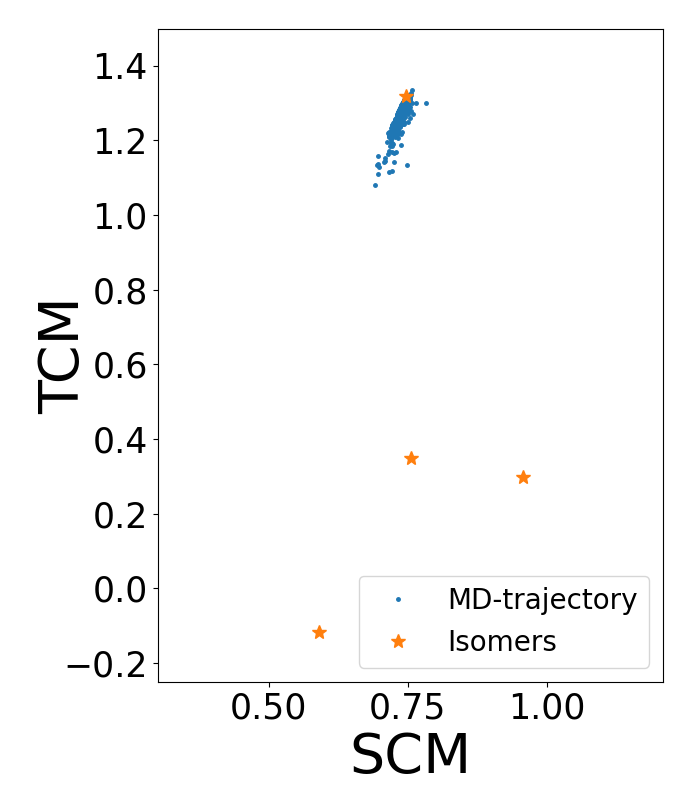

## Molecular Dynamics Simulation 

Let's start with a Langevin simulation without bias. In LJ dimensionless 
reduced units (assuming $\epsilon$ = 1 eV, $\sigma$ = 1 $\textrm Å$ and 
m = 1 a.m.u), the parameters of the simulation are $k_\text{B}T=0.1$, 
friction coefficient fixed equal to 1 and a time step of 0.005. 

In principle, the system should explore all the configuration space 
due to thermal fluctuations. However, we can see that the system remains in the 
same conformational state, even when we simulate for a long time. This happens because the system gets trapped in a local minimum and a 
complete exploration of the configuration 
space is too expensive computationally. Figure 2 -blue 
dots- shows the trajectory obtained from the following unbiased 
Molecular Dynamics [`MD.py`](https://github.com/Sucerquia/ASE-PLUMED_tutorial/blob/master/files/MD.py): 

```python 
from ase.calculators.lj import LennardJones 
from ase.calculators.plumed import Plumed 
from ase.constraints import FixedPlane 
from ase.md.langevin import Langevin 
from ase.io import read 
from ase import units 


timestep = 0.005 

ps = 1000 * units.fs 
setup = open("plumedLJ.dat", "r").read().splitlines() 

atoms = read('isomer.xyz') 
# Constraint to keep the system in a plane 
cons = [FixedPlane(i, [0, 0, 1]) for i in range(7)] 
atoms.set_constraint(cons) 
atoms.set_masses([1, 1, 1, 1, 1, 1, 1]) 

atoms.calc = Plumed(calc=LennardJones(rc=3., r0=2.5, smooth=True), 
input=setup, 
timestep=timestep, 
atoms=atoms, 
kT=0.1) 

dyn = Langevin(atoms, timestep, temperature_K=0.1/units.kB, friction=1, 
fixcm=False, trajectory='UnbiasMD.xyz') 

dyn.run(100000) 
``` 

Where [`plumedLJ.dat`](https://github.com/Sucerquia/ASE-PLUMED_tutorial/blob/master/files/plumedLJ.dat) 
contains the next information: 


<div style="width: 100%; float:left">
<div style="width: 90%; float:left" id="value_details_data/MD.md_working_1.dat"> Click on the labels of the actions for more information on what each action computes </div>
<div style="width: 10%; float:left"><table><tr><td style="padding:1px"><a href="MD.md_working_1.dat.plumed.stderr"></a></td></tr><tr><td style="padding:1px"><a href="MD.md_working_1.dat.plumed_master.stderr"></a></td></tr></table></div></div>
<pre style="width=97%;">
<div class="tooltip" style="color:green">UNITS<div class="right">This command sets the internal units for the code. <a href="https://www.plumed.org/doc-master/user-doc/html/_u_n_i_t_s.html" style="color:green">More details</a><i></i></div></div> <div class="tooltip">LENGTH<div class="right">the units of lengths<i></i></div></div>=A <div class="tooltip">TIME<div class="right">the units of time<i></i></div></div>=0.0101805 <div class="tooltip">ENERGY<div class="right">the units of energy<i></i></div></div>=96.4853329
<span style="display:none;" id="data/MD.md_working_1.dat">The UNITS action with label <b></b> calculates something</span><span id="data/MD.md_working_1.datc1_short"><b name="data/MD.md_working_1.datc1" onclick='showPath("data/MD.md_working_1.dat","data/MD.md_working_1.datc1","data/MD.md_working_1.datc1_shortcut","blue")'>c1</b><span style="display:none;" id="data/MD.md_working_1.datc1_shortcut">The COORDINATIONNUMBER action with label <b>c1</b> calculates the following quantities:<table  align="center" frame="void" width="95%" cellpadding="5%"><tr><td width="5%"><b> Quantity </b>  </td><td width="5%"><b> Type </b>  </td><td><b> Description </b> </td></tr><tr><td width="5%">c1</td><td width="5%"><font color="blue">vector</font></td><td>the coordination numbers of the specified atoms</td></tr></table></span>: <div class="tooltip" style="color:green">COORDINATIONNUMBER<div class="right">Calculate the coordination numbers of atoms so that you can then calculate functions of the distribution of This action is <a class="toggler" href='javascript:;' onclick='toggleDisplay("data/MD.md_working_1.datc1");'>a shortcut</a>. <a href="https://www.plumed.org/doc-master/user-doc/html/_c_o_o_r_d_i_n_a_t_i_o_n_n_u_m_b_e_r.html">More details</a><i></i></div></div> <div class="tooltip">SPECIES<div class="right">this keyword is used for colvars such as coordination number<i></i></div></div>=1-7 <div class="tooltip">MOMENTS<div class="right">the list of moments that you would like to calculate<i></i></div></div>=2-3 <div class="tooltip">SWITCH<div class="right">the switching function that it used in the construction of the contact matrix<i></i></div></div>={RATIONAL R_0=1.5 NN=8 MM=16}
</span><span id="data/MD.md_working_1.datc1_long" style="display:none;"><span style="color:blue" class="comment"># PLUMED interprets the command:
</span><span class="toggler" style="color:red" onclick='toggleDisplay("data/MD.md_working_1.datc1")'># c1: COORDINATIONNUMBER SPECIES=1-7 MOMENTS=2-3 SWITCH={RATIONAL R_0=1.5 NN=8 MM=16}</span>
<span style="color:blue" class="comment"># as follows (Click the red comment above to revert to the short version of the input):</span>
<b name="data/MD.md_working_1.datc1_grp" onclick='showPath("data/MD.md_working_1.dat","data/MD.md_working_1.datc1_grp","data/MD.md_working_1.datc1_grp","violet")'>c1_grp</b><span style="display:none;" id="data/MD.md_working_1.datc1_grp">The GROUP action with label <b>c1_grp</b> calculates the following quantities:<table  align="center" frame="void" width="95%" cellpadding="5%"><tr><td width="5%"><b> Quantity </b>  </td><td width="5%"><b> Type </b>  </td><td><b> Description </b> </td></tr><tr><td width="5%">c1_grp</td><td width="5%"><font color="violet">atoms</font></td><td>indices of atoms specified in GROUP</td></tr></table></span>: <div class="tooltip" style="color:green">GROUP<div class="right">Define a group of atoms so that a particular list of atoms can be referenced with a single label in definitions of CVs or virtual atoms. <a href="https://www.plumed.org/doc-master/user-doc/html/_g_r_o_u_p.html" style="color:green">More details</a><i></i></div></div> <div class="tooltip">ATOMS<div class="right">the numerical indexes for the set of atoms in the group<i></i></div></div>=1-7
<b name="data/MD.md_working_1.datc1_mat" onclick='showPath("data/MD.md_working_1.dat","data/MD.md_working_1.datc1_mat","data/MD.md_working_1.datc1_mat","red")'>c1_mat</b><span style="display:none;" id="data/MD.md_working_1.datc1_mat">The CONTACT_MATRIX action with label <b>c1_mat</b> calculates the following quantities:<table  align="center" frame="void" width="95%" cellpadding="5%"><tr><td width="5%"><b> Quantity </b>  </td><td width="5%"><b> Type </b>  </td><td><b> Description </b> </td></tr><tr><td width="5%">c1_mat</td><td width="5%"><font color="red">matrix</font></td><td>a matrix containing the weights for the bonds between each pair of atoms</td></tr></table></span>: <div class="tooltip" style="color:green">CONTACT_MATRIX<div class="right">Adjacency matrix in which two atoms are adjacent if they are within a certain cutoff. <a href="https://www.plumed.org/doc-master/user-doc/html/_c_o_n_t_a_c_t__m_a_t_r_i_x.html" style="color:green">More details</a><i></i></div></div> <div class="tooltip">GROUP<div class="right">specifies the list of atoms that should be assumed indistinguishable<i></i></div></div>=1-7 <div class="tooltip">SWITCH<div class="right">specify the switching function to use between two sets of indistinguishable atoms<i></i></div></div>={RATIONAL R_0=1.5 NN=8 MM=16}
<b name="data/MD.md_working_1.datc1_ones" onclick='showPath("data/MD.md_working_1.dat","data/MD.md_working_1.datc1_ones","data/MD.md_working_1.datc1_ones","blue")'>c1_ones</b><span style="display:none;" id="data/MD.md_working_1.datc1_ones">The CONSTANT action with label <b>c1_ones</b> calculates the following quantities:<table  align="center" frame="void" width="95%" cellpadding="5%"><tr><td width="5%"><b> Quantity </b>  </td><td width="5%"><b> Type </b>  </td><td><b> Description </b> </td></tr><tr><td width="5%">c1_ones</td><td width="5%"><font color="blue">vector</font></td><td>the constant value that was read from the plumed input</td></tr></table></span>: <div class="tooltip" style="color:green">ONES<div class="right">Create a constant vector with all elements equal to one <a href="https://www.plumed.org/doc-master/user-doc/html/_o_n_e_s.html" style="color:green">More details</a><i></i></div></div> <div class="tooltip">SIZE<div class="right">the number of ones that you would like to create<i></i></div></div>=7
<b name="data/MD.md_working_1.datc1" onclick='showPath("data/MD.md_working_1.dat","data/MD.md_working_1.datc1","data/MD.md_working_1.datc1","blue")'>c1</b><span style="display:none;" id="data/MD.md_working_1.datc1">The MATRIX_VECTOR_PRODUCT action with label <b>c1</b> calculates the following quantities:<table  align="center" frame="void" width="95%" cellpadding="5%"><tr><td width="5%"><b> Quantity </b>  </td><td width="5%"><b> Type </b>  </td><td><b> Description </b> </td></tr><tr><td width="5%">c1</td><td width="5%"><font color="blue">vector</font></td><td>the vector that is obtained by taking the product between the matrix and the vector that were input</td></tr></table></span>: <div class="tooltip" style="color:green">MATRIX_VECTOR_PRODUCT<div class="right">Calculate the product of the matrix and the vector <a href="https://www.plumed.org/doc-master/user-doc/html/_m_a_t_r_i_x__v_e_c_t_o_r__p_r_o_d_u_c_t.html" style="color:green">More details</a><i></i></div></div>  <div class="tooltip">ARG<div class="right">the label for the matrix and the vector/scalar that are being multiplied<i></i></div></div>=<b name="data/MD.md_working_1.datc1_mat">c1_mat</b>,<b name="data/MD.md_working_1.datc1_ones">c1_ones</b>
<b name="data/MD.md_working_1.datc1_caverage" onclick='showPath("data/MD.md_working_1.dat","data/MD.md_working_1.datc1_caverage","data/MD.md_working_1.datc1_caverage","black")'>c1_caverage</b><span style="display:none;" id="data/MD.md_working_1.datc1_caverage">The MEAN action with label <b>c1_caverage</b> calculates the following quantities:<table  align="center" frame="void" width="95%" cellpadding="5%"><tr><td width="5%"><b> Quantity </b>  </td><td width="5%"><b> Type </b>  </td><td><b> Description </b> </td></tr><tr><td width="5%">c1_caverage</td><td width="5%"><font color="black">scalar</font></td><td>the mean of all the elements in the input vector</td></tr></table></span>: <div class="tooltip" style="color:green">MEAN<div class="right">Calculate the arithmetic mean of the elements in a vector <a href="https://www.plumed.org/doc-master/user-doc/html/_m_e_a_n.html" style="color:green">More details</a><i></i></div></div> <div class="tooltip">ARG<div class="right">the values input to this function<i></i></div></div>=<b name="data/MD.md_working_1.datc1">c1</b> <div class="tooltip">PERIODIC<div class="right">if the output of your function is periodic then you should specify the periodicity of the function<i></i></div></div>=NO
<b name="data/MD.md_working_1.datc1_diffpow-2" onclick='showPath("data/MD.md_working_1.dat","data/MD.md_working_1.datc1_diffpow-2","data/MD.md_working_1.datc1_diffpow-2","blue")'>c1_diffpow-2</b><span style="display:none;" id="data/MD.md_working_1.datc1_diffpow-2">The CUSTOM action with label <b>c1_diffpow-2</b> calculates the following quantities:<table  align="center" frame="void" width="95%" cellpadding="5%"><tr><td width="5%"><b> Quantity </b>  </td><td width="5%"><b> Type </b>  </td><td><b> Description </b> </td></tr><tr><td width="5%">c1_diffpow-2</td><td width="5%"><font color="blue">vector</font></td><td>the vector obtained by doing an element-wise application of an arbitrary function to the input vectors</td></tr></table></span>: <div class="tooltip" style="color:green">CUSTOM<div class="right">Calculate a combination of variables using a custom expression. <a href="https://www.plumed.org/doc-master/user-doc/html/_c_u_s_t_o_m.html" style="color:green">More details</a><i></i></div></div> <div class="tooltip">ARG<div class="right">the values input to this function<i></i></div></div>=<b name="data/MD.md_working_1.datc1">c1</b>,<b name="data/MD.md_working_1.datc1_caverage">c1_caverage</b> <div class="tooltip">PERIODIC<div class="right">if the output of your function is periodic then you should specify the periodicity of the function<i></i></div></div>=NO <div class="tooltip">FUNC<div class="right">the function you wish to evaluate<i></i></div></div>=(x-y)^2
<b name="data/MD.md_working_1.datc1_moment-2" onclick='showPath("data/MD.md_working_1.dat","data/MD.md_working_1.datc1_moment-2","data/MD.md_working_1.datc1_moment-2","black")'>c1_moment-2</b><span style="display:none;" id="data/MD.md_working_1.datc1_moment-2">The MEAN action with label <b>c1_moment-2</b> calculates the following quantities:<table  align="center" frame="void" width="95%" cellpadding="5%"><tr><td width="5%"><b> Quantity </b>  </td><td width="5%"><b> Type </b>  </td><td><b> Description </b> </td></tr><tr><td width="5%">c1_moment-2</td><td width="5%"><font color="black">scalar</font></td><td>the mean of all the elements in the input vector</td></tr></table></span>: <div class="tooltip" style="color:green">MEAN<div class="right">Calculate the arithmetic mean of the elements in a vector <a href="https://www.plumed.org/doc-master/user-doc/html/_m_e_a_n.html" style="color:green">More details</a><i></i></div></div> <div class="tooltip">ARG<div class="right">the values input to this function<i></i></div></div>=<b name="data/MD.md_working_1.datc1_diffpow-2">c1_diffpow-2</b> <div class="tooltip">PERIODIC<div class="right">if the output of your function is periodic then you should specify the periodicity of the function<i></i></div></div>=NO
<b name="data/MD.md_working_1.datc1_diffpow-3" onclick='showPath("data/MD.md_working_1.dat","data/MD.md_working_1.datc1_diffpow-3","data/MD.md_working_1.datc1_diffpow-3","blue")'>c1_diffpow-3</b><span style="display:none;" id="data/MD.md_working_1.datc1_diffpow-3">The CUSTOM action with label <b>c1_diffpow-3</b> calculates the following quantities:<table  align="center" frame="void" width="95%" cellpadding="5%"><tr><td width="5%"><b> Quantity </b>  </td><td width="5%"><b> Type </b>  </td><td><b> Description </b> </td></tr><tr><td width="5%">c1_diffpow-3</td><td width="5%"><font color="blue">vector</font></td><td>the vector obtained by doing an element-wise application of an arbitrary function to the input vectors</td></tr></table></span>: <div class="tooltip" style="color:green">CUSTOM<div class="right">Calculate a combination of variables using a custom expression. <a href="https://www.plumed.org/doc-master/user-doc/html/_c_u_s_t_o_m.html" style="color:green">More details</a><i></i></div></div> <div class="tooltip">ARG<div class="right">the values input to this function<i></i></div></div>=<b name="data/MD.md_working_1.datc1">c1</b>,<b name="data/MD.md_working_1.datc1_caverage">c1_caverage</b> <div class="tooltip">PERIODIC<div class="right">if the output of your function is periodic then you should specify the periodicity of the function<i></i></div></div>=NO <div class="tooltip">FUNC<div class="right">the function you wish to evaluate<i></i></div></div>=(x-y)^3
<b name="data/MD.md_working_1.datc1_moment-3" onclick='showPath("data/MD.md_working_1.dat","data/MD.md_working_1.datc1_moment-3","data/MD.md_working_1.datc1_moment-3","black")'>c1_moment-3</b><span style="display:none;" id="data/MD.md_working_1.datc1_moment-3">The MEAN action with label <b>c1_moment-3</b> calculates the following quantities:<table  align="center" frame="void" width="95%" cellpadding="5%"><tr><td width="5%"><b> Quantity </b>  </td><td width="5%"><b> Type </b>  </td><td><b> Description </b> </td></tr><tr><td width="5%">c1_moment-3</td><td width="5%"><font color="black">scalar</font></td><td>the mean of all the elements in the input vector</td></tr></table></span>: <div class="tooltip" style="color:green">MEAN<div class="right">Calculate the arithmetic mean of the elements in a vector <a href="https://www.plumed.org/doc-master/user-doc/html/_m_e_a_n.html" style="color:green">More details</a><i></i></div></div> <div class="tooltip">ARG<div class="right">the values input to this function<i></i></div></div>=<b name="data/MD.md_working_1.datc1_diffpow-3">c1_diffpow-3</b> <div class="tooltip">PERIODIC<div class="right">if the output of your function is periodic then you should specify the periodicity of the function<i></i></div></div>=NO
<span style="color:blue"># --- End of included input --- </span></span><div class="tooltip" style="color:green">PRINT<div class="right">Print quantities to a file. <a href="https://www.plumed.org/doc-master/user-doc/html/_p_r_i_n_t.html" style="color:green">More details</a><i></i></div></div> <div class="tooltip">ARG<div class="right">the labels of the values that you would like to print to the file<i></i></div></div>=<b name="data/MD.md_working_1.datc1">c1</b> <div class="tooltip">STRIDE<div class="right"> the frequency with which the quantities of interest should be output<i></i></div></div>=100 <div class="tooltip">FILE<div class="right">the name of the file on which to output these quantities<i></i></div></div>=COLVAR
<div class="tooltip" style="color:green">FLUSH<div class="right">This command instructs plumed to flush all the open files with a user specified frequency. <a href="https://www.plumed.org/doc-master/user-doc/html/_f_l_u_s_h.html" style="color:green">More details</a><i></i></div></div> <div class="tooltip">STRIDE<div class="right">the frequency with which all the open files should be flushed<i></i></div></div>=1000
</pre>
  

This simulation starts from the configuration of minimum energy, whose 
coordinates are imported from [`isomerLJ.xyz`](https://github.com/Sucerquia/ASE-PLUMED_tutorial/blob/master/files/isomer.xyz). 
As you can see in Figure 2, the 
system remains around that state and it does not jump to the other 
isomers, thereby not fully sampling all possible 
configurations of the system. It is therefore necessary to use an enhanced 
sampling method. 
In this tutorial, we implement Well-Tempered Metadynamics. 


| **WARNING** | 
| --- | 
| Note that in the plumed setup, there is a line with the keyword `UNITS`, which is necessary because all parameters and output files are assumed to be in plumed internal units. This line is important to maintain the units of all plumed parameters and outputs in ASE units. You can ignore this line if you are aware of the unit conversion. | 


### Post Processing Analysis 

Once you have the trajectory of an MD simulation and you want to compute a set of 
CVs of that trajectory, you can reconstruct the plumed files without running 
again the simulation. As an example, let's use the trajectory created in 
the last example to rewrite the COLVAR file with the code [`postpro.py`](https://github.com/Sucerquia/ASE-PLUMED_tutorial/blob/master/files/postpro.py): 

```python 
from ase.calculators.idealgas import IdealGas 
from ase.calculators.plumed import Plumed 
from ase.io import read 
from ase import units 


traj = read('UnbiasMD.xyz', index=':') 

atoms = traj[0] 

timestep = 0.005 
ps = 1000 * units.fs 
setup = open("plumedLJ.dat", "r").read().splitlines() 

# IdealGas is a calculator that removes all ineractions. 
calc = Plumed(calc=IdealGas(), 
input=setup, 
timestep=timestep, 
atoms=atoms, 
kT=0.1) 

calc.write_plumed_files(traj) 
``` 

This code, as well as the previous one, generates a file called COLVAR with 
the value of the CVs. All PLUMED files begin with a header that describes the 
fields that it contains. In this case, the header looks like: 

``` 
$ head -n 2 COLVAR 
#! FIELDS time c1.moment-2 c1.moment-3 
0.000000 0.757954 1.335796 
``` 

As you can see, the first column corresponds to the time, the second one is the 
second central moment (SCM) and the third column is the third central moment 
(TCM). When we plot this trajectory in the space of these CVs (that is, the 
second and third columns) we obtain this result: 

<div align="center"> 
 
</div> 

**Figure 2.** Unbiased MD trajectory (blue dots) in the space of the collective 
variables second and third central moment. Orange stars represent the location of 
the local minima isomers of the LJ cluster in this space. 

Note that the system remains confined in the same stable state. Therefore, the MD simulation is too short and it is not possible to explore all configurations or to obtain 
a statistical study of the possible configurations of the system. An alternative is to use an enhanced sampling 
method. In this case, we implement Well-Tempered Metadynamics for 
reconstructing the Free Energy Surface (FES). 

##### [&larr; Toy model: Planar 7-Atoms Cluster](defsystem.md) 
##### [Biased simulation: Well Tempered Metadynamics &rarr;](MTD.md) 
