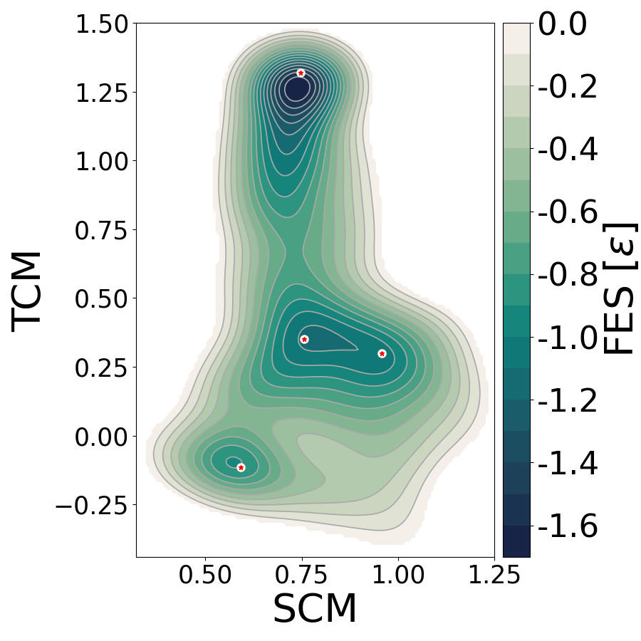

## Well-Tempered Metadynamics Simulation

The Well-Tempered Metadynamics method is an enhanced sampling method described in the [`Theory section`](theory.md#metadynamics). It adds external energy for pushing the system to explore different 
conformations. to avoid atom dissociation, we add a restraint to the system. This restriction consists of a 
semi-harmonic potential with the form

$$
V(d_i)= \begin{array}{ll}
          k (d_i - r_w)^2 & \text{if }d_i>2 \\
          0               & \text{otherwise}
       \end{array} ~,
$$

where $k$ is a constraint, in this case being 1000; $r_w$ is the location of
the constraint, that we choose to be 2 (in LJ dimensionless reduced units);
$d_i$ is the distance of each atom to the center of mass. Note that this 
potential does not do anything if the distance between the atom and the 
center of mass is lower than $r_w$, but if it 
is greater this potential begins to exert a force over the atoms and to avoid dissociation. This is defined with the keyword UPPER_WALLS in 
the plumed setup.

An example PLUMED file with the information of the constraints (also called walls) and the coordinates you want to bias can be found here ([plumedMTD-LJ.dat](https://github.com/Sucerquia/ASE-PLUMED_tutorial/blob/master/files/plumedMTD-LJ.dat)):


<div class="plumedpreheader">
<div class="headerInfo" id="value_details_data/MTD.md_working_1.dat"> Click on the labels of the actions for more information on what each action computes </div>
<div class="containerBadge">
<div class="headerBadge"><a href="MTD.md_working_1.dat.plumed.stderr"></a></div>
<div class="headerBadge"><a href="MTD.md_working_1.dat.plumed_master.stderr"></a></div>
</div>
</div>
<pre class="plumedlisting">
<span class="plumedtooltip" style="color:green">UNITS<span class="right">This command sets the internal units for the code. <a href="https://www.plumed.org/doc-master/user-doc/html/UNITS" style="color:green">More details</a><i></i></span></span> <span class="plumedtooltip">LENGTH<span class="right">the units of lengths<i></i></span></span>=A <span class="plumedtooltip">TIME<span class="right">the units of time<i></i></span></span>=0.0101805 <span class="plumedtooltip">ENERGY<span class="right">the units of energy<i></i></span></span>=96.4853329
<span style="display:none;" id="data/MTD.md_working_1.dat">The UNITS action with label <b></b> calculates something</span><span class="plumedtooltip" style="color:green">COM<span class="right">Calculate the center of mass for a group of atoms. <a href="https://www.plumed.org/doc-master/user-doc/html/COM" style="color:green">More details</a><i></i></span></span> <span class="plumedtooltip">ATOMS<span class="right">the list of atoms which are involved the virtual atom's definition<i></i></span></span>=1-7 <span class="plumedtooltip">LABEL<span class="right">a label for the action so that its output can be referenced in the input to other actions<i></i></span></span>=<b name="data/MTD.md_working_1.datcom" onclick='showPath("data/MTD.md_working_1.dat","data/MTD.md_working_1.datcom","data/MTD.md_working_1.datcom","violet")'>com</b><span style="display:none;" id="data/MTD.md_working_1.datcom">The COM action with label <b>com</b> calculates the following quantities:<table  align="center" frame="void" width="95%" cellpadding="5%"><tr><td width="5%"><b> Quantity </b>  </td><td width="5%"><b> Type </b>  </td><td><b> Description </b> </td></tr><tr><td width="5%">com</td><td width="5%"><font color="violet">atoms</font></td><td>virtual atom calculated by COM action</td></tr></table></span>
<span class="plumedtooltip" style="color:green">DISTANCE<span class="right">Calculate the distance/s between pairs of atoms. <a href="https://www.plumed.org/doc-master/user-doc/html/DISTANCE" style="color:green">More details</a><i></i></span></span> <span class="plumedtooltip">ATOMS<span class="right">the pair of atom that we are calculating the distance between<i></i></span></span>=1,<b name="data/MTD.md_working_1.datcom">com</b> <span class="plumedtooltip">LABEL<span class="right">a label for the action so that its output can be referenced in the input to other actions<i></i></span></span>=<b name="data/MTD.md_working_1.datd1" onclick='showPath("data/MTD.md_working_1.dat","data/MTD.md_working_1.datd1","data/MTD.md_working_1.datd1","black")'>d1</b><span style="display:none;" id="data/MTD.md_working_1.datd1">The DISTANCE action with label <b>d1</b> calculates the following quantities:<table  align="center" frame="void" width="95%" cellpadding="5%"><tr><td width="5%"><b> Quantity </b>  </td><td width="5%"><b> Type </b>  </td><td><b> Description </b> </td></tr><tr><td width="5%">d1</td><td width="5%"><font color="black">scalar</font></td><td>the DISTANCE between this pair of atoms</td></tr></table></span>
<span class="plumedtooltip" style="color:green">UPPER_WALLS<span class="right">Defines a wall for the value of one or more collective variables, <a href="https://www.plumed.org/doc-master/user-doc/html/UPPER_WALLS" style="color:green">More details</a><i></i></span></span> <span class="plumedtooltip">ARG<span class="right">the arguments on which the bias is acting<i></i></span></span>=<b name="data/MTD.md_working_1.datd1">d1</b> <span class="plumedtooltip">AT<span class="right">the positions of the wall<i></i></span></span>=2.0 <span class="plumedtooltip">KAPPA<span class="right">the force constant for the wall<i></i></span></span>=100.
<span class="plumedtooltip" style="color:green">DISTANCE<span class="right">Calculate the distance/s between pairs of atoms. <a href="https://www.plumed.org/doc-master/user-doc/html/DISTANCE" style="color:green">More details</a><i></i></span></span> <span class="plumedtooltip">ATOMS<span class="right">the pair of atom that we are calculating the distance between<i></i></span></span>=2,<b name="data/MTD.md_working_1.datcom">com</b> <span class="plumedtooltip">LABEL<span class="right">a label for the action so that its output can be referenced in the input to other actions<i></i></span></span>=<b name="data/MTD.md_working_1.datd2" onclick='showPath("data/MTD.md_working_1.dat","data/MTD.md_working_1.datd2","data/MTD.md_working_1.datd2","black")'>d2</b><span style="display:none;" id="data/MTD.md_working_1.datd2">The DISTANCE action with label <b>d2</b> calculates the following quantities:<table  align="center" frame="void" width="95%" cellpadding="5%"><tr><td width="5%"><b> Quantity </b>  </td><td width="5%"><b> Type </b>  </td><td><b> Description </b> </td></tr><tr><td width="5%">d2</td><td width="5%"><font color="black">scalar</font></td><td>the DISTANCE between this pair of atoms</td></tr></table></span>
<span class="plumedtooltip" style="color:green">UPPER_WALLS<span class="right">Defines a wall for the value of one or more collective variables, <a href="https://www.plumed.org/doc-master/user-doc/html/UPPER_WALLS" style="color:green">More details</a><i></i></span></span> <span class="plumedtooltip">ARG<span class="right">the arguments on which the bias is acting<i></i></span></span>=<b name="data/MTD.md_working_1.datd2">d2</b> <span class="plumedtooltip">AT<span class="right">the positions of the wall<i></i></span></span>=2.0 <span class="plumedtooltip">KAPPA<span class="right">the force constant for the wall<i></i></span></span>=100.
<span class="plumedtooltip" style="color:green">DISTANCE<span class="right">Calculate the distance/s between pairs of atoms. <a href="https://www.plumed.org/doc-master/user-doc/html/DISTANCE" style="color:green">More details</a><i></i></span></span> <span class="plumedtooltip">ATOMS<span class="right">the pair of atom that we are calculating the distance between<i></i></span></span>=3,<b name="data/MTD.md_working_1.datcom">com</b> <span class="plumedtooltip">LABEL<span class="right">a label for the action so that its output can be referenced in the input to other actions<i></i></span></span>=<b name="data/MTD.md_working_1.datd3" onclick='showPath("data/MTD.md_working_1.dat","data/MTD.md_working_1.datd3","data/MTD.md_working_1.datd3","black")'>d3</b><span style="display:none;" id="data/MTD.md_working_1.datd3">The DISTANCE action with label <b>d3</b> calculates the following quantities:<table  align="center" frame="void" width="95%" cellpadding="5%"><tr><td width="5%"><b> Quantity </b>  </td><td width="5%"><b> Type </b>  </td><td><b> Description </b> </td></tr><tr><td width="5%">d3</td><td width="5%"><font color="black">scalar</font></td><td>the DISTANCE between this pair of atoms</td></tr></table></span>
<span class="plumedtooltip" style="color:green">UPPER_WALLS<span class="right">Defines a wall for the value of one or more collective variables, <a href="https://www.plumed.org/doc-master/user-doc/html/UPPER_WALLS" style="color:green">More details</a><i></i></span></span> <span class="plumedtooltip">ARG<span class="right">the arguments on which the bias is acting<i></i></span></span>=<b name="data/MTD.md_working_1.datd3">d3</b> <span class="plumedtooltip">AT<span class="right">the positions of the wall<i></i></span></span>=2.0 <span class="plumedtooltip">KAPPA<span class="right">the force constant for the wall<i></i></span></span>=100.
<span class="plumedtooltip" style="color:green">DISTANCE<span class="right">Calculate the distance/s between pairs of atoms. <a href="https://www.plumed.org/doc-master/user-doc/html/DISTANCE" style="color:green">More details</a><i></i></span></span> <span class="plumedtooltip">ATOMS<span class="right">the pair of atom that we are calculating the distance between<i></i></span></span>=4,<b name="data/MTD.md_working_1.datcom">com</b> <span class="plumedtooltip">LABEL<span class="right">a label for the action so that its output can be referenced in the input to other actions<i></i></span></span>=<b name="data/MTD.md_working_1.datd4" onclick='showPath("data/MTD.md_working_1.dat","data/MTD.md_working_1.datd4","data/MTD.md_working_1.datd4","black")'>d4</b><span style="display:none;" id="data/MTD.md_working_1.datd4">The DISTANCE action with label <b>d4</b> calculates the following quantities:<table  align="center" frame="void" width="95%" cellpadding="5%"><tr><td width="5%"><b> Quantity </b>  </td><td width="5%"><b> Type </b>  </td><td><b> Description </b> </td></tr><tr><td width="5%">d4</td><td width="5%"><font color="black">scalar</font></td><td>the DISTANCE between this pair of atoms</td></tr></table></span>
<span class="plumedtooltip" style="color:green">UPPER_WALLS<span class="right">Defines a wall for the value of one or more collective variables, <a href="https://www.plumed.org/doc-master/user-doc/html/UPPER_WALLS" style="color:green">More details</a><i></i></span></span> <span class="plumedtooltip">ARG<span class="right">the arguments on which the bias is acting<i></i></span></span>=<b name="data/MTD.md_working_1.datd4">d4</b> <span class="plumedtooltip">AT<span class="right">the positions of the wall<i></i></span></span>=2.0 <span class="plumedtooltip">KAPPA<span class="right">the force constant for the wall<i></i></span></span>=100.
<span class="plumedtooltip" style="color:green">DISTANCE<span class="right">Calculate the distance/s between pairs of atoms. <a href="https://www.plumed.org/doc-master/user-doc/html/DISTANCE" style="color:green">More details</a><i></i></span></span> <span class="plumedtooltip">ATOMS<span class="right">the pair of atom that we are calculating the distance between<i></i></span></span>=5,<b name="data/MTD.md_working_1.datcom">com</b> <span class="plumedtooltip">LABEL<span class="right">a label for the action so that its output can be referenced in the input to other actions<i></i></span></span>=<b name="data/MTD.md_working_1.datd5" onclick='showPath("data/MTD.md_working_1.dat","data/MTD.md_working_1.datd5","data/MTD.md_working_1.datd5","black")'>d5</b><span style="display:none;" id="data/MTD.md_working_1.datd5">The DISTANCE action with label <b>d5</b> calculates the following quantities:<table  align="center" frame="void" width="95%" cellpadding="5%"><tr><td width="5%"><b> Quantity </b>  </td><td width="5%"><b> Type </b>  </td><td><b> Description </b> </td></tr><tr><td width="5%">d5</td><td width="5%"><font color="black">scalar</font></td><td>the DISTANCE between this pair of atoms</td></tr></table></span>
<span class="plumedtooltip" style="color:green">UPPER_WALLS<span class="right">Defines a wall for the value of one or more collective variables, <a href="https://www.plumed.org/doc-master/user-doc/html/UPPER_WALLS" style="color:green">More details</a><i></i></span></span> <span class="plumedtooltip">ARG<span class="right">the arguments on which the bias is acting<i></i></span></span>=<b name="data/MTD.md_working_1.datd5">d5</b> <span class="plumedtooltip">AT<span class="right">the positions of the wall<i></i></span></span>=2.0 <span class="plumedtooltip">KAPPA<span class="right">the force constant for the wall<i></i></span></span>=100.
<span class="plumedtooltip" style="color:green">DISTANCE<span class="right">Calculate the distance/s between pairs of atoms. <a href="https://www.plumed.org/doc-master/user-doc/html/DISTANCE" style="color:green">More details</a><i></i></span></span> <span class="plumedtooltip">ATOMS<span class="right">the pair of atom that we are calculating the distance between<i></i></span></span>=6,<b name="data/MTD.md_working_1.datcom">com</b> <span class="plumedtooltip">LABEL<span class="right">a label for the action so that its output can be referenced in the input to other actions<i></i></span></span>=<b name="data/MTD.md_working_1.datd6" onclick='showPath("data/MTD.md_working_1.dat","data/MTD.md_working_1.datd6","data/MTD.md_working_1.datd6","black")'>d6</b><span style="display:none;" id="data/MTD.md_working_1.datd6">The DISTANCE action with label <b>d6</b> calculates the following quantities:<table  align="center" frame="void" width="95%" cellpadding="5%"><tr><td width="5%"><b> Quantity </b>  </td><td width="5%"><b> Type </b>  </td><td><b> Description </b> </td></tr><tr><td width="5%">d6</td><td width="5%"><font color="black">scalar</font></td><td>the DISTANCE between this pair of atoms</td></tr></table></span>
<span class="plumedtooltip" style="color:green">UPPER_WALLS<span class="right">Defines a wall for the value of one or more collective variables, <a href="https://www.plumed.org/doc-master/user-doc/html/UPPER_WALLS" style="color:green">More details</a><i></i></span></span> <span class="plumedtooltip">ARG<span class="right">the arguments on which the bias is acting<i></i></span></span>=<b name="data/MTD.md_working_1.datd6">d6</b> <span class="plumedtooltip">AT<span class="right">the positions of the wall<i></i></span></span>=2.0 <span class="plumedtooltip">KAPPA<span class="right">the force constant for the wall<i></i></span></span>=100.
<span class="plumedtooltip" style="color:green">DISTANCE<span class="right">Calculate the distance/s between pairs of atoms. <a href="https://www.plumed.org/doc-master/user-doc/html/DISTANCE" style="color:green">More details</a><i></i></span></span> <span class="plumedtooltip">ATOMS<span class="right">the pair of atom that we are calculating the distance between<i></i></span></span>=7,<b name="data/MTD.md_working_1.datcom">com</b> <span class="plumedtooltip">LABEL<span class="right">a label for the action so that its output can be referenced in the input to other actions<i></i></span></span>=<b name="data/MTD.md_working_1.datd7" onclick='showPath("data/MTD.md_working_1.dat","data/MTD.md_working_1.datd7","data/MTD.md_working_1.datd7","black")'>d7</b><span style="display:none;" id="data/MTD.md_working_1.datd7">The DISTANCE action with label <b>d7</b> calculates the following quantities:<table  align="center" frame="void" width="95%" cellpadding="5%"><tr><td width="5%"><b> Quantity </b>  </td><td width="5%"><b> Type </b>  </td><td><b> Description </b> </td></tr><tr><td width="5%">d7</td><td width="5%"><font color="black">scalar</font></td><td>the DISTANCE between this pair of atoms</td></tr></table></span>
<span class="plumedtooltip" style="color:green">UPPER_WALLS<span class="right">Defines a wall for the value of one or more collective variables, <a href="https://www.plumed.org/doc-master/user-doc/html/UPPER_WALLS" style="color:green">More details</a><i></i></span></span> <span class="plumedtooltip">ARG<span class="right">the arguments on which the bias is acting<i></i></span></span>=<b name="data/MTD.md_working_1.datd7">d7</b> <span class="plumedtooltip">AT<span class="right">the positions of the wall<i></i></span></span>=2.0 <span class="plumedtooltip">KAPPA<span class="right">the force constant for the wall<i></i></span></span>=100.
<span id="data/MTD.md_working_1.datc1_short"><b name="data/MTD.md_working_1.datc1" onclick='showPath("data/MTD.md_working_1.dat","data/MTD.md_working_1.datc1","data/MTD.md_working_1.datc1_shortcut","blue")'>c1</b><span style="display:none;" id="data/MTD.md_working_1.datc1_shortcut">The COORDINATIONNUMBER action with label <b>c1</b> calculates the following quantities:<table  align="center" frame="void" width="95%" cellpadding="5%"><tr><td width="5%"><b> Quantity </b>  </td><td width="5%"><b> Type </b>  </td><td><b> Description </b> </td></tr><tr><td width="5%">c1</td><td width="5%"><font color="blue">vector</font></td><td>the coordination numbers of the specified atoms</td></tr></table></span>: <span class="plumedtooltip" style="color:green">COORDINATIONNUMBER<span class="right">Calculate the coordination numbers of atoms so that you can then calculate functions of the distribution of This action is <a class="toggler" href='javascript:;' onclick='toggleDisplay("data/MTD.md_working_1.datc1");'>a shortcut</a>. <a href="https://www.plumed.org/doc-master/user-doc/html/COORDINATIONNUMBER">More details</a><i></i></span></span> <span class="plumedtooltip">SPECIES<span class="right">the list of atoms for which the symmetry function is being calculated and the atoms that can be in the environments<i></i></span></span>=1-7 <span class="plumedtooltip">MOMENTS<span class="right">the list of moments that you would like to calculate<i></i></span></span>=2-3 <span class="plumedtooltip">SWITCH<span class="right">the switching function that it used in the construction of the contact matrix. Options for this keyword are explained in the documentation for <a href="https://www.plumed.org/doc-master/user-doc/html/LESS_THAN">LESS_THAN</a>.<i></i></span></span>={RATIONAL R_0=1.5 NN=8 MM=16}
</span><span id="data/MTD.md_working_1.datc1_long" style="display:none;"><span style="color:blue" class="comment"># PLUMED interprets the command:
</span><span class="toggler" style="color:red" onclick='toggleDisplay("data/MTD.md_working_1.datc1")'># c1: COORDINATIONNUMBER SPECIES=1-7 MOMENTS=2-3 SWITCH={RATIONAL R_0=1.5 NN=8 MM=16}</span>
<span style="color:blue" class="comment"># as follows (Click the red comment above to revert to the short version of the input):</span>
<b name="data/MTD.md_working_1.datc1_grp" onclick='showPath("data/MTD.md_working_1.dat","data/MTD.md_working_1.datc1_grp","data/MTD.md_working_1.datc1_grp","violet")'>c1_grp</b><span style="display:none;" id="data/MTD.md_working_1.datc1_grp">The GROUP action with label <b>c1_grp</b> calculates the following quantities:<table  align="center" frame="void" width="95%" cellpadding="5%"><tr><td width="5%"><b> Quantity </b>  </td><td width="5%"><b> Type </b>  </td><td><b> Description </b> </td></tr><tr><td width="5%">c1_grp</td><td width="5%"><font color="violet">atoms</font></td><td>indices of atoms specified in GROUP</td></tr></table></span>: <span class="plumedtooltip" style="color:green">GROUP<span class="right">Define a group of atoms so that a particular list of atoms can be referenced with a single label in definitions of CVs or virtual atoms. <a href="https://www.plumed.org/doc-master/user-doc/html/GROUP" style="color:green">More details</a><i></i></span></span> <span class="plumedtooltip">ATOMS<span class="right">the numerical indexes for the set of atoms in the group<i></i></span></span>=1-7
<b name="data/MTD.md_working_1.datc1_mat" onclick='showPath("data/MTD.md_working_1.dat","data/MTD.md_working_1.datc1_mat","data/MTD.md_working_1.datc1_mat","red")'>c1_mat</b><span style="display:none;" id="data/MTD.md_working_1.datc1_mat">The CONTACT_MATRIX action with label <b>c1_mat</b> calculates the following quantities:<table  align="center" frame="void" width="95%" cellpadding="5%"><tr><td width="5%"><b> Quantity </b>  </td><td width="5%"><b> Type </b>  </td><td><b> Description </b> </td></tr><tr><td width="5%">c1_mat</td><td width="5%"><font color="red">matrix</font></td><td>a matrix containing the weights for the bonds between each pair of atoms</td></tr></table></span>: <span class="plumedtooltip" style="color:green">CONTACT_MATRIX<span class="right">Adjacency matrix in which two atoms are adjacent if they are within a certain cutoff. <a href="https://www.plumed.org/doc-master/user-doc/html/CONTACT_MATRIX" style="color:green">More details</a><i></i></span></span> <span class="plumedtooltip">GROUP<span class="right">specifies the list of atoms that should be assumed indistinguishable<i></i></span></span>=1-7 <span class="plumedtooltip">SWITCH<span class="right">the input for the switching function that acts upon the distance between each pair of atoms. Options for this keyword are explained in the documentation for <a href="https://www.plumed.org/doc-master/user-doc/html/LESS_THAN">LESS_THAN</a>.<i></i></span></span>={RATIONAL R_0=1.5 NN=8 MM=16}
<b name="data/MTD.md_working_1.datc1_ones" onclick='showPath("data/MTD.md_working_1.dat","data/MTD.md_working_1.datc1_ones","data/MTD.md_working_1.datc1_ones","blue")'>c1_ones</b><span style="display:none;" id="data/MTD.md_working_1.datc1_ones">The CONSTANT action with label <b>c1_ones</b> calculates the following quantities:<table  align="center" frame="void" width="95%" cellpadding="5%"><tr><td width="5%"><b> Quantity </b>  </td><td width="5%"><b> Type </b>  </td><td><b> Description </b> </td></tr><tr><td width="5%">c1_ones</td><td width="5%"><font color="blue">vector</font></td><td>the constant value that was read from the plumed input</td></tr></table></span>: <span class="plumedtooltip" style="color:green">ONES<span class="right">Create a constant vector with all elements equal to one <a href="https://www.plumed.org/doc-master/user-doc/html/ONES" style="color:green">More details</a><i></i></span></span> <span class="plumedtooltip">SIZE<span class="right">the number of ones that you would like to create<i></i></span></span>=7
<b name="data/MTD.md_working_1.datc1" onclick='showPath("data/MTD.md_working_1.dat","data/MTD.md_working_1.datc1","data/MTD.md_working_1.datc1","blue")'>c1</b><span style="display:none;" id="data/MTD.md_working_1.datc1">The MATRIX_VECTOR_PRODUCT action with label <b>c1</b> calculates the following quantities:<table  align="center" frame="void" width="95%" cellpadding="5%"><tr><td width="5%"><b> Quantity </b>  </td><td width="5%"><b> Type </b>  </td><td><b> Description </b> </td></tr><tr><td width="5%">c1</td><td width="5%"><font color="blue">vector</font></td><td>the vector that is obtained by taking the product between the matrix and the vector that were input</td></tr></table></span>: <span class="plumedtooltip" style="color:green">MATRIX_VECTOR_PRODUCT<span class="right">Calculate the product of the matrix and the vector <a href="https://www.plumed.org/doc-master/user-doc/html/MATRIX_VECTOR_PRODUCT" style="color:green">More details</a><i></i></span></span>  <span class="plumedtooltip">ARG<span class="right">the label for the matrix and the vector/scalar that are being multiplied<i></i></span></span>=<b name="data/MTD.md_working_1.datc1_mat">c1_mat</b>,<b name="data/MTD.md_working_1.datc1_ones">c1_ones</b>
<b name="data/MTD.md_working_1.datc1_caverage" onclick='showPath("data/MTD.md_working_1.dat","data/MTD.md_working_1.datc1_caverage","data/MTD.md_working_1.datc1_caverage","black")'>c1_caverage</b><span style="display:none;" id="data/MTD.md_working_1.datc1_caverage">The MEAN action with label <b>c1_caverage</b> calculates the following quantities:<table  align="center" frame="void" width="95%" cellpadding="5%"><tr><td width="5%"><b> Quantity </b>  </td><td width="5%"><b> Type </b>  </td><td><b> Description </b> </td></tr><tr><td width="5%">c1_caverage</td><td width="5%"><font color="black">scalar</font></td><td>the MEAN of the elements in the input value</td></tr></table></span>: <span class="plumedtooltip" style="color:green">MEAN<span class="right">Calculate the arithmetic mean of the elements in a vector <a href="https://www.plumed.org/doc-master/user-doc/html/MEAN" style="color:green">More details</a><i></i></span></span> <span class="plumedtooltip">ARG<span class="right">the vector/matrix/grid whose elements shuld be added together<i></i></span></span>=<b name="data/MTD.md_working_1.datc1">c1</b> <span class="plumedtooltip">PERIODIC<span class="right">if the output of your function is periodic then you should specify the periodicity of the function<i></i></span></span>=NO
<b name="data/MTD.md_working_1.datc1_diffpow-2" onclick='showPath("data/MTD.md_working_1.dat","data/MTD.md_working_1.datc1_diffpow-2","data/MTD.md_working_1.datc1_diffpow-2","blue")'>c1_diffpow-2</b><span style="display:none;" id="data/MTD.md_working_1.datc1_diffpow-2">The CUSTOM action with label <b>c1_diffpow-2</b> calculates the following quantities:<table  align="center" frame="void" width="95%" cellpadding="5%"><tr><td width="5%"><b> Quantity </b>  </td><td width="5%"><b> Type </b>  </td><td><b> Description </b> </td></tr><tr><td width="5%">c1_diffpow-2</td><td width="5%"><font color="blue">vector</font></td><td>the vector obtained by doing an element-wise application of an arbitrary function to the input vectors</td></tr></table></span>: <span class="plumedtooltip" style="color:green">CUSTOM<span class="right">Calculate a combination of variables using a custom expression. <a href="https://www.plumed.org/doc-master/user-doc/html/CUSTOM" style="color:green">More details</a><i></i></span></span> <span class="plumedtooltip">ARG<span class="right">the values input to this function<i></i></span></span>=<b name="data/MTD.md_working_1.datc1">c1</b>,<b name="data/MTD.md_working_1.datc1_caverage">c1_caverage</b> <span class="plumedtooltip">PERIODIC<span class="right">if the output of your function is periodic then you should specify the periodicity of the function<i></i></span></span>=NO <span class="plumedtooltip">FUNC<span class="right">the function you wish to evaluate<i></i></span></span>=(x-y)^2
<b name="data/MTD.md_working_1.datc1_moment-2" onclick='showPath("data/MTD.md_working_1.dat","data/MTD.md_working_1.datc1_moment-2","data/MTD.md_working_1.datc1_moment-2","black")'>c1_moment-2</b><span style="display:none;" id="data/MTD.md_working_1.datc1_moment-2">The MEAN action with label <b>c1_moment-2</b> calculates the following quantities:<table  align="center" frame="void" width="95%" cellpadding="5%"><tr><td width="5%"><b> Quantity </b>  </td><td width="5%"><b> Type </b>  </td><td><b> Description </b> </td></tr><tr><td width="5%">c1_moment-2</td><td width="5%"><font color="black">scalar</font></td><td>the MEAN of the elements in the input value</td></tr></table></span>: <span class="plumedtooltip" style="color:green">MEAN<span class="right">Calculate the arithmetic mean of the elements in a vector <a href="https://www.plumed.org/doc-master/user-doc/html/MEAN" style="color:green">More details</a><i></i></span></span> <span class="plumedtooltip">ARG<span class="right">the vector/matrix/grid whose elements shuld be added together<i></i></span></span>=<b name="data/MTD.md_working_1.datc1_diffpow-2">c1_diffpow-2</b> <span class="plumedtooltip">PERIODIC<span class="right">if the output of your function is periodic then you should specify the periodicity of the function<i></i></span></span>=NO
<b name="data/MTD.md_working_1.datc1_diffpow-3" onclick='showPath("data/MTD.md_working_1.dat","data/MTD.md_working_1.datc1_diffpow-3","data/MTD.md_working_1.datc1_diffpow-3","blue")'>c1_diffpow-3</b><span style="display:none;" id="data/MTD.md_working_1.datc1_diffpow-3">The CUSTOM action with label <b>c1_diffpow-3</b> calculates the following quantities:<table  align="center" frame="void" width="95%" cellpadding="5%"><tr><td width="5%"><b> Quantity </b>  </td><td width="5%"><b> Type </b>  </td><td><b> Description </b> </td></tr><tr><td width="5%">c1_diffpow-3</td><td width="5%"><font color="blue">vector</font></td><td>the vector obtained by doing an element-wise application of an arbitrary function to the input vectors</td></tr></table></span>: <span class="plumedtooltip" style="color:green">CUSTOM<span class="right">Calculate a combination of variables using a custom expression. <a href="https://www.plumed.org/doc-master/user-doc/html/CUSTOM" style="color:green">More details</a><i></i></span></span> <span class="plumedtooltip">ARG<span class="right">the values input to this function<i></i></span></span>=<b name="data/MTD.md_working_1.datc1">c1</b>,<b name="data/MTD.md_working_1.datc1_caverage">c1_caverage</b> <span class="plumedtooltip">PERIODIC<span class="right">if the output of your function is periodic then you should specify the periodicity of the function<i></i></span></span>=NO <span class="plumedtooltip">FUNC<span class="right">the function you wish to evaluate<i></i></span></span>=(x-y)^3
<b name="data/MTD.md_working_1.datc1_moment-3" onclick='showPath("data/MTD.md_working_1.dat","data/MTD.md_working_1.datc1_moment-3","data/MTD.md_working_1.datc1_moment-3","black")'>c1_moment-3</b><span style="display:none;" id="data/MTD.md_working_1.datc1_moment-3">The MEAN action with label <b>c1_moment-3</b> calculates the following quantities:<table  align="center" frame="void" width="95%" cellpadding="5%"><tr><td width="5%"><b> Quantity </b>  </td><td width="5%"><b> Type </b>  </td><td><b> Description </b> </td></tr><tr><td width="5%">c1_moment-3</td><td width="5%"><font color="black">scalar</font></td><td>the MEAN of the elements in the input value</td></tr></table></span>: <span class="plumedtooltip" style="color:green">MEAN<span class="right">Calculate the arithmetic mean of the elements in a vector <a href="https://www.plumed.org/doc-master/user-doc/html/MEAN" style="color:green">More details</a><i></i></span></span> <span class="plumedtooltip">ARG<span class="right">the vector/matrix/grid whose elements shuld be added together<i></i></span></span>=<b name="data/MTD.md_working_1.datc1_diffpow-3">c1_diffpow-3</b> <span class="plumedtooltip">PERIODIC<span class="right">if the output of your function is periodic then you should specify the periodicity of the function<i></i></span></span>=NO
<span style="color:blue"># --- End of included input --- </span></span><span class="plumedtooltip" style="color:green">METAD<span class="right">Used to performed metadynamics on one or more collective variables. <a href="https://www.plumed.org/doc-master/user-doc/html/METAD" style="color:green">More details</a><i></i></span></span> <span class="plumedtooltip">ARG<span class="right">the labels of the scalars on which the bias will act<i></i></span></span>=<b name="data/MTD.md_working_1.datc1">c1.*</b> <span class="plumedtooltip">HEIGHT<span class="right">the heights of the Gaussian hills<i></i></span></span>=0.05 <span class="plumedtooltip">PACE<span class="right">the frequency for hill addition<i></i></span></span>=500 <span class="plumedtooltip">SIGMA<span class="right">the widths of the Gaussian hills<i></i></span></span>=0.1,0.1 <span class="plumedtooltip">GRID_MIN<span class="right">the lower bounds for the grid<i></i></span></span>=-1.5,-1.5 <span class="plumedtooltip">GRID_MAX<span class="right">the upper bounds for the grid<i></i></span></span>=2.5,2.5 <span class="plumedtooltip">GRID_BIN<span class="right">the number of bins for the grid<i></i></span></span>=500,500 <span class="plumedtooltip">BIASFACTOR<span class="right">use well tempered metadynamics and use this bias factor<i></i></span></span>=5 <span class="plumedtooltip">FILE<span class="right"> a file in which the list of added hills is stored<i></i></span></span>=HILLS
</pre>
  

The Well-Tempered Metadynamics simulation can be run using the code 
[`MTD.py`](https://github.com/Sucerquia/ASE-PLUMED_tutorial/blob/master/files/MTD.py):

```python
from ase.calculators.lj import LennardJones
from ase.calculators.plumed import Plumed
from ase.constraints import FixedPlane
from ase.md.langevin import Langevin
from ase.io import read
from ase import units

timestep = 0.005
ps = 1000 * units.fs

setup = open("plumedMTD-LJ.dat", "r").read().splitlines()

atoms = read('isomerLJ.xyz')
cons = [FixedPlane(i, [0, 0, 1]) for i in range(7)]
atoms.set_constraint(cons)
atoms.set_masses([1, 1, 1, 1, 1, 1, 1])

atoms.calc = Plumed(calc=LennardJones(rc=3., r0=2.5, smooth=True),
                    input=setup,
                    timestep=timestep,
                    atoms=atoms,
                    kT=0.1)

dyn = Langevin(atoms, timestep, temperature_K=0.1/units.kB, friction=1,
               fixcm=False, trajectory='MTD.traj')

dyn.run(500000)
```

Note that Well-Tempered Metadynamics requires the value of the temperature 
according to [equation (2)](theory.md#hills) . Then, it is necessary to define the 
kT argument of the calculator. SIGMA and PACE are the 
standard deviation of the Gaussians and the deposition interval in terms of 
the number of steps ($\tau$ in [equation (1)](theory.md#bias)), respectively. HEIGHT and 
BIASFACTOR are the maximum height of the Gaussians (W) and the $\gamma$ factor 
of [equation (2)](theory.md#hills), respectively.

In this case, the Lennard-Jones calculator computes the forces between atoms,
namely, ${\bf F}_i$ forces in [equation (3)](theory.md#force). 
Likewise, you can use any preferred ASE calculator in place of the LJ calculator used here.

When one runs a metadynamics simulation, Plumed generates an output file called HILLS 
that contains the information of the deposited Gaussians. You can reconstruct 
the free energy by yourself or can use the plumed tool 
[sum_hills](https://www.plumed.org/doc-v2.7/user-doc/html/sum_hills.html). 
The simplest way of using it is:

```
$ plumed sum_hills --hills HILLS
```
After this, Plumed creates a fes.dat file with the free energy surface (FES) reconstructed. The 
FES of this example is plotted using [plotterFES.py](https://github.com/Sucerquia/ASE-PLUMED_tutorial/blob/master/files/plotterFES.py):

<div align="center">
  
</div>

**Figure 3.** Free energy surface (LJ units) in the space of the collective
variables second and third central moment. Orange stars represent the location of
the local minima isomers of the LJ cluster in this space.

Note that bias is added over all states, meaning that the system
jumped from one state to another and gave a complete reconstruction of the
free energy surface.

##### [&larr; Unbiased simulation and Postprocessing](MD.md)
##### [Restart a simulation &rarr;](restart.md)
##### [Ab-initio: Small Silver Cluster &rarr;](SC.md)
