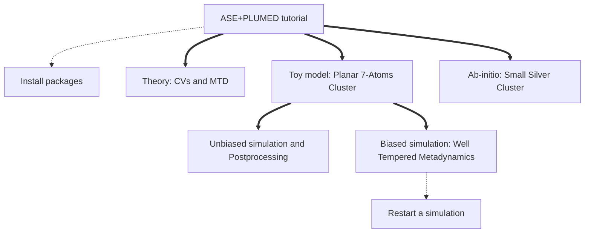
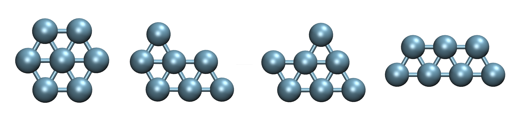
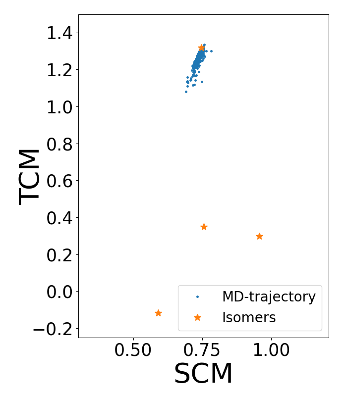
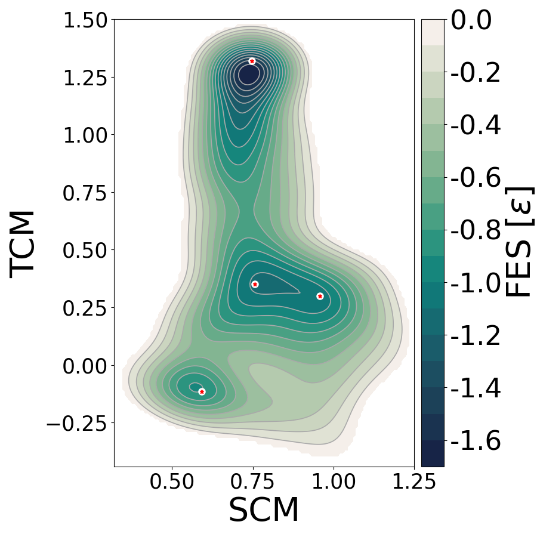
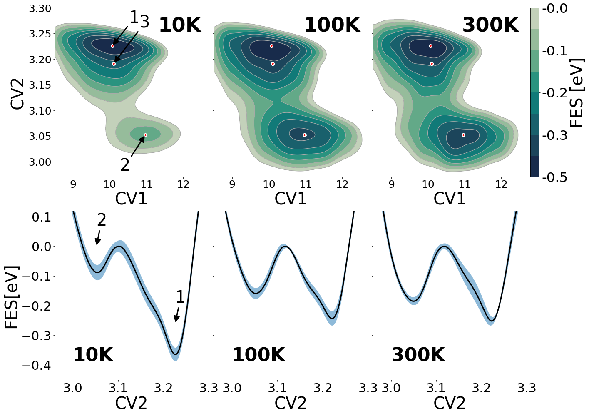

# ASE-PLUMED Calculator Tutorial
### Tutorial about the calculator presented in the paper: https://doi.org/10.1063/5.0082332
by Daniel Sucerquia, Pilar Cossio and Olga Lopez-Acevedo. March, 2022

This tutorial shows how to use the [plumed calculator](https://wiki.fysik.dtu.dk/ase/ase/calculators/plumed.html)
of [ASE](https://wiki.fysik.dtu.dk/ase/). As a proof-of-concept, we use a toy model to compute
some collective variables on-the-fly during a Molecular Dynamics
simulation (MD) and by post-processing a trajectory. From this first simulation it is clear that
simple MD is not enough to complete an exploration of the free energy landscape and it is necessary to
apply Well-Tempered Metadynamics. Finally, we show how
to reconstruct the free energy surface of a small cluster of silver atoms using Ab-initio Molecular
Dynamics.

The Atomic Simulation Environment, [ASE](https://wiki.fysik.dtu.dk/ase/), is a package that allows to set up,
run and visualize atomistic simulations. It is interfaced with some [other codes](https://wiki.fysik.dtu.dk/ase/#supported-calculators),
which use quantum or classical methods. In other words, this tutorial shows how to connect PLUMED to
all the other codes interfaced in ASE.

Plumed, in the other hand, allows several actions besides of what we show here. For further description of plumed details, visit [plumed web page](http://www.plumed.org/doc). The usage of other tools of Plumed with ASE is absolutely analogous to what is explain here.

This tutorial begins with a brief explanation of [basic ideas about metadynamics](#theory). Then, we use a toy model to show how to compute collective variables on-the-fly in an [MD simulation](#planar-7-atoms-cluster). We obtain again the last results, but from the trajectory using postprocesing. Finally, we implement [Well-Tempered Metadynamics](#well-tempered-metadynamics-simulation) to reconstruct the free energy surface of the toy model after a complete exploration of the configuration landscape. All the files required to complete this tutorial are [publicly available](https://github.com/Sucerquia/ASE-PLUMED_tutorial/blob/master/files).

**CONTENT**
- [Theory](#theory)
  - [Collective Variables](#collective-variables)
  - [Metadynamics](#metadynamics)
- [Planar 7-Atoms Cluster](#planar-7-atoms-cluster)
  - [Molecular Dynamics Simulation](#molecular-dynamics-simulation)
    - [Post Processing Analysis](#post-processing-analysis)
  - [Well-Tempered Metadynamics Simulation](#well-tempered-metadynamics-simulation)
- [Restart Note](#restart-note)
- [Ab-initio: Small Silver Cluster](#ab-initio-small-silver-cluster)
  - [Collective variables](#collective-variables-1)
  - [Running the Simulation](#running-the-simulation)




| **WARNING** |
| ---         |
| In order to complete this tutorial you have to install [py-plumed](https://www.plumed.org/doc-v2.8/user-doc/html/_installation.html#installingpython) and version of [ASE](https://gitlab.com/ase/ase) >= 3.23.0. For further details, check [installation instructions](https://github.com/Sucerquia/ASE-PLUMED_tutorial/blob/master/install.md).|

# Theory

## Collective Variables

In most of cases, it is impossible to extract clear information about 
a system of interest by monitoring the cartesian coordinates of all atoms directly, 
even more if our system contains many atoms. Instead, it
is possible to make the monitoring simpler by defining functions of those 
coordinates that describe the chemical properties that we are interested in. 
Those functions are called Collective Variables (CVs) and allow biasing 
specific degrees of freedom or analyzing how those properties evolve. Plumed 
has numerous CVs already implemented that can be used with ASE. For a 
complete explanation of CVs implemented in Plumed, 
[go to this link](https://www.plumed.org/doc-v2.8/user-doc/html/colvarintro.html).

## Metadynamics

[Metadynamics](https://www.nature.com/articles/s42254-020-0153-0) is an enhanced sampling method 
that allows exploring the configuration landscape by adding cumulative bias in 
terms of some CVs. This bias is added each $\tau$ time lapse and usually its 
shape is Gaussian. In time t, the accumulated bias is
defined as

<a name="bias"></a>
```math
(1)
```
```math
V_{B}({\mathbf{s}}, t) = \sum_{t'=\tau, 2\tau,...}^{t' < t}W(\mathbf{s}, t') 
                            \hspace{0.1cm}
                            exp\left({-\sum_i\frac{[s_i\hspace{0.1cm} - 
                            \hspace{0.1cm}
                            s_i(t')]^2}{2\sigma_i}}\right) ~,
```

where $\mathbf{s}$ is a set of collective variables, $\sigma_i$ is the width of the 
Gaussian related with the i-th collective variable, and *W(s, t')* is the height 
of the Gaussian in time *t'*. In simple metadynamics, *W(s, t')* is a constant, 
but in Well-Tempered Metadynamics, the height of the Gaussians is lower where 
previous bias was added. This reduction of height of the new Gaussians decreases 
the error and avoids exploration towards high free energy states that are 
thermodynamically irrelevant. The height in time t' for Well-Tempered 
Metadynamics is 

<a name="hills"></a>
```math
(2)
```
```math
W(\mathbf{s}, t')  = W exp\left({-\frac{\beta \hspace{0.1cm} V_B({\bf s}, 
                  \hspace{0.1cm}t')}{\gamma}}\right) ~,
```

with $W$ the maximum height of the Gaussians, $\beta$ the inverse of
the thermal energy ($1/k_BT$) and $\gamma$ a bias factor greater than
one that regulates how fast the height of the bias decreases: the higher the 
bias factor, the slower is the decreasing of the heights. Note that when 
$\gamma$ approaches infinity, this equation becomes constant and simple 
metadynamics is recovered. On contrast, when $\gamma$ approaches zero, no bias is
added, which is the case of Molecular Dynamics.

The addition of the bias potential produces an extra force in each atom, such that
the resultant force for the i-th atom is

<a name="force"></a>
```math
(3)
```
```math
{\bf F^B}_i = {\bf F}_i - \frac{\partial {\bf s}}{\partial {\bf R}_i} 
                   \frac{\partial V_B({\bf s}, t)}{\partial {\bf s}} ~,
```

where ${\bf F}_i$ is the natural unbiased force, $R_i$ is the coordinate of the atom, and the second term 
is the additional force due to the added bias.

Part of the power of metadynamics is that it can be used for exploring 
conformations. Moreover, the accumulated bias converges to the free energy surface 
($F({\bf s})$),

```math
(4)
```
```math
\lim_{t\rightarrow \infty} V_B ({\bf{s}}, t) = -\frac{(\gamma -1)}
                                               {\gamma} F({\bf s})~.
```

# Planar 7-Atoms Cluster

Let's consider a simple system formed by seven atoms with Lennard-Jones (LJ) 
interactions in a planar space. This simple model is presented in the 
[Plumed Masterclass 21.2](https://www.plumed.org/doc-v2.7/user-doc/html/masterclass-21-2.html#masterclass-21-2-ex-9).
This LJ cluster has several stable isomers (Figure 1), which can be 
distinguished in a space of the CVs second (SCM) and third (TCM) central 
moments of the distribution of coordinations (orange stars in Figure 2).

<div align="center">
  
</div>

**Figure 1.** Local minima isomers of the LJ cluster used in this tutotrial.

The n-th central moment, $\mu_n$, of the coordination number of an N-atoms
cluster is defined as

```math
(5)
```
```math
{\mu_n} = \frac{1}{N} \sum_{i=1}^{N} \left( {X}_{i} - 
                \left< {X} \right> \right)^n ~,
```

where $\left< {X} \right>$ is the mean value of $X_i$, which is the
coordination of the i-th atom,

```math
(6)
```
```math
X_i= \sum_{i\ne j}\frac{1-(r_{ij}/d)^8}{1-(r_{ij}/d)^{16}} ~,
```

with $r_{ij}$ the distance between atoms $i$ and $j$, and $d$ a reference 
parameter. For this example, d is fixed to 1.5 $\sigma$, in LJ units.

## Molecular Dynamics Simulation

For showing that is necessary to use an enhanced sampling method,
let's start with a Langevin simulation without bias. In LJ dimensionless 
reduced units (assuming $\epsilon$ = 1 eV, $\sigma$ = 1 $\textrm Å$ and 
m = 1 a.m.u), the parameters of the simulation are  $k_\text{B}T=0.1$, 
friction coefficient fixed equal to 1 and a time step of 0.005.

It is supposed that the system should explore all the space of configurations 
due to thermal fluctuations. However, we can see that the system remains in the 
same state, even when we sample for a long time lapse. That is because a 
complete exploration of the configuration 
space could take more time than the possible to simulate. Figure 2 -blue 
dots- shows the trajectory obtained from the following unbiased 
Molecular dynamics script [`MD.py`](https://github.com/Sucerquia/ASE-PLUMED_tutorial/blob/master/files/MD.py):

```python
from ase.calculators.lj import LennardJones
from ase.calculators.plumed import Plumed
from ase.constraints import FixedPlane
from ase.md.langevin import Langevin
from ase.io import read
from ase import units


timestep = 0.005
ps = 1000 * units.fs

setup = [f"UNITS LENGTH=A TIME={1/ps} ENERGY={units.mol/units.kJ}",
         "c1: COORDINATIONNUMBER SPECIES=1-7 MOMENTS=2-3" +
         " SWITCH={RATIONAL R_0=1.5 NN=8 MM=16}",
         "PRINT ARG=c1.* STRIDE=100 FILE=COLVAR",
         "FLUSH STRIDE=1000"]

atoms = read('isomer.xyz')
# Constraint to keep the system in a plane
cons = [FixedPlane(i, [0, 0, 1]) for i in range(7)]
atoms.set_constraint(cons)
atoms.set_masses([1, 1, 1, 1, 1, 1, 1])

atoms.calc = Plumed(calc=LennardJones(rc=2.5, r0=3.),
                    input=setup,
                    timestep=timestep,
                    atoms=atoms,
                    kT=0.1)

dyn = Langevin(atoms, timestep, temperature_K=0.1/units.kB, friction=1,
               fixcm=False, trajectory='UnbiasMD.xyz')

dyn.run(100000)

```

This simulation starts from the configuration of minimum energy, whose 
coordinates are imported from [`isomer.xyz`](https://github.com/Sucerquia/ASE-PLUMED_tutorial/blob/master/files/isomer.xyz).
As you can see in Figure 2, the 
system remains moving around that state; it does not jump to the other 
isomers. This means we do not obtain a complete sampling of possible 
configurations as mentioned before. Then, it is necessary  to use an enhanced
sampling method as an alternative to observe transitions to other configurations.
In this tutorial, we implement Well-Tempered Metadynamics.
 
 **NOTE**  
If you want to use a set up from a typical plumed file ([`plumedLJ.dat`](https://github.com/Sucerquia/ASE-PLUMED_tutorial/blob/master/files/plumedLJ.dat), for this example) to set up the plumed actions, you can replace the `setup` variable assignament in the previous code for:

```python
setup = open("plumedLJ.dat", "r").read().splitlines()
```

| **WARNING** |
| ---         |
| Note that in the plumed set-up, there is a line with the keyword UNITS, which is necessary because all parameters in the plumed set-up and output files are assumed to be in plumed internal units. Then, this line is important to mantain the units of all plumed parameters and outputs in ASE units. You can ignore this line if you are aware of the units  conversion.   |


### Post Processing Analysis

If you have the trajectory of an MD simulation and you want to compute a set of 
CVs of that trajectory, you can reconstruct the plumed files without running 
again all the simulation. As an example, let's use the trajectory created in 
the last code for rewriting the COLVAR file with the code [`postpro.py`](https://github.com/Sucerquia/ASE-PLUMED_tutorial/blob/master/files/postpro.py):

```python
from ase.calculators.idealgas import IdealGas
from ase.calculators.plumed import Plumed
from ase.io import read
from ase import units


traj = read('UnbiasMD.xyz', index=':')

atoms = traj[0]

timestep = 0.005
ps = 1000 * units.fs
setup = [f"UNITS LENGTH=A TIME={1/ps} ENERGY={units.mol/units.kJ}",
         "c1: COORDINATIONNUMBER SPECIES=1-7 MOMENTS=2-3" +
         " SWITCH={RATIONAL R_0=1.5 NN=8 MM=16}",
         "PRINT ARG=c1.* STRIDE=100 FILE=COLVAR",
         "FLUSH STRIDE=1000"]

calc = Plumed(calc=IdealGas(),
              input=setup,
              timestep=timestep,
              atoms=atoms,
              kT=0.1)

calc.write_plumed_files(traj)
```

This code, as well as the previous one, generates a file called COLVAR with 
the value of the CVs. All plumed files begin with a head that describes the 
fields that it contains. In this case, the heading looks like:

```
$ head -n 2 COLVAR
#! FIELDS time c1.moment-2 c1.moment-3
0.000000 0.757954 1.335796
```

As you can see, the first column corresponds to the time, the second one is the 
second central moment (SCM) and the third column is the third central moment 
(TCM). When we plot this trajectory in the space of this CVs (that is, the 
second and third columns) we obtain this result:

<div align="center">
  
</div>

**Figure 2.** Unbiased MD trajectory (blue dots) in the space of the collective
variables second and third central moment. Orange stars represent the location of
the local minima isomers of the LJ cluster in this space.

Note that the system remains confined in the same stable state. That means, for this
case, MD is not enough for exploring all possible configurations and obtaining 
a statistical study of the possible configurations of the system -at least in the 
simulated time scale-. Therefore, an alternative is to use an enhanced sampling 
method. In this case, we implement Well-Tempered Metadynamics for 
reconstructing the Free Energy Surface (FES).

## Well-Tempered Metadynamics Simulation

Well-Tempered Metadynamics method is described in the [`Theory section`](#metadynamics). It 
basically adds external energy for pushing the system to explore different 
conformations. This makes necessary to add a restrain to avoid that the extra 
energy dissolves the atoms in vacuum. This restriction consists in a 
semi-harmonic potential with the form

```math
V(d_i)=\left\{
          \begin{array}{ll}
              k (d_i - r_w)^2 & \text{if }d_i>2 \\
              0               & \text{otherwise}
          \end{array}
          \right. ~,
```

where $k$ is a constraint, in this case being 1000; $r_w$ is the location of
the constraint, that we choose to be 2 (in LJ dimensionless reduced units);
$d_i$ is the distance of each atom to the center of mass. Note that this 
potential does not do anything whereas the distance between the atom and the 
center of mass is lower than $r_w$, but if it 
is greater (trying to escape), this potential begins to work and send it back 
to be close the other atoms. This is defined with the keyword UPPER_WALLS in 
the plumed set up.

Well-Tempered Metadynamics simulation for this case can be run using the code 
[`MTD.py`](https://github.com/Sucerquia/ASE-PLUMED_tutorial/blob/master/files/MTD.py):

```python
from ase.calculators.lj import LennardJones
from ase.calculators.plumed import Plumed
from ase.constraints import FixedPlane
from ase.md.langevin import Langevin
from ase.io import read
from ase import units

timestep = 0.005
ps = 1000 * units.fs

setup = [f"UNITS LENGTH=A TIME={1/ps} ENERGY={units.mol/units.kJ}",
         "COM ATOMS=1-7 LABEL=com"]
         "DISTANCE ATOMS=1,com LABEL=d1",
         "UPPER_WALLS ARG=d1 AT=2.0 KAPPA=100.",
         "DISTANCE ATOMS=2,com LABEL=d2",
         "UPPER_WALLS ARG=d2 AT=2.0 KAPPA=100.",
         "DISTANCE ATOMS=3,com LABEL=d3",
         "UPPER_WALLS ARG=d3 AT=2.0 KAPPA=100.",
         "DISTANCE ATOMS=4,com LABEL=d4",
         "UPPER_WALLS ARG=d4 AT=2.0 KAPPA=100.",
         "DISTANCE ATOMS=5,com LABEL=d5",
         "UPPER_WALLS ARG=d5 AT=2.0 KAPPA=100.",
         "DISTANCE ATOMS=6,com LABEL=d6",
         "UPPER_WALLS ARG=d6 AT=2.0 KAPPA=100.",
         "DISTANCE ATOMS=7,com LABEL=d7",
         "UPPER_WALLS ARG=d7 AT=2.0 KAPPA=100.",
         "c1: COORDINATIONNUMBER SPECIES=1-7 MOMENTS=2-3" +
         " SWITCH={RATIONAL R_0=1.5 NN=8 MM=16}",
         "METAD ARG=c1.* HEIGHT=0.05 PACE=500 " +
         "SIGMA=0.1,0.1 GRID_MIN=-1.5,-1.5 GRID_MAX=2.5,2.5" +
         " GRID_BIN=500,500 BIASFACTOR=5 FILE=HILLS"]

atoms = read('isomer.xyz')
cons = [FixedPlane(i, [0, 0, 1]) for i in range(7)]
atoms.set_constraint(cons)
atoms.set_masses([1, 1, 1, 1, 1, 1, 1])

atoms.calc = Plumed(calc=LennardJones(rc=2.5, r0=3.0),
                    input=setup,
                    timestep=timestep,
                    atoms=atoms,
                    kT=0.1)

dyn = Langevin(atoms, timestep, temperature_K=0.1/units.kB, friction=1,
               fixcm=False, trajectory='MTD.traj')

dyn.run(500000)
```

Note that Well-Tempered Metadynamics requires the value of the temperature 
according to [equation (2)](#hills) . Then, it is necessary to define the 
kT argument of the calculator. SIGMA and PACE are the 
standard deviation of the Gaussians and the deposition interval in terms of 
number of steps ($\tau$ in [equation (1)](#bias)). HEIGHT and 
BIASFACTOR are the maximum height of the Gaussians (W) and the $\gamma$ factor 
of [equation (2)](#hills), respectively.

In this case, the Lennard-Jones calculator computes the forces between atoms,
namely, ${\bf F}_i$ forces in [equation (3)](#force). 
Likewise, you could use your preferred ASE calculator instead of the LJ calculator used here.

When one runs a metadynamics simulation, Plumed generates a file called HILLS 
that contains the information of the deposited Gaussians. You can reconstruct 
the free energy by yourself or can use the plumed tool 
[sum_hills](https://www.plumed.org/doc-v2.7/user-doc/html/sum_hills.html). 
The simplest way of using it is:

```
$ plumed sum_hills --hills HILLS
```
After this, Plumed creates a fes.dat file with the FES reconstructed. When the 
FES of this example is plotted using [plotter.py](https://github.com/Sucerquia/ASE-PLUMED_tutorial/blob/master/files/plotter.py), it yields:

<div align="center">
  
</div>

**Figure 3.** Free energy surface (LJ units) in the space of the collective
variables second and third central moment. Orange stars represent the location of
the local minima isomers of the LJ cluster in this space.

Note that theere is bias added around all the states, that means that the system
jumped from one state to the others and gave a complete reconstruction of the
free energy surface.

# Restart Note

Suppose you realize it was not enough added bias when your simulation finalized
(because one state was not covered, for example). Therefore, you 
have to restart your simulation during some more steps. For doing so, you have 
to configure the atoms object in the last state of previous simulation and to 
fix the value of steps in the plumed calculator. Taking the last code as an 
example, this means you would have to change the initialization of the object atoms 
as follows:

```python
from ase.io import read
last_configuration = read('MTD.traj')
atoms.set_positions(last_configuration.get_positions())
atoms.set_momenta(last_configuration.get_momenta())
```

and the definition of the calculator becomes in

```python
atoms.calc = Plumed( ... , restart=True)
atoms.calc.istep = 10000
```

where the three points must be replaced by the other arguments of the calculator.
Alternatively, you can initialize your calculator using the next script

```python
from ase.calculators.plumed import restart_from_trajectory

...

atoms.calc = restart_from_trajectory(prev_traj='MTD.traj',
                                     prev_steps = 10000,
                                     ... )
```
# Ab-initio: Small Silver Cluster

In the same way as we did our analysis of the toy model, we can also obtain the free energy profile of a real system but using an Ab-initio calculator. In this part of the tutorial, we show how to find the free energy surface of an Ag-6 cluster presented in the paper [D. Sucerquia *et. al.*, JCP, 2022](https://doi.org/10.1063/5.0082332). There, we showed that this cluster is the smallest silver cluster where entropic effects at room temperature boost the non-planar isomer probability to a competing state.

## Collective variables

To obtain a proper exploration of the different states of the silver cluster, we can use the coordination number (C) and the radius of gyration (R) as collective variables. This Collective variables are defined as

```math
C= \sum_{i=1}^{N_a} \sum_{j\ne i}\frac{1-(r_{ij}/d)^8}{1-(r_{ij}/d)^{16}},
```

and

```math
R= \left(\frac{\sum_i^N |{\color{black}{\bf r}}_i - {\color{black}{\bf r}}_{CM}|^2}{N_a}\right)^{1/2},
```

where $r_i$ is the position of atom $i$, $r_{CM}$ is the center of mass of the cluster and $N_a$ is the number of atoms of the cluster. This CV gives information about how disperse the system is with respect to the center of mass. $C$ and $R$ enable extracting information about the shape of the cluster and permit differentiating the free-energy minima found by DFT optimization, which are expected to be metastable states in the free-energy landscape.

By performing short WT-MTD along these CVs, we noticed that there were isomers with broken bonds or that formed linear clusters, which are not of interest in the isomerisation process. Therefore, there are regions of the space that are thermodynamically irrelevant. Considering how expensive are Ab-initio calculations, we try to avoid enhancing the exploration toward these regions. Then we created a new set of CVs (CV1 and CV2) that are a rotation of C and R, over which we could easily apply a constraint as we did for the previous example. The rotated CVs are defined as
 
$$
CV 1 = 0.99715 C − 0.07534Å^{−1} R
$$

and

$$
CV 2 = 0.07534 C + 0.99715Å^{−1} R
$$

Using this CV setup for WT-MTD, we added walls using repulsive semi-harmonic potentials that act when CV1 is lower than 8 with harmonic constant 10 eV and values of CV2 greater than 3.3 with harmonic constant 50 eV.

## Running the Simulation

| **WARNING** |
| ---         |
| To obtain the proper reconstruction of the free energy surface, Metadynamics has to run for long trajectories until reaching convergence. This could take many hours to be completed. This part of the tutorial is just an example of the capabilities of the ASE-PLUMED calculator. The next code shows how to run a 5 steps simulation. For longer simulations, you have to change the argument of the function `run` in the last line, and you might need to use High Performance Computing.|

You need to create a file called [`plumedSC.dat`](https://github.com/Sucerquia/ASE-PLUMED_tutorial/blob/master/files/plumedSC.dat) containing the lines,

```plumed
UNITS LENGTH=A TIME=0.0101805 ENERGY=96.4853329
c: COORDINATION GROUPA=1-6 GROUPB=1-6 R_0=2.8
r: GYRATION ATOMS=1-6
rrot: COMBINE ARG=c,r COEFFICIENTS=0.07534,0.99715 PERIODIC=NO
crot: COMBINE ARG=c,r COEFFICIENTS=0.99715,-0.07534 PERIODIC=NO
UPPER_WALLS ARG=rrot AT=3.3 KAPPA=50
LOWER_WALLS ARG=crot AT=8. KAPPA=10
METAD ARG=crot,rrot SIGMA=0.3,0.03 HEIGHT=0.2 PACE=100 BIASFACTOR=100 FILE=HILLS
FLUSH STRIDE=100
```

Once this file is created, we can start the simulation from one of the DFT-optimized configurations, here called [isomerSC.xyz](https://github.com/Sucerquia/ASE-PLUMED_tutorial/blob/master/files/isomerSC.xyz). Note that for this part of the tutorial you need to set up [GPAW](https://gpaw.readthedocs.io/), which is a DFT code. You can choose the QM code that you prefer. This can be done as shown in the file [MTD-SC.py](https://github.com/Sucerquia/ASE-PLUMED_tutorial/blob/master/files/MTD-SC.py):

``` python
from ase.md.velocitydistribution import MaxwellBoltzmannDistribution
from ase.md.nvtberendsen import NVTBerendsen
from gpaw import MixerDif, FermiDirac, GPAW
from ase.calculators.plumed import Plumed
from ase.io import read
from ase import Atoms
from ase import units


pos = read("isomerSC.xyz").get_positions()

setup = open("plumedSC.dat", "r").read().splitlines()

T = 100
timestep = 5 * units.fs
taut = 50 * units.fs

atoms = Atoms('Ag6', pos)

MaxwellBoltzmannDistribution(atoms, temperature_K=T)

p = atoms.get_momenta()
psum = p.sum(axis=0) / float(len(p))
p = p - psum
atoms.set_momenta(p)

a = 16

atoms.set_cell([a, a, a])
atoms.set_pbc(True)
atoms.center()

atoms.calc = Plumed(GPAW(h=0.2,
                         mode='lcao',
                         basis='pvalence.dz',
                         xc='PBE',
                         spinpol=True,
                         nbands=-4,
                         occupations=FermiDirac(0.05),
                         parallel=dict(augment_grids=True),
                         mixer=MixerDif(beta=0.25, nmaxold=3, weight=50.0),
                         symmetry='off'),
                    input=setup,
                    timestep=timestep,
                    atoms=atoms,
                    kT=units.kB*T)

dyn = NVTBerendsen(atoms, timestep, temperature_K=T, taut=taut, fixcm=False,
                   trajectory='trajectory.traj')

dyn.run(5)
```

After running this same code but changing the temperature and the number of time steps, you can obtain the free energy surfaces of Figure 4.

<div align="center">
   
</div>

**Figure 4.** Free energy surface of a Ag6 cluster at three different temperatures.
