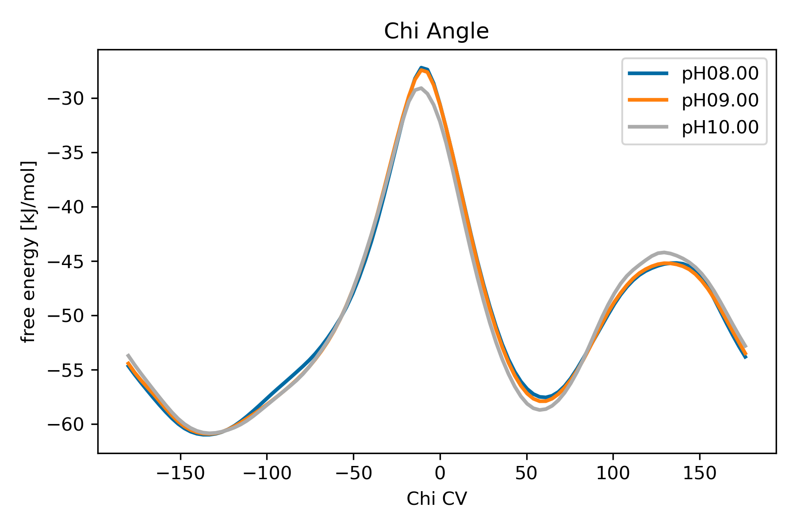
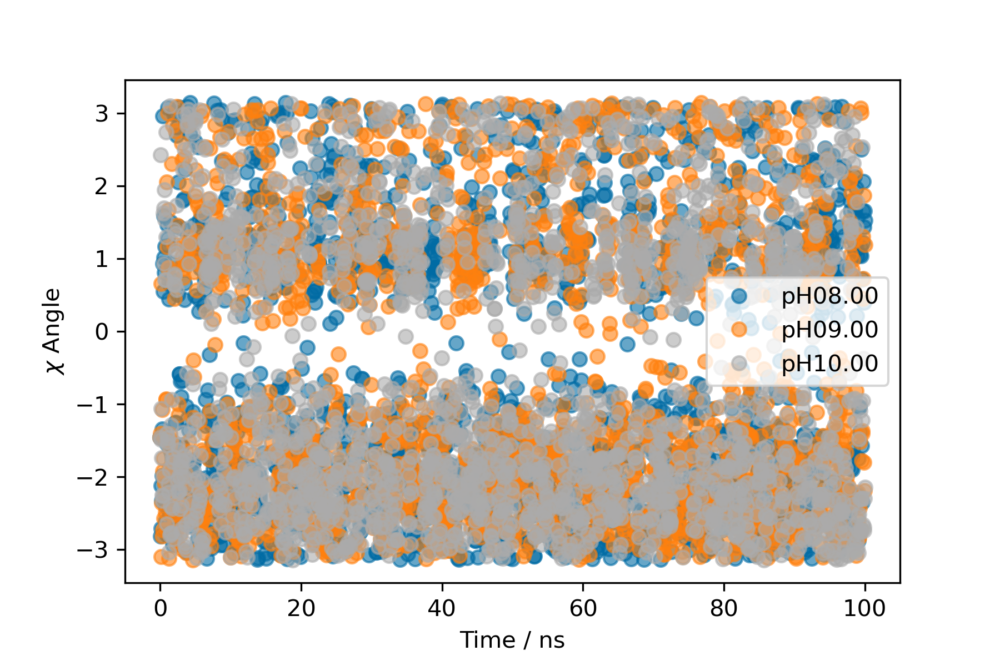
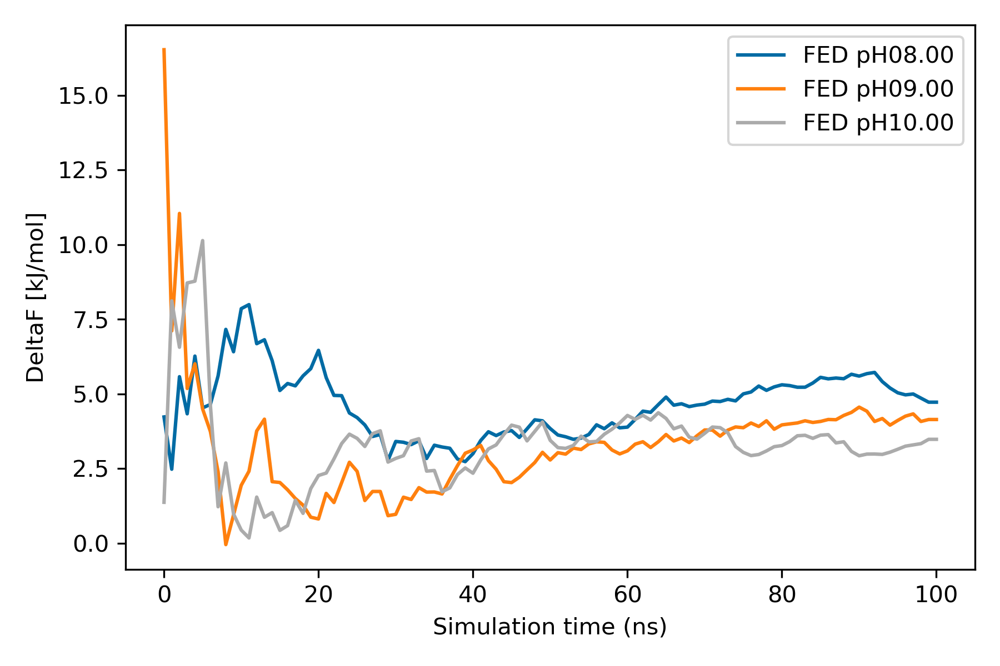
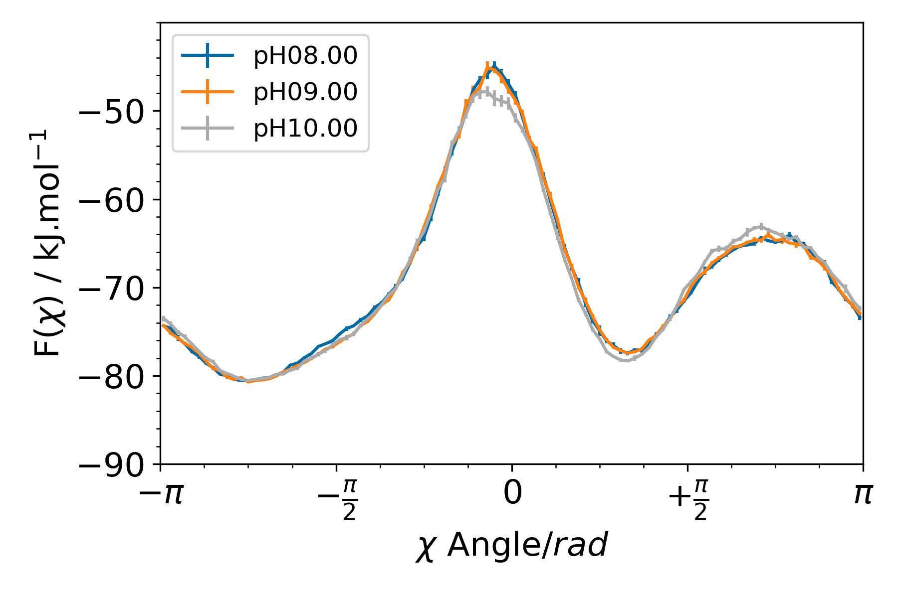
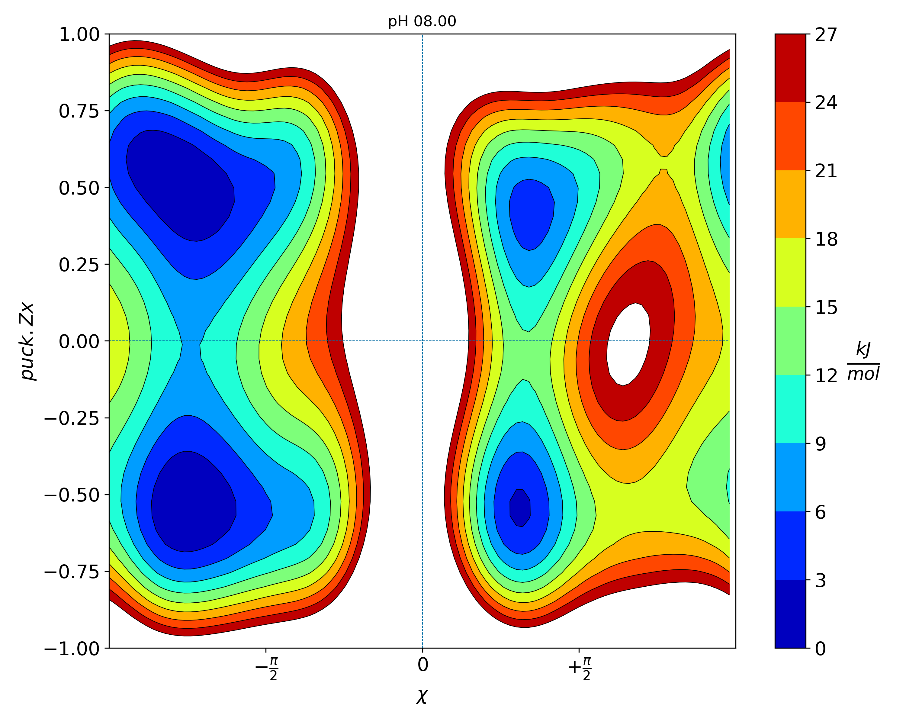
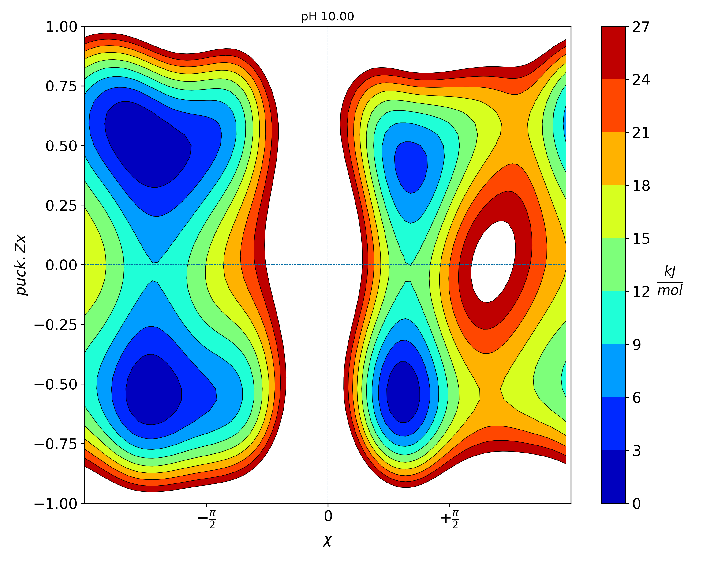

# Analyzing CpH-Metadynamics simulations

In this tutorial, we will briefly look into different analyses that can be performed using CpH-MetaD. These analysis will be comprised of two parts:

- Conformational analysis
- Protonation analysis

In the conformational analysis, we will evaluate the convergence of chosen Collective Variables (CV's), characterize the CV space and estimate errors. In the protonation analysis, we will estimate average protonations of the titrable site at each pH value, estimate pKas using the Henderson-Hasselbalch equation and calculate errors, while using the metadynamics weights. Furthermore, we will compute the same properties using a WHAM procedure to reweight to obtain smoother and more accurate descriptions of several observables.

## Loading Packages
``` python
import sys
import numpy as np
import scipy
from scipy.optimize import curve_fit
import plumed
import math
import pandas as pd
import matplotlib.pyplot as plt
```
# Conformational Analysis

## Extraction of trajectories and protonation state data

All trajectories and protonation states were extracted locally using the scripts in the data folder. Take notice of them and examine how to extract the information.

## Calculating populations and the free energy in function of the CVs 

Here we use the PLUMED tool to obtain reweighted data on the desired observables, i.e. the chosen CV's: 
- the $\chi$ angle of titrable site : this important property of nucleobases characterizes the relative orientation of the base/sugar. It is defined by the O4'-C1'-N1'-C2 (C,U) or O4'-C1'-N9-C4 (A,G). When the angle is between 0 and 2 radians (-90º to 90º) it is in syn and the base is oriented towards the sugar, while from -pi to 0 and 2 to pi the angle is in anti. This base-flipping is a slow internal degree of freedom therefore a good candidate for a CV. It is also useful to validate our force field against experimental data;

- the sugar puckering: another slow yet important property that refers to the conformation of the ribose. It is defined by the C2' and C3' atoms' relative positions to the plane defined by the C1', O4' and C4' atoms. The C2' endo is defined by the C2' atom above the plane and similarly the C3' endo for the C3' atom. The positioning defines the proximity of the 2'-OH group to the base and also the helix type. These calculations were done locally. 

Biased simulations were performed at 3 distinct pH values: 8.0, 9.0 and 10.0. Since the pKa of uridine is 9.22, then each simulation should exhibit differences in their observables if they are protonation-dependent. And that is what we are going to assess. For that purpose, we need to unbias our simulations and obtain either the weights or the unbiased observables. First, we need to extract the reweighted observables using the HILLS file for each simulation of our system. To do that we need to run the PLUMED driver module on the concatenated trajectory using a modified version of our PLUMED.dat input file. Examine the following cell that generates the PLUMED_rew.dat file. 

``` bash
%%bash
    # Define system name
    sys=U1mer
    # Iterate through each simulation pH
    for pH in 09.00 09.25 09.50
    do
    #Generate a new PLUMED file for each pH
    cat > plumed_rew_${pH}.dat << EOF
    
    # Provide molecular information given the system pdb
    MOLINFO STRUCTURE=data/${sys}.pdb
    # Define the atoms for the chi torsion angle CV
    chi:  TORSION ATOMS=8,9,19,28
    # Define the atoms for the sugar puckering CV
    puck: PUCKERING ATOMS=6,8,9,13,11
        
    # Activate well-tempered metadynamics module using the defined CVs. For the sugar puckering, we want specifically the Zx vector.
    # The PACE is defined to a very large number and the Height to 0.0 kJ/mol because we do not want to add new gaussians.
    # The RESTART=YES to restart the metadynamics, hence read the added Gaussians from the provided HILLS file.
    # The bias factor, GRID boundaries are equal to the ones provided in the simulation.
    metad: METAD ARG=chi,puck.Zx PACE=100000000 HEIGHT=0.0 BIASFACTOR=8 SIGMA=0.35,0.35 FILE=data/HILLS_pH${pH} GRID_MIN=-pi,-pi GRID_MAX=pi,pi RESTART=YES # <- this is the new stuff! 
    
    # Using the REWEIGHT_BIAS, we provided the metad.bias as an argument to obtain the weights.
    as: REWEIGHT_BIAS ARG=metad.bias

    # Unbiased histograms for the observables are obtained by providing the logweights previously defined.
    hhchi:  HISTOGRAM ARG=chi STRIDE=1 GRID_MIN=-pi GRID_MAX=pi GRID_BIN=100 BANDWIDTH=0.1 LOGWEIGHTS=as 
    hhpuck: HISTOGRAM ARG=puck.Zx STRIDE=1 GRID_MIN=-pi GRID_MAX=pi GRID_BIN=100 BANDWIDTH=0.1 LOGWEIGHTS=as 
    # Then we can convert the histograms h(s) to free energies F(s) = -kBT * log(h(s))
    # by using the CONVERT_TO_FES module and then dump the free energies.
    ffchi: CONVERT_TO_FES GRID=hhchi 
    ffpuck: CONVERT_TO_FES GRID=hhpuck 
    # Print out the free energies F(s) 
    DUMPGRID GRID=ffchi FILE=ffchi_${pH}.dat 
    DUMPGRID GRID=ffpuck FILE=ffpuck_${pH}.dat 

# Print to a COLVAR file the chi angle, the Zx component of the sugar puckering and the metad.bias
PRINT ARG=chi,puck.Zx,metad.bias FILE=COLVAR_REWEIGHT_${pH} STRIDE=1 
EOF

# Then we run the plumed driver tool using the following command for each pH simulation. We also define the value of KBT in energy units.
plumed driver --mf_xtc data/${sys}_pH${pH}.xtc --plumed plumed_rew_${pH}.dat --kt 2.5
done

```

From the previous cell, we were able to obtain the weighted histograms, the unweighted properties and the bias used along the frames of the simulation. At this moment, we can extract the information from the COLVAR files and compute the weights w of each frame using w = exp(V/kBT) and then applying each w to each value of the observable. As such, we can obtain weighted averages, free-energy differences between the energy minima and plot the free energy along the chosen observable. 

In the following cells, we will examine how the pH impacts the CVs of our system by comparing the populations of the syn/anti and the C2'/C3' endo conformations and their free energy differences. 

### Q1. Does increasing the pH, thus the number of deprotonation events, impact the thermodynamic balance between these distinct conformations? 

``` python
KbT = 2.5
pH_values = ['08.00','09.00','10.00']
for pH in pH_values:
    
    # Load the FES file and the COLVAR file.
    ffChi   = np.loadtxt("ffchi_"+str(pH)+".dat")
    Chi     = np.loadtxt("COLVAR_REWEIGHT_"+str(pH))
    
    # Extract the information into distinct columns: Time, Chi, Puck, metad.bias
    col = pd.read_csv('COLVAR_REWEIGHT_'+str(pH), sep=" ", header=None, skiprows=range(0,3),usecols=[1,2,3,4],names=["Time", "Chi", "Puck", "metad.bias"])
    # Define the maximum value of the bias. This will provide a better numerical approximation.
    maxim=np.max(col['metad.bias']) 
    # Define the weight for each frame as defined by w=exp(V(s)/kBT).
    weights=np.exp((col['metad.bias']-maxim)/KbT)
    # Then normalize the weights
    weights=weights/np.sum(weights)
    # Add a new columnd with the weights to our dataframe.
    col['weight']=weights

    sweights = []
    aweights = []

    # Split the weight between syn (0<= syn <=2) and anti according to the Chi values.
    for index in range(0,len(col)):
        cval = col['Chi'][index]
        wval = col['weight'][index]
        if 0 <= float(cval) <= 2:            
            sweights.append(wval)
        else:
            aweights.append(wval)
    
    # Then we each population average as the sum the normalized weights
    smean  = np.sum(sweights)
    amean = np.sum(aweights)
    # Through the relation of Fi = - KbT ln(1/N Sum(x)), we know the free energy of a minimum
    # Then the free energy difference can be given by deltaF_{x-y} = - KbT ln(meanX/meanY) 
    # Since the difference of the logs is equal to the log of the quotient, we assume KbT = 1 in this case
    fed = -np.log(smean/amean)*KbT

    # Then we can print the free energy difference between the two populations and their average value for chosen property (Chi angle)
    #### Exercise: Try to print the population values of both states at the different pH values:
    #HIDDEN
    print("The free energy difference, at pH {}, (syn to anti) on the Chi angle CV is {:.3f} KJ/mol and the syn pop is {:.3f}".format(pH,fed,smean))
    #ENDHIDDEN

    #### Exercise: Try to plot the free energy in function of the $\chi$ angle CV  at the different pH values:
    # We can also plot the data as degrees instead of radians by converting rad*180/pi
#SOLUTIONFILE=notebooks/solution.ipynb
#HIDDEN
    plt.plot(ffChi[:,0]*180/np.pi,ffChi[:,1],label="pH"+str(pH),linewidth=2)
    plt.title("Chi Angle")
    plt.xlabel("Chi CV")
    plt.ylabel("free energy [kJ/mol]")
    plt.legend(ncol=1)
plt.show()
#ENDHIDDEN
```


### Q2. Calculate the By observing the plot and examining the populations' values, what can we learn from the pH dependence of this system?

Wt-metadynamics simulations depend on providing enough transitions across the defined range of the CV space to obtain sufficient sampling and a good description of the desired observables. As such, we need to examine if the number of transitions across the full CV range and if there is enough sampling in the transition regions which are typically of high energy. 

``` python
for pH in pH_values:
    # Load the data from the COLVAR file
    Chi     = np.loadtxt("COLVAR_REWEIGHT_"+str(pH))
    # Plot the time series 
    plt.plot(Chi[:,0]*2/1000,Chi[:,1],label="pH"+str(pH),marker="o",markevery=25,linewidth=0,alpha=0.6)
    plt.xlabel("Time / ns")
    plt.ylabel("$\chi$ Angle")
    plt.legend(ncol=1)
plt.show()

```



### Q3. Are there enough transitions across the full range to state that we are sampling this specific CV space?

Another important property to evaluate is the convergence of the free energy difference. In a simple system such as this, convergence can be assessed by measuring the free energy difference along the simulation time. Then, we will be able to use the converged portion of the trajectory to calculate other observables and estimate standard errors.

To obtain the convergence, we need to compute the free energy along each CV value using the sum_hills module every N steps of the simulation.

``` python
for pH in ["08.00", "09.00", "10.00"]:
    !plumed sum_hills --hills data/HILLS_pH${pH} --stride 1000 --idw "chi" --kt 2.5 --outfile ff.chi_pH${pH}_

```

The sum_hills module is used to sum the Gaussians stored in the HILLS file by using the --hills keyword. Then it is possible to select one specific CV, using the --idw keyword, to obtain their specific bias.

Then, by iterating through each pH value, we can extract the data of each file and compute the free energy difference of the minima defined by the syn/anti criterion used previously.

``` python
# Calculate free energy difference between syn and anti minima.

# Since we defined stride=1000 in sum_hills, the tau is equivalent to 10 (1ns).
tau=1 
# Then we cycle through pH and each obtained free energy profile.
for pH in pH_values:    
    DeltaF=[]

    for n in range(0,101):  
        # Load the data for each file. 
        filename="ff.chi_pH"+str(pH)+"_"+str(n)+".dat"
        if os.path.isfile(filename):
            # Import fes file into pandas dataframe
            data=plumed.read_as_pandas(filename)
            # Find minimum value of fes
            minf =np.min(data["projection"])
            F0=0.0; F1=0.0
            
            # Then we convert the free energy at each value of the CV 
            for j in range(0, len(data["chi"])):
                chi = data["chi"][j]
                # Calculate probability
                p = np.exp((-data["projection"][j]+minf)/KbT)
                # And we integrate in one of the two minima
                if(0<=chi<=2.0):   F0 += p
                else: F1 += p
            # Calculate free energy difference and add to list
            DeltaF.append(-KbT*np.log(F0/F1))    
            time = np.arange(0,len(DeltaF)*tau,tau)
    # Then we plot the data
    plt.plot(time,DeltaF,label="F1") 
    plt.legend()
    plt.title("pH"+str(pH))
    plt.xlabel("Simulation time (ns)")
    plt.ylabel("DeltaF [kJ/mol]")
    plt.show()

```


### Q4. Did the free energy difference converge quickly and how much should we discard of our trajectory?

After assessing the convergence of our simulation and defining how much should we discard, we can perform some statistics using block analysis and a bootstrap approach on the converged part of our trajectory. 

First, we are going to reproduce the plot of the free energy as a function of the $\chi$ angle with the standard errors.

``` python
# First, we define a function to partition the trajectory into blocks
def partition_array(arr, chunk_size):
    return [arr[i:i + chunk_size] for i in range(0, len(arr)-1, chunk_size)]
```

``` python
# Once again, we iterate through each pH simulation
for pH in pH_values:
    # Load the dataframe
    col = pd.read_csv('COLVAR_REWEIGHT_'+str(pH), sep=" ", header=None, skiprows=range(0,3),usecols=[1,2,3,4],names=["time", "chi", "puck.Zx", "metad.bias"])
    # Discard non-equilibrated segments and define data sets
    chi    = np.array(col['chi'].loc[col['time']>10000])
    bias   = np.array(col['metad.bias'].loc[col['time']>10000])
    maxim  = np.max(bias) #
    weight = np.array(np.exp((bias)/KbT))

    # Define the number of blocks for the converged segment
    bnumber = 5
    # Define the block size
    bsize   = int(len(chi)/bnumber)
    # Use the function to partition each data set.
    bl_chi     = partition_array(chi,bsize)
    bl_weight  = partition_array(weight,bsize)
     
    # Define the parameters for bootstrap
    samples_chi = []
    nsamples    = 1000
    nbins       = 100
    
    # Iterate through the number of samples
    for j in range(nsamples):
        #Generate a list of n blocks to generate subsamples
        n = len(bl_chi)   
        blocks = np.random.choice(n,n,replace=True)
        iter_chi     = []
        iter_weight  = []
        # Generate the nem sub sample with the randomized blocks
        for i in blocks:
            iter_chi.append(bl_chi[i])
            iter_weight.append(bl_weight[i])
        # Generate a reweighted histogram with the new data and weights
        hist_chi, bin_edges   = np.histogram(iter_chi,bins=nbins,weights=iter_weight,density=False)
        # Convert the reweighted histogram to a free energy surface
        fes_chi   = np.array(-KbT*np.log(hist_chi))   
        # Append the output to the list
        samples_chi.append(fes_chi)
    # After obtaining the outputs for all the new samples, estimate the std_deviation
    std_chi    = np.std(samples_chi,axis=0)
    
    # Estimate the mean
    mean_chi   = np.mean(samples_chi,axis=0)
    
    # Then plot the histogram with errors defined as the std_dev
    bin_edges = np.histogram(chi,bins=nbins)[1]
    bin_centers = (bin_edges[:-1] + bin_edges[1:]) / 2
    plt.errorbar(bin_centers,mean_chi,yerr=std_chi,label="pH"+str(pH))
    x_tick = np.arange(-1,1.1,0.5)

    x_label = [r"$-\pi$",r"$-\frac{\pi}{2}$", r"$0$", r"$+\frac{\pi}{2}$",r"$\pi$"]
    plt.minorticks_on()
    plt.xticks(x_tick*np.pi,x_label, fontsize=16)
    plt.yticks(np.arange(-100,-40,10),fontsize=16)
    plt.xlim(-np.pi,np.pi)
    plt.ylim(-90,-40)
    plt.ylabel("F($\chi$) / kJ.mol$^{-1}$",fontsize=16)
    plt.xlabel("$\chi$ Angle$ / rad$ ",fontsize=16)
    plt.legend(fontsize=12,loc="upper left")
plt.tight_layout()
plt.show()

```


### Q5. How does the new free energy plot compare to the one obtained through the PLUMED module? How big are the error estimates?

### Q6. Attempt to reproduce the previous analyses for the Zx component of the sugar puckering. How does it compare to the $\chi$ angle? 

So far, we have examined how an individual CV depends on the simulation pH and how the population balance of syn/anti and C2'/C3' endo change across the different simulations. Now, we want to compare the 2D free energy surface along all pH values and observe how the energy minima relate to each other.

## Plotting 2D Free Energy Surface in the function of the metadynamics CVs 

First, we need to once again use the sum_hills module to read the HILLS file of each simulation and generate a file with the free energies at each grid point. The grid is defined by both CVs and, at each point, an energy value is assigned after the module sums all the Gaussians deposited during the simulation that are stored in the HILLS file. 

``` bash
%%bash
# For each pH value, we generate a fes.dat file
for pH in 08.00 09.00 10.00
do
    # We define a grid of 100x100 and we read each pH simulation HILLS file
    plumed sum_hills --bin 100,100 --hills data/HILLS_pH${pH}
    mv fes.dat fes_pH${pH}.dat
done

```
After generating each fes_pH.dat file, we can plot the data and it should look like the following plot:

``` python
for pH in pH_values:
    # Load the data of each fes file.
    X,Y,Z= np.loadtxt('fes_pH'+str(pH)+'.dat',unpack=True)[:][0:3]
    Z-=np.min(Z)
    print(X.shape,Y.shape,Z.shape)
    temp_counter=0
    total_line_counter=0
    block_count_finished=False
    
    with open('fes_pH'+str(pH)+'.dat') as f:
        for count,line in enumerate(f):
            if line != "\n" and '#' not in line:
                temp_counter+=1
            if line == "\n" and block_count_finished==False:
                block_line_counter=temp_counter
                block_count_finished=True
            if line != "\n" and '#' not in line:
                total_line_counter+=1
    print('lines total: ', total_line_counter)
    print('X shape: ',block_line_counter)
    print('Y shape: ', int(total_line_counter/block_line_counter))

    shapeX=block_line_counter
    shapeY=int(total_line_counter/block_line_counter)

    X= np.reshape(X, (shapeY,shapeX))
    Y= np.reshape(Y, (shapeY,shapeX))
    Z= np.reshape(Z, (shapeY,shapeX))


    plt.figure(figsize=(10,8))
    levels=np.arange(0,30,3)
    plt.contourf(X, Y, Z,levels,cmap='jet')
    cbar = plt.colorbar(ticks=levels)
    cbar.set_label(r'$\frac{kJ}{mol}$', rotation=0, labelpad=20,weight='bold',fontsize=20)
    cs=plt.contour(X, Y, Z, levels, colors='black',linewidths=0.5)
    cbar.ax.tick_params(labelsize=15) 
    plt.ylim(-1, 1.0)
    plt.xlim(-np.pi,np.pi)
    plt.title('free energy surface',fontsize=15)


    x_pi   = X*180/np.pi
    x_tick = np.arange(-0.5,0.6,0.5)

    x_label = [r"$-\frac{\pi}{2}$", r"$0$", r"$+\frac{\pi}{2}$"]
    plt.title("pH "+str(pH))
    plt.xticks(x_tick*np.pi,x_label, fontsize=15)
    plt.yticks(fontsize=15)
    plt.xlabel(r'$\chi$',fontsize=15)
    plt.ylabel(r'$puck.Zx$',fontsize=15)
    plt.hlines(0,-np.pi, np.max(X),linewidth=0.5,linestyle='dashed')
    plt.vlines(0,-1, 1,linewidth=0.5,linestyle='dashed')
    plt.tight_layout()
    plt.show() 

```





### Q7. Do we identify differences in the energy minima and barriers across the different pH values? What can we say about the system?
