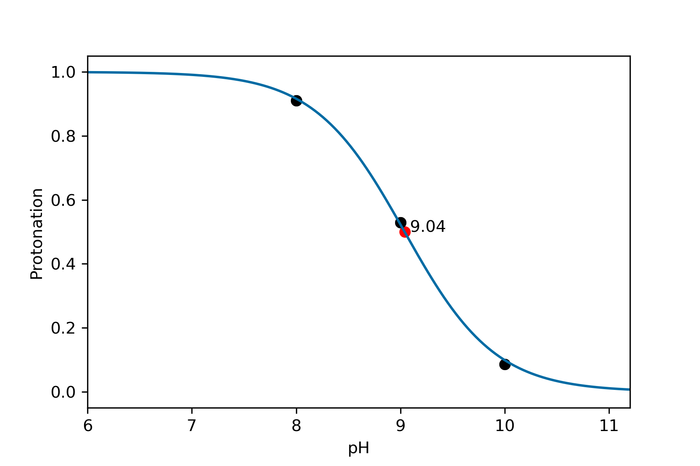
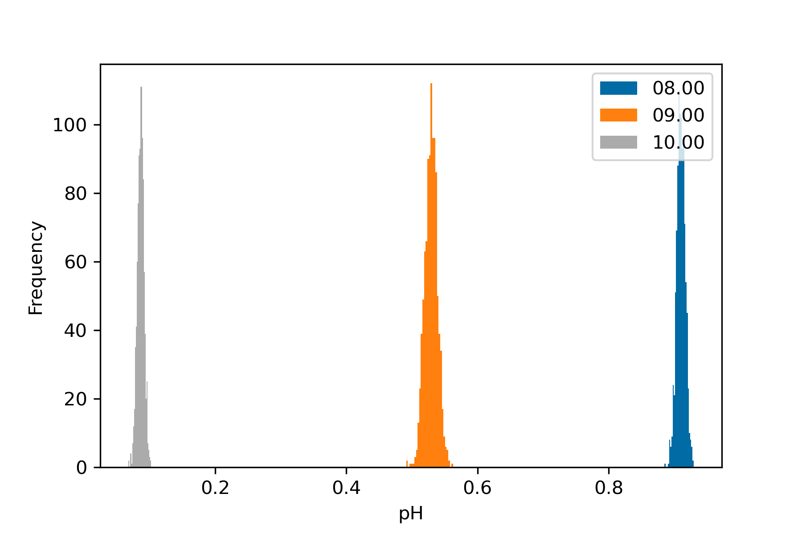
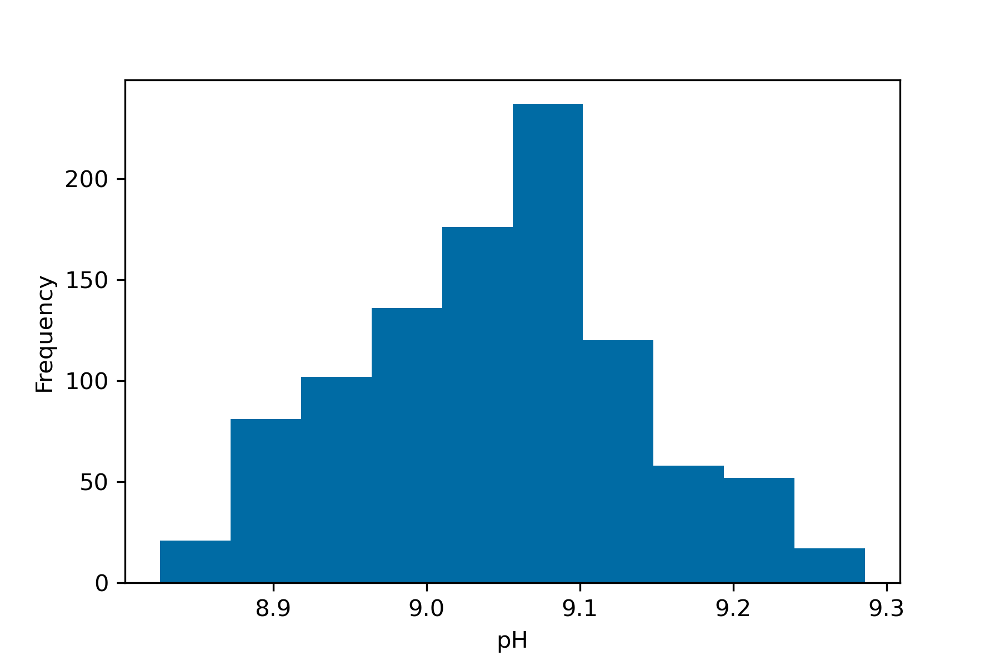
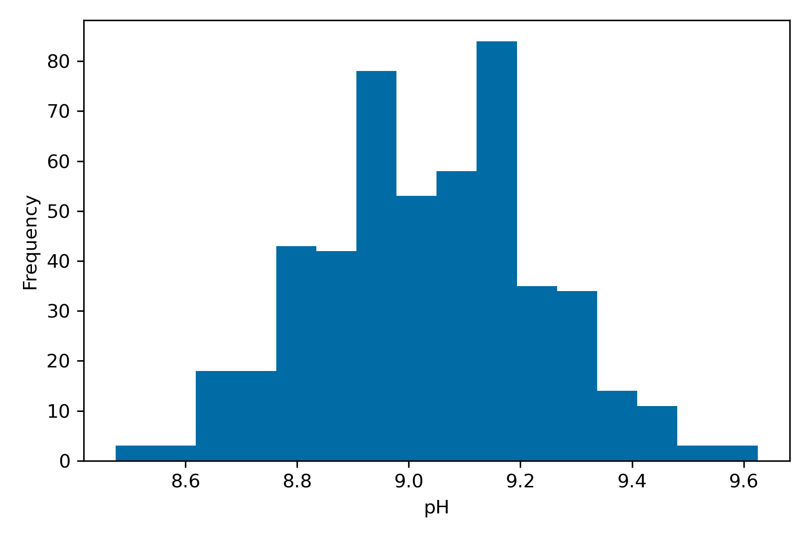
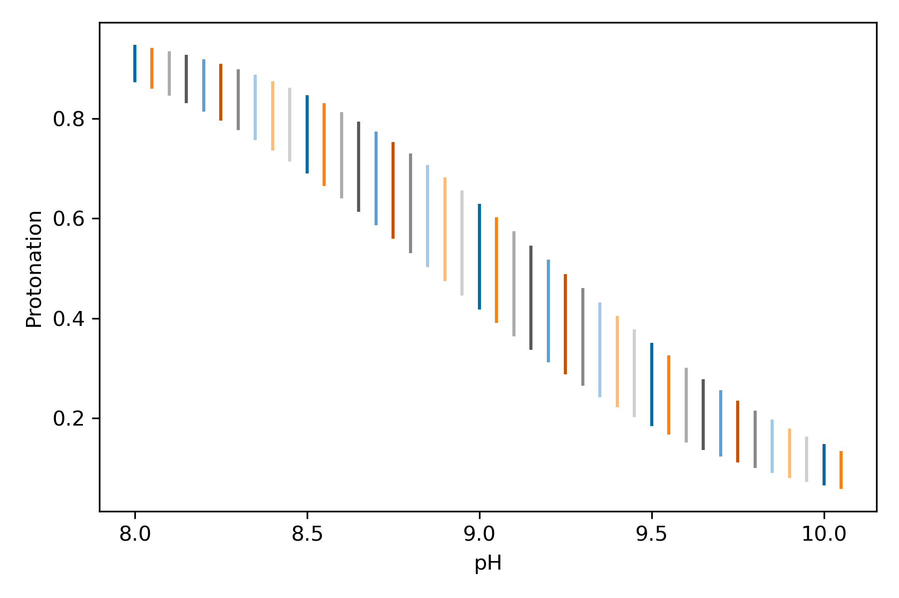
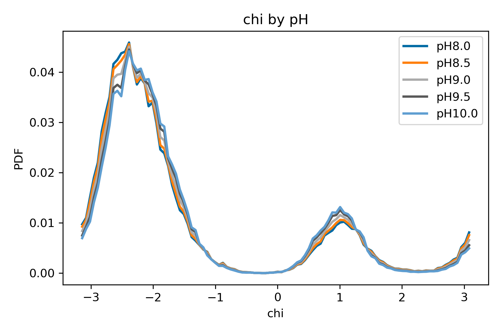
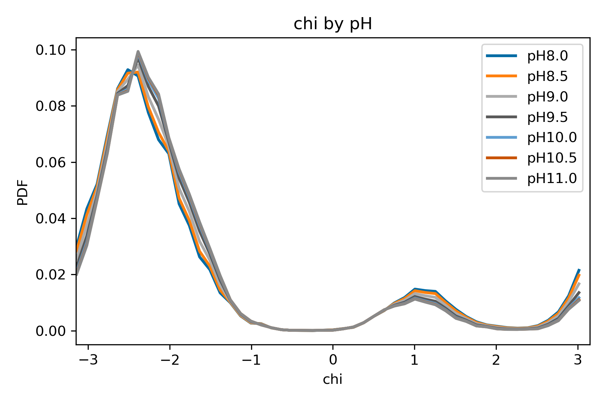
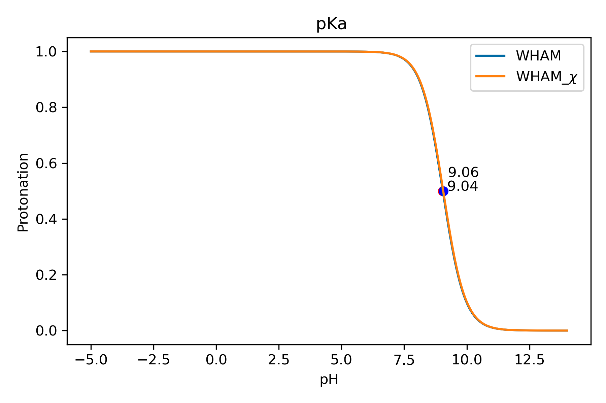

# Protonation Analysis

Conformational analyses are fundamental in identifying energy minima, estimating populations of the chosen CVs and other observables, thus assessing how the system behaves at different pH values. Nevertheless, there is an another dimension to CpH-Metadynamics simulations which concerns the protonation analysis.

When we consider how the system behaves at different pH conditions, we are evaluating how the protonation balance (i.e. the average protonation) of the titrable sites impact the conformational part. Therefore, it is important to consider how the protonation states change throughout the simulation or what is the average protonation of different energy minima. One important and distinctive property is the pKa. 

The pKa is the pH at which 50%  of the population of a titrable site is protonated and the other 50% is deprotonated. Hence the pKa measures the proton binding affinity of a titrable site at a given pH value. Typically, if the solution pH < pKa, then the population of protonated states is more likely to be larger than the population of deprotonated states. If the pH > pKa, then the population of deprotonated states is likely to be larger than the population of protonated states. At pH=pKa, the protonation and deprotonation probability is equal, thus there is a thermodynamic equilibrium. 

The pKa is typically associated with the Henderson-Hasselbalch equation, which describes the relationship between the pKa, pH, and the balance between the protonated and deprotonated populations:

$$ pH = pKa + log(\frac{[A-]}{[AH]}) $$

Usually, changes in pKa are measured as pH units, however, they can be translated into kJ/mol. pH variations can be measured as a $\Delta\Delta$ G of the protonation-free energies at two distinct pH values. Since the protonation-free energy can be described as:

$$ \Delta\text{G} = -\ln(10) \cdot RT \cdot (pKa - pH) $$

where R is the gas constant, T is the temperature in Kelvin. Then the energy associated with a pH unit change is:

$$ \Delta\Delta\text{G} = -\ln(10) \cdot RT \cdot (pH_f - pH_i) $$

which for a $ \Delta pH=1 $ is roughly:

$$ \Delta\Delta\text{G} \approx -5.7 \text{kJ/mol at 298K} $$

These energetic contributions can impact significantly thermodynamic equilibria, change conformational probabilities and balance between populations. Therefore, using these relationships, we will see how we are able to plot titration curves, estimate pKa values and measure energy differences using CpH-metaD simulations. 

In the uridine system, the nucleobase has a pKa of 9.22 at the N3 atom. This means that at pH < pKa, most of the population should be protonated, hence in a neutral state. While for  pH >  pKa, most of the population should be deprotonated, hence in a negatively charged state. How do these charge variations impact our system? Can we measure changes in protonation at different pH values and along the simulation time? Is each energy minima distinguishable by their average protonation? If so, then why and how does electrostatics play a role?

These are all questions to be addressed in the following section.

## Extracting the protonation data

We need to extract the protonation data stored in the .occ files. These files contain information of the proton occupation state of each titrable site along segments of the simulation. These files are generated after each cycle of CpHMD and the total number of lines matches the $ Time_{seg}/\tau_{p} $, which is the time of segment (1000 ps) over the frequency of protonation (20 ps). 

Each column corresponds to a distinct titrable site and each row to different timestamps (typically every 20 ps). Then the occupation state is defined by the parametrized states found in the St-XOL3_DelPHi folder. For example, the uridine has two states: URN0 and URN1. URN0 refers to the neutral (0) state, hence the protonated state, while URN1 refers to the charged (-1) state, hence the deprotonated state. In the .occ file, if the occupation state is 0, then it means it is protonated. However, for the adenine, the AR0 also refers to the neutral state, however in this case it is the deprotonated state, and AR1 is the protonated (+1) state. Hence in this specific case, the protonation and occupation states match and we don't need to correct.
Typically, binary protonable sites  do not need to be corrected, as for the adenine and cytidine, while deprotonable sites (uridine and guanine) require this conversion to obtain the protonation states. Sites with multiple tautomers always need a correction since in those cases, each occupation state refers to a different position of the proton.

First, we are going to generate a data frame to store all the data found in the .occ files for the different pH values.

``` python
# First we create a pandas dataframe for time and protonation states
protdf    = pd.DataFrame(columns=['Time','Protonation'])
# We define the number of segments of our simulation
segs      = range(0,11)
prots     = {}
pH_values = ['08.00','09.00','10.00']
# We define the frequency of protonation as in the CpHMD settings (20ps)
taup      = 20

# Create a dictionary for the data
prots = {"pH":[],"Time":[],"Protonation":[]}

# We iterate through each pH
for pH in pH_values:
    # Then for each segment
    for seg in segs:
        # We obtain the time range of each segment
        time = seg*10000-10000
        # Get the occ files from the data folder
        path = "data/occ_pH"+str(pH)+str("/")
        itemList =  os.listdir(path)
        # Iterate through each .occ file to obtain the protonation states
        for file in itemList:
            if ".occ" in file and seg == float(file[-7:-4]):
                with open(path+file) as f:
                    for line in f:
                        # Save the time, pH and protonation state
                        prots["Time"].append(int(time))
                        prots["pH"].append(pH)
                        prots["Protonation"].append(float(line.strip()))
                        time += taup
    
protdf = pd.DataFrame.from_dict(prots,orient='columns')
protdf.reset_index(inplace=True)
print(protdf)

```

After extracting all the data and assigning the proper timestamps, we can define the frequency of protonation. While we only calculate the protonation information every 20~ps, in reality, we can propagate the stored protonation states to the intermediate frames within each protonation calculation. If the simulation timestep is 2 ps and the $\tau_{p}$ is 20 ps, then the protonation states of these intermediate frames correspond to the state assigned in the previous cycle. 

``` python
dfs  = []
# Define the frequency of protonation
taup = 20
# Define the timestep of the simulation
taus = 2

for pH in pH_values:
    # Get last time for each pH series based on occ
    pH_time = protdf['Time'].loc[protdf["pH"]==pH].max()
    # Expand the fixed protonation to frames every 2 ps (simulation)
    tmp = pd.DataFrame(protdf.loc[protdf["pH"]==pH])
    new_pH_time = pd.Series(range(0, pH_time + taup, taus), name='Time').to_frame()
    # Merge and propagate the protonation based on both dataframes
    final_protdf = pd.merge_asof(new_pH_time, tmp, on=["Time"])#,direction='forward')
    dfs.append(final_protdf)

# Concatenated dataframe of all pH data   
final_protdf = pd.concat(dfs)
# Examine the dataframe
print(final_protdf)

```

Since we are performing CpH-Metadynamics simulations, we require the weight data from the accumulated bias in the simulation. Protonation and conformation are intrinsically coupled, then biased conformations dictate that their protonation states should also be unbiased. To do that we need to obtain the weights and correctly assign them to the corresponding frames. 

``` python
# Define a list for the weighted dataframes
wprot = []

# Iterate through each pH value
for pH in pH_values:
    # Load the data of COLVAR
    col = pd.read_csv('COLVAR_REWEIGHT_'+str(pH), sep=" ", header=None, skiprows=range(0,3),usecols=[1,2,3,4],names=["Time",'chi','puck.Zx', "metad.bias"])
    # Define the maximum bias for a better numerical approximation
    maxim=np.max(col['metad.bias']) 
    # Calculate the weights
    weights=np.exp((col['metad.bias']-maxim)/KbT)
    # Normalize the weights
    weights=weights/np.sum(weights)
    # Define a new column in the dataframe
    col['Weight']=weights
    # Correct the time column
    time = np.array(col['Time']*2)
    col['Time'] = time
    # Merge the two dataframes (protonation and COLVAR)
    pdf1 = pd.merge(final_protdf.loc[final_protdf['pH']==pH], col[['Time','chi','puck.Zx','Weight']],left_on="Time",right_on="Time",how="left")
    # Append each pH dataframe to the list    
    wprot.append(pdf1)

# Create dataframe with Weights
rewprot = pd.DataFrame(columns=['pH','Time','Protonation', 'Weight'])
# Concatenate all pH dataframes into a single on
rewprot = pd.concat(wprot)
rewprot.drop('index',axis=1)
# If there are any rows with nan values due to mismatch when sims are not complete. This should be commented if the simulation ended
# To check for possible mismatch errors
rewprot=rewprot.dropna()

```

### Q8. Examine the final dataframe. Do the timestamps of the protonation states match the conformational data? Are all the pH values present?

After obtaining the final dataframe with all the pH values, protonation and conformation data and the weights, we can calculate average protonations, derive a titration curve, and estimate the pKa. To plot a titration curve, we need to redefine the Henderson-Hasselbalch (HH) relationship between pH, pKa and protonation. We can rewrite the HH function as follows:

$$ \langle P \rangle = \frac{1}{1 + 10^{pH - pKa}} $$

where <P> is the average protonation at a certain pH value, pH is the assigned value of the simulation and the pKa is the fitted parameter. However, we are dealing with biased simulations, then we need to calculate the weighted average protonations:

$$ \langle P^* \rangle = \frac{\sum_i P_i \times e^{\frac{B_i}{k_B T}}}{\sum_i e^{\frac{B_i}{k

where <P*> is the weighted average protonation, B_i is the accumulated bias accumulated at the end of the metadynamics simulations calculated on the coordinates corresponding to the i-th frame. Knowing this relationship and how to get the weighted protonation averages, we can fit the simulation data to the HH function and obtain a pKa estimate.

``` python
## Calculate average protonation for each pH value
data = []
x = []
y = []
w = []

for pH in pH_values:
    # We discard the equilibration time obtained previously
    equil  = 00000
    tlimit = 100000
    # Load the dataframe with all the data
    vals   = pd.DataFrame(rewprot[['pH','Protonation','Weight']].loc[(rewprot["pH"]==pH) & (rewprot["Time"] >= equil)& (rewprot["Time"] < tlimit)])
    weights = vals["Weight"]
    weights = weights/np.sum(weights)
    # Convert the occs into prot states
    occs   = vals["Protonation"] 
    # Remember that for uridine and guanine, the 0 state is the neutral/protonated state.
    prots  = 1-np.array(occs)
    
    # Obtain the weighted average using the normalized weights
    avx = np.sum(prots*weights)
    data.append((pH,avx))
    print(pH,avx,np.sum(prots)/len(prots))

```

### Q9. What can we determine from the average protonations? Do they follow an expected trend?

After obtaining the reweighted data, now we can use the HH relationship to plot a titration curve and determine the uridine pKa. 

``` python
# Define a tolerance for the upper and lower limtis of average protonation
# Average protonations too close to the upper (1) and lower (0) bounds should not be used
tol = 0.01  
for val in data:
    if val[1] > tol and val[1] < 1-tol:
        x.append(float(val[0]))
        y.append(val[1])

# Define arrays for the pH, protonation and weight data               
x = np.array(x)
y = np.array(y)

# Obtain an initial guess of the pH closer to the pKa     
minndx = 0
for i in range(len(y)):
    if abs(0.5-y[1]) < abs(0.5-y[minndx]):
        minndx = i
# This guess will be used as a reference for the HH function            
pKainit = x[minndx]
    
def Hill(x, pKa, n):
    return 1.0 / (1.0 + 10.0**(n*(x - pKa)))
def HH(x, pKa):
    return 1.0 / (1.0 + 10.0**(x - pKa))
    
params = curve_fit(HH,x,y,p0=[pKainit])
    
x_new = np.linspace(-5,14,1000)
y_new = HH(x_new,params[0][0])
print('## {:5.2f}'.format(params[0][0]))
pKa_fit = '{:5.2f}'.format(params[0][0])


plt.tight_layout()
plt.xlabel("pH")
plt.ylabel("Protonation")
plt.xlim(6.0,11.2)
plt.plot(float(pKa_fit),0.5,"ro")
plt.plot(x,y,"ko")
plt.annotate(pKa_fit,(float(pKa_fit),0.5))
plt.plot(x_new,y_new)

```



Although the final pKa result is slightly underestimated by our simulations, as the experimental pKa is 9.22, the simulations were done on our approach that aims to reflect pKas in an RNA construct and not the single nucleoside. As such, this result is expected. However, one should take notice of the analysis steps required to achieve the result.

Additionally, using the previous rationale, we can apply a bootstrap approach to determine some statistics on the protonation data. For instance, we evaluate the confidence in our estimates by estimating the standard error and plotting histograms of the subsamples. First, we run the function that partitions the data into blocks and generates the new samples.

``` python
def bt_avgprots(data,weights,nblocks,nsamples):
    data_blocks    = np.split(data,nblocks)
    weights_blocks = np.split(weights,nblocks)
    bt_samples     = []
    #
    for i in range(nsamples):
        new_data   = []
        new_weight = []
        blocks = np.random.choice(nblocks, nblocks, replace=True)
        for j in blocks:
            new_data.append(data_blocks[j])
            new_weight.append(weights_blocks[j])
        prot_tmp = np.average(np.array(new_data),weights=np.array(new_weight))
        bt_samples.append(prot_tmp)
    
    return bt_samples

```
Then we can provide the input data and draw the output.

``` python
sims_err = []
# Iterate through each pH value.
for pH in pH_values:
    # Convert the .occ data to the protonation states.
    data_prot   = 1-np.array(rewprot["Protonation"].loc[rewprot["pH"]==pH])
    # Get the weights
    data_weight = np.array(rewprot["Weight"].loc[rewprot["pH"]==pH])
    # Run the bootstrap function with the desired parameters
    # Here we ran 1000 samples with the data partitioned into 20 blocks
    out_bt = bt_avgprots(data_prot,data_weight,20,1000)
    sims_err.append(np.std(out_bt))
    print(np.average(out_bt),np.std(out_bt))
    hist, bin_edges = np.histogram(out_bt)
    plt.hist(out_bt,bins='auto',label=pH)
    plt.legend()
plt.show()

```



### Q9. Does the protonation of a particular pH simulation exhibit more variability? If yes, then is there any biological/chemical significance?

Similarly for the protonation, we can also calculate the error of our pKa estimation by performing a bootstrap procedure. To do that, first we need to define the following function:

``` python
# Define the bootstrap function. Bootstrap with HILLS reweight to the blocks
# In this version, we provide the explicit reweight blocks to the curve fit with a weight = 1/n_block
# n_block is the number of repetitions of each block in the resampling. This way we fit n values, where n is the number of blocks.
# In the previous version, we estimate the weighted average, at a given pH, only then we do the fit. So it has 3 fit values. 

def HH(x, pKa):
    return 1.0 / (1.0 + 10.0**(x - pKa))
    
def bootstrap_fit(data1,data2,data3, fit_func,nsamples,nblocks):
    fit_parameters = []
    for j in range(nsamples):
        
        # Reset data subset lists
        prot_blocks   = []
        weight_blocks = []
        
        #
        data2_blocks = np.split(data2,len(data1))
        data3_blocks = np.split(data3,len(data1))
        p_blocks = []
        w_blocks = []
        for j in range(0,len(data2_blocks)):
            tmp_prot   = np.array(np.split(data2_blocks[j],nblocks))
            tmp_weight = np.array(np.split(data3_blocks[j],nblocks))
            p_blocks.append(tmp_prot)
            w_blocks.append(tmp_weight)

        weighted_prots = []

        for j in range(0,len(data2_blocks)):
            # Create random data subset
            blocks = np.random.choice(nblocks, nblocks, replace=True)

            for i in blocks:
                prot_blocks   = p_blocks[j][i] 
                weight_blocks = w_blocks[j][i]
                w_prot = np.sum(prot_blocks*weight_blocks)/np.sum(weight_blocks)
            weighted_prots.append(w_prot)

        # Check pKainit over all pH values until it finds the closest one whose prot block average is close to 0.5 (pKa)
        nhill   = 1
        last    = 1
        pKainit = 9.5
        #
        for iter in range(0,len(data1)):
            avx = np.average(weighted_prots[iter])
            if abs(avx - 0.5) < abs(last - 0.5):
                last    = avx
                pKainit =float( data1[iter])

        ## Fit to selected function
        if fit_func == HH:
            p0 = pKainit
        elif fit_func == Hill:
            p0 = [pKainit,nhill]
            # Get pKa and Hill coeficient (n) parameters
        popt, _ = curve_fit(fit_func,data1,weighted_prots,p0)
        pKa = popt[0]
        fit_parameters.append(pKa)
        
    return np.array(fit_parameters)

```
After defining the bootstrap function to estimate the pKa for the chosen number of sub-samples, let's use the bootstrap_fit function. It takes as input:
- an array of the simulated pH values;
- an array of the protonation states ;
- an array of the weights of each frame ;

``` python
pH_values = np.array( [08.00,09.00,10.00])
prots   = 1-np.array(rewprot["Protonation"])
weights = np.array(rewprot["Weight"])
out = bootstrap_fit(pH_values, prots, weights,HH,1000,50)
bt_pKa_fit = np.sum(out) / len(out)
bt_sem = np.std(out) 
print(bt_pKa_fit,bt_sem)
plt.xlabel('pH')
plt.ylabel('Frequency')
plt.hist(out)
```



### Q10. Is the pKa estimate and the error close to the experimental data? 

The previous analyses are the straightforward way to perform pKa and average protonation estimates by simply reweighting the data. However, one of the major advantages of performing CpH-Metadynamics is the ability to use the binless Weighted Histogram Analysis Method (WHAM) to combine data from all simulations at different pH values to obtain more accurate estimates of the system of interest.

# A binless WHAM Reweight approach to combine CpH-MetaD simulations

In this approach, we use a binless WHAM module (https://bussilab.github.io/doc-py-bussilab/bussilab/wham.html) to obtain weights derived from the accumulated biases and the chemical potential (pH) of each simulation using their protonation information. 

The procedure consists on the following rationale: 
- concatenate all the CpH-MetaD equilibrated trajectories ;
- recompute the biases ($B_k$) of the concatenated trajectory for each simulated $k$ pH using their respective HILLS. I.e. if we have $k$ pH simulations, we run the plumed driver $k$ times for each HILLS_k ;
- correct each bias ($B_k$) with the corresponding protonation-dependent contribution for each frame $i$ ;

- thus we obtain a final bias matrix:


$$ M_{k,i}^{\text{Bias}} = \frac{B_{k,i}}{k_{B} T} + pH_k \times P_{i} \times \log(10


This bias matrix contains each reweighted bias potential ($k$) dependent of each frame's protonation state ($P_i$) and the simulation pH ($pH_k$) for the concatenated trajectory. Then we use the bias matrix to compute the weights using the binless WHAM implementation. Afterward, we can compute weights for arbitrary pH values to reweight any observable property of the systems.

In this section, we will examine how to obtain the pH-dependent bias matrix and how to derive observable properties at any desired pH values.

First, we need to import the necessary packages and define a function to compute the weights.

``` python
# We need to import the bussilab and plumed packages
import bussilab
import plumed
# This is a function to process the result and obtain normalized weights of each frame
# at arbitrary pH

def compute_weights(N,pH,w):
    logW=w.logW-(np.log(10)*pH*N)
    logW-=np.max(logW)
    weights=np.exp(logW)
    weights/=np.sum(weights)
    return weights

```

## Extracting the trajectory:
The next step is to obtain the concatenated trajectories. In the data folder, there is a script (get_concat_traj.sh) to be run locally. Examine the script and run it to obtain the concatenated trajectories.

## Recomputing the bias:
After obtaining the concatenated trajectory, please examine the (run_colvar_wham.sh) to obtain the recomputed biases for the concatenated trajectory using each pH HILLS file. 

### Q11. Examine the TOTVAR_REWEIGHT_pH output of each run. Compare them with each other. How do they differ from one another?

### Q12. Compare each output to the COLVAR files of the individual trajectories for the same pH values. Are they similar in any way?

Note: This comparison is a good sanity check to confirm that the obtained biases are correct.

Next, we need to obtain the bias matrix necessary for the binless WHAM.

``` python
# Create necessary lists
N       = []
colpH   = []
biaspH  = []

# Define the pH arrays
pH_values = ["08.00","09.00","10.00"] # 
pH_array  = np.array([8.0,9.0,10.0])

# Iterate through each pH
for pH in pH_values:
    # Load each output of the concatenated trajectories as a distinct pH dataframe 
    df    = plumed.read_as_pandas("TOTVAR_REWEIGHT_" + str(pH))
    # Extract the bias and store it
    colpH = np.array(df["metad.bias"])
    biaspH.append(colpH)

# Be careful with the sorting of the data to avoid mismatches
# Define the protonation array using the stored data in the rewprot dataframe
N = 1-np.array(rewprot["Protonation"])

# Transpose the array to match the matrix
biaspH = np.array(biaspH).T 

# Correct the bias matrix with the pH-dependent protonation contribution
# This is done by doing the dot product of each bias with the correspoding protonation data
# and pH. 

# The energy contribution is given by: log(10)*pH_k*prot_i 
# and that is applied to each corresponding entry (i,k) of the matrix 
bias = np.outer(N,(np.log(10)*pH_array))+biaspH/KbT
# Get the array length to apply a weight based on the trajectory length
# This will adjust the contribution in case of differently lengthed trajectories
lpH1 = len(np.array(protdf["Protonation"].loc[(protdf["pH"]=="08.00")])) 
lpH2 = len(np.array(protdf["Protonation"].loc[(protdf["pH"]=="09.00")])) 
lpH3 = len(np.array(protdf["Protonation"].loc[(protdf["pH"]=="10.00")])) 
min = np.amin([lpH1,lpH2,lpH3])

# Get the relative trj length for each pH value
rtrj1 = lpH1/min
rtrj2 = lpH2/min
rtrj3 = lpH3/min

# Get the final weights based on the bias matrix
w = bussilab.wham.wham(bias,normalize=False, method='minimize',traj_weight = [rtrj1,rtrj2,rtrj3])

```

After obtaining the weights using the binless WHAM, we can apply them to different properties by using the compute_weights function defined earlier. For example, we can compare average protonations across any pH range and compare them to the individual trajectory estimates.

``` python
for pH in np.arange(8.0,10.2,0.2):
    print(pH,np.average(N,weights=compute_weights(N,pH,w)))

```

Afterward, by using the full sampling of our simulations and generating weights for any given pH, we can plot a more complete titration curve compared to the one obtained previously.

``` python
# Define the desired pH range for the calculation
pH_array = np.arange(8.0,10.2,0.05)

# Define necessary lists
rprots   = []

# Iterate through each pH value of the defined range
for iter in pH_array:
            # Get the average protonation using the computed weights for the desired pH
            avx = np.average(N,weights=compute_weights(N,iter,w))
            rprots.append(avx)

# Compute the absolute difference relative to the midtration point
rprots    = np.array(rprots)
min_diffs = np.abs(rprots - 0.5)
 
 # Get the indices of the two smallest differences
indices = np.argsort(min_diffs)[:2]
 
 # Return the corresponding values
closest = pH_array[indices]
pKa_fit = np.mean(closest) 
pKa_fit = '{:5.2f}'.format(pKa_fit)
print(pKa_fit)
# Import the average protonations from the individual trajectories stored in data
x = []
y = []

for val in data:
    x.append(float(val[0]))
    y.append(val[1])
#
plt.figure(figsize=(10,8))
#
plt.plot(pH_array,rprots,'#9bc1d1',linewidth=8,label="WHAM fit")
plt.plot(x,y,"ko",markersize=12,label="$\overline{Prot}_{Sim}$ ")
plt.plot(float(pKa_fit),0.5,markersize=12,marker="o",color="red",label="p$\it{K}_a$ WHAM")
plt.xlabel("pH",fontsize=34)
plt.ylabel("Protonation",fontsize=34)
plt.xticks(np.arange(7.0,11.1,step=0.5),fontsize=28)
plt.yticks(np.arange(0,1.2,step=0.2),fontsize=28)
plt.xlim(7.9,10.05)

plt.legend(fontsize=16)
plt.tight_layout()
plt.show()

```


### Q13. Compare the titration curve, the individual average protonations and the pKa estimate. How do the two approaches - binless WHAM and standard - compare to each other?

As a follow-up to calculating the titration curve, average protonations for a pH range and the pKa using the binless WHAM procedure, now we will see how we can use this information and the previously used bootstrap procedure to obtain error estimates.

In the first, we will define the bootstrap function as done previously.

``` python
# Define the function that takes as inputs the bias data, the protonation array
# the desired pH array and the number of bootstrap iterations.

def bt_wham(bias,N,pH_array,nsamples):
    fit_parameters = []
   
    for j in range(nsamples):
        n = len(bias)   
        blocks = np.random.choice(n,n,replace=True)
        bias_array = []
        prot_array = []
        for i in blocks:
            bias_array.append(bias[i])
            prot_array.append(N[i])

        N_new    = np.concatenate(prot_array)
        bias_new = np.concatenate(bias_array)
        # Get the weights
        w_new = bussilab.wham.wham(bias_new,normalize=False)

        rprots = []

        for iter in pH_array:
            avx = np.average(N_new,weights=compute_weights(N_new,iter,w_new))
            rprots.append(avx)

         # Compute the absolute difference from the point
        rprots = np.array(rprots)
        min_diffs = np.abs(rprots - 0.5)
         # Get the indices of the two smallest differences
        indices = np.argsort(min_diffs)[:2]
         # Return the corresponding values
        closest = pH_array[indices]
        pKa_bt = np.mean(closest) 
        fit_parameters.append(pKa_bt)

        
    return np.array(fit_parameters)

```

Here we slightly changed the bootstrap approach to be compatible with the bias matrix. Basically, we are reconstructing the obtained bias matrix for every iteration by generating new subsamples using the partitioned blocks. This way, we have a distinct weights applied to our data, hence different average protonation and pKa estimates.

To do this, then we need to partition our data into blocks before giving as an input to the $bt\_wham$ function.

``` python
# Bootstrap the matrix instead of the individual data
biaspH   = []
# Define the input pH range and the desired pH range
pH_input =  np.array([8.0,9.0,10.0],dtype=float) 
pH_array = np.arange(8.0,10.2,0.05)

# Load the data from the TOTVAR files
for pH in pH_values:
    df    = plumed.read_as_pandas("TOTVAR_REWEIGHT_" + str(pH))
    colpH = np.array(df["metad.bias"])
    biaspH.append(colpH)

# Correct the .occ state and protonation state
N = 1-np.array(rewprot["Protonation"])
biaspH = np.array(biaspH).T
bias   = np.outer(N,(np.log(10)*pH_input))+biaspH/KbT

# Define the total number of blocks. 
# Rule of thumb: Consider how many blocks each pH trajectory should be partitioned into.
# Then multiply by the number of pH values. 
nblock = 30

# Partition the data into blocks
bias_m = np.vsplit(bias,nblock)
N_arr  = np.split(N,nblock)

# Run the bt_wham function for N iterations.
bts_pka = bt_wham(bias_m,N_arr,pH_array,500)

```

Then we can plot an histogram of our results and estimate the error.

``` python
boot_pKa = np.sum(bts_pka)/len(bts_pka)
boot_err = np.std(bts_pka)
plt.hist(bts_pka,bins="auto")
print(boot_pKa,boot_err)

```


### Q14. What does the histogram look like? Is the error estimate better than the one obtained previously?

Using a similar rationale, we estimate the error associated with each average protonation. We define a bt_prot function to generate sub-samples for the protonation and weights. The bt_prot function will take as input:
- an array with the bias for each frame ;
- an array of the protonation states ;
- an array with the desired pH range ;
- the number of samples (iterations) ;

``` python

def bt_prot(bias,N,pH_array,nsamples):
    rprots = [] 
    for j in range(nsamples):
        n = len(bias)   
        blocks = np.random.choice(n,n,replace=True)
        N_new    = []
        bias_new = []
        for i in blocks:
            bias_new.append(bias[i])
            N_new.append(N[i])
        N_new    = np.concatenate(N_new)
        bias_new = np.concatenate(bias_new)

        # Get the weights for each pH
        w_prot = bussilab.wham.wham(bias_new,normalize=False)
        sample_prot = []
        for pH in pH_array:
           avx = np.average(N_new,weights=compute_weights(N_new,pH,w_prot))
           sample_prot.append(avx)
        
        rprots.append(np.array(sample_prot))
    return rprots

```
Then we can apply the new bt_prot function to our data.

``` python
biaspH   = []
pH_input = np.array([8.0,9.0,10.0],dtype=float) 
pH_prots = np.arange(8.0,10.1,0.05)
for pH in pH_values:
    df    = plumed.read_as_pandas("TOTVAR_REWEIGHT_" + str(pH))
    colpH = np.array(df["metad.bias"])
    biaspH.append(colpH)

N = 1-np.array(rewprot["Protonation"])
biaspH = np.array(biaspH).T
bias   = np.outer(N,(np.log(10)*pH_input))+biaspH/KbT
#
nblock = 30 
#
bias_m = np.vsplit(bias,nblock)
N_arr  = np.split(N,nblock)
#
boot_prots = bt_prot(bias_m,N_arr,pH_prots,500)
boot_prots = np.array(boot_prots).T

```

After doing the bootstrap procedure, we can print and plot the averages and associated errors.

``` python
for n in range(0,len(boot_prots)):
    pH = pH_array[n]
    prot_avx = np.sum(boot_prots[n])/len(boot_prots[n])
    err      = np.std(boot_prots[n])
    plt.xlabel('pH')
    plt.ylabel('Protonation')
    plt.yticks(np.arange(0,1.2,0.2))
    plt.errorbar(pH,prot_avx,yerr=err)
plt.show()

```



# WHAM Reweight for conformational observables

With the WHAM-derived weights, we can also provide data of conformational observables, such as the chosen CVs, and calculate their reweighted properties at any given pH value. In this section, we will compute the $\chi$ angle at multiple pH values besides the ones that were simulated and interpet their information. This approach will provide a more robust description of the system as it combines data of multiple simulations to reconstruct the CV space. Note that it is important that for the method to work, there needs to be a reasonable overlap between the simulations.

Additionally, we can also compute pKas dependent on conformational properties. For example, what if we are interested in the pKa in function of the $\chi$ angle. First, we need to compute the binless WHAM weights as we did previously for the pKa estimates.

Attempt to modify the code based on previous exercises.

``` python
N       = []
colpH   = []
biaspH  = []

pH_array  = np.arange(8.0,10.2)
for pH in pH_values:
    df    = plumed.read_as_pandas("TOTVAR_REWEIGHT_" + str(pH))
    colpH = np.array(df["metad.bias"])
    biaspH.append(colpH)

N = 1-np.array(rewprot["Protonation"])
biaspH = np.array(biaspH).T 

bias = np.outer(N,(np.log(10)*pH_array))+biaspH/KbT
# Get the array length to apply a weight based on the trj length
lpH1 = len(np.array(rewprot["Protonation"].loc[(rewprot["pH"]=="08.00")])) 
lpH2 = len(np.array(rewprot["Protonation"].loc[(rewprot["pH"]=="09.00")])) 
lpH3 = len(np.array(rewprot["Protonation"].loc[(rewprot["pH"]=="10.00")])) 
min = np.amin([lpH1,lpH2,lpH3])
# Get the relative trj length for each pH value
rtrj1 = lpH1/min
rtrj2 = lpH2/min
rtrj3 = lpH3/min
print(rtrj1,rtrj2,rtrj3)
# Get the weights for each pH
w = bussilab.wham.wham(bias,normalize=False, method='minimize',traj_weight = [rtrj1,rtrj2,rtrj3])

```

After obtaining the weights, we can load the desired observable data and apply these weights within the same pH range.

``` python
# Define the pH array and the data arrays
pH_array    = np.arange(8,10.2,0.5)
N           = 1-np.array(rewprot['Protonation'])
chi         = np.array(rewprot['chi'])

# Iterate through each pH of the array
for pH in pH_array:
    # Obtain the weights
    pH_weights = compute_weights(N,pH,w)
    # Obtain the reweighted histogram
    hist, bin_edges = np.histogram(chi,bins=100,density=True,weights=pH_weights)
    hist = hist/np.sum(hist)
    #plt.xlim(-3.15,3.15)
    plt.title("chi by pH")
    plt.xlabel("chi")
    plt.ylabel("PDF")
    plt.plot(bin_edges[:-1],hist,label="pH"+str(pH),linewidth=2)
    plt.legend()
plt.show()

```


### Q15. How does the syn/anti population balance change along with pH? Does it differ a lot from the initial calculations that we did?

Note: In nucleobases, the lack of the negatively charged phosphate group removes a significant contribution of electrostatic to drive repulsion with the deprotonated state of uridine. As such, conformational properties of the nucleoside should be mainly pH-insensitive. 

On another note, we can also adjust the contribution of the observable property to the estimated weights. For example, if we desire to do a scan of how relevant the $\chi$ angle is to the estimated pKa or how much the sugar puckering affects the $\chi$ angle distribution, we can adjust the weights based on another observable property.

First, we need to change the compute_weights function:

``` python
# this is a function to process the result and obtain normalized weights of each frame
# at arbitrary pHb
# This has an additional term "prop": an array of 0,1 to exclude or include the weight to the assigned value.
# This allows to select specific ranges of data to recompute our histograms.
# i.e. If we assign a 1 to values within the 0-2 chi angle region, these values will be excluded as the weights converts to 0 
# Or it can diminish their contribution by multiplying by a factor 0.25 i.e.
def compute_weights_prop(N,pH,w,prop):
    logW=w.logW-(np.log(10)*pH*N)
    logW-=np.max(logW)
    weights=np.exp(logW)
    weights*=(1-1*prop)
    weights/=np.sum(weights)
    return weights

```

After redefining the function, we load the data of the desired observable and the property that we want to adjust for. In this case, we want to see how much the $\chi$ angle distribution depends on the C2'/C3' endo conformation of the ribose.

``` python
pH_array    = np.arange(8,11.2,0.5)
Zx          = np.array(rewprot['puck.Zx'])
N           = 1 - np.array(rewprot['Protonation'])
chi         = np.array(rewprot['chi'])
# We filter out values where the sugar puckering is C2' endo, hence negative values.
puck        = 1.0*(Zx<0) #* 1.0*(chi>0) # 

# Iterate through each pH
for pH in pH_array:
    pH_weights = compute_weights_prop(N,pH,w,puck)
    hist, bin_edges = np.histogram(chi,bins=50,density=True,weights=pH_weights)
    hist = hist/np.sum(hist)
    plt.xlim(-3.15,3.15)
    plt.title("chi by pH")
    plt.xlabel("chi")
    plt.ylabel("PDF")
    plt.plot(bin_edges[:-1],hist,label="pH"+str(pH),linewidth=2)
    plt.legend()
plt.show()

```


### Q16. How different is the distribution of the $\chi$ angles when we look solely into C3' endo conformations? How does it depend on the pH?

On a final note, we can make use of the compute_weight_prop function to make pKa estimates dependent on conformational criteria. In the following example, we will examine how either the syn or anti states affect the pKa estimates.

``` python

pH_array = np.arange(8.0,11.2,0.05)
rprots1  = []
rprots2  = []

p0 = 9.0

chi  = rewprot['chi']
N    = 1-np.array(rewprot['Protonation'])
chi  = (1.0 * (chi<2) * 1.0 * (chi>0))

for iter in pH_array:
            # Estimate the average protonation at each pH value with and without the conformational filter
            avx1 = np.average(N,weights=compute_weights(N,iter,w))
            avx2 = np.average(N,weights=compute_weights_prop(N,iter,w,chi))
            # Append each average protonation value of the different pH
            rprots1.append(avx1)
            rprots2.append(avx2)

# We use the curve_fit module with the HH equation to obtain the pKas
params1 = curve_fit(HH,pH_array, rprots1, p0)
params2 = curve_fit(HH,pH_array, rprots2, p0)

# Generate arrays to plot the data
x_new = np.linspace(-5,14,1000)
y_new1 = HH(x_new,params1[0][0])
y_new2 = HH(x_new,params2[0][0])

#
print('## {:5.2f}'.format(params1[0][0]))
print('## {:5.2f}'.format(params2[0][0]))

#
pKa_fit1 = '{:5.2f}'.format(params1[0][0])
pKa_fit2 = '{:5.2f}'.format(params2[0][0])
#
plt.tight_layout()
plt.title(" pKa") 
plt.plot(float(pKa_fit1),0.5,"ro")
plt.plot(float(pKa_fit2),0.5,"bo")

plt.annotate(pKa_fit1,(float(pKa_fit1),0.5))
plt.annotate(pKa_fit2,(float(pKa_fit2),0.55))

plt.xlabel("pH")
plt.ylabel("Protonation")
#plt.xticks(np.arange(2,6,step=0.5))
plt.plot(x_new,y_new1,label="WHAM")
plt.plot(x_new,y_new2,label="WHAM_$\chi$")

plt.legend(loc='best')
plt.show()

```


### Q17. How much is the pKa estimate affected by only considering the syn states? What if we only considered the anti population? 

# Conclusions

In summary, in this tutorial we have learned how to analyse data obtained from CpH-Metadynamics simulations in distinct points:

- how to compute free energies from the metadynamics bias potential for the chosen CVs;
- obtain reweighted properties for conformational data;
- how to manage protonation state data of titrable sites;
- how to compute reweighted average protonations and pKa estimates using a titration curve and the HH equation;
- how to estimate the errors using a block analysis and bootstrap approach;
- how to use a binless WHAM procedure to compute weights dependent on both the conformation and chemical information;
- Calculate protonation and conformational properties using these WHAM weights.  

Although some properties were shown to be pH-insensitive for the nucleoside, in macromolecular systems, this notebok is a good starting template to derive pH-related observables.
