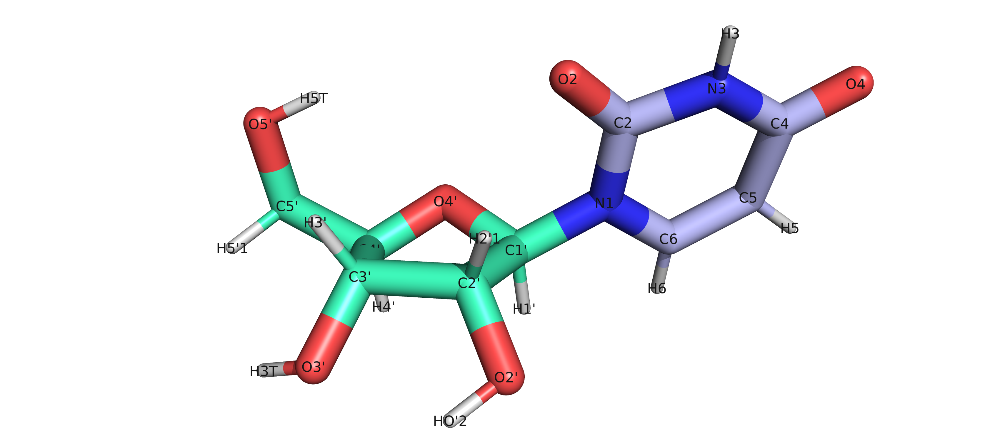
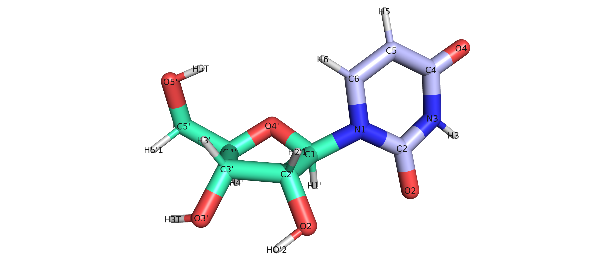
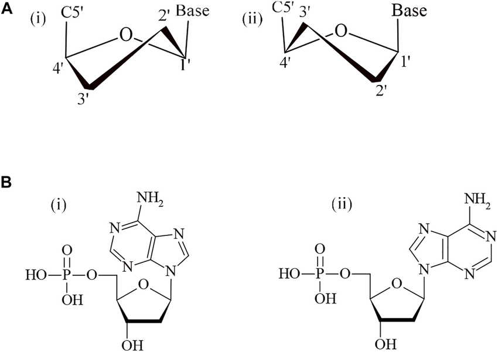

# An introduction to CpH-Metadynamics simulations

## Aim

This tutorial aims to train users to perform CpH-Metadynamics simulations using the stochastic titration constant-pH Molecular Dynamics method and PLUMED. 

## Objectives

Upon completion of this tutorial users will be able to:
- Write and modify both the CpHMD.settings and PLUMED input file to perform CpH-MetaD simulations ;
- Calculate free energy as a function of the chosen collective variables and the pH of the simulation ;
- Unbias conformational and pH-dependent properties ; 
- Estimate the errors in average protonations and pKa estimates ;
- How to combine multiple CpH-MetaD simulations through binless WHAM procedure ;
- Calculate properties using the WHAM pH weights.

## Software Installation

We will need PLUMED 2.9.0, a GROMACS version 2023 patched with PLUMED and the CpHMD v3.0 for this tutorial. The first two softwares can be installed using the instructions found [here](https://github.com/plumed/cecam2023/blob/main/software.md). For the installation of the CpHMD v3.0, we recommend visiting the [GitHub page](https://github.com/NunoFBOliveira/CpHMD_v3/tree/main) of the CpHMD method by the Machuqueiro group and installing the AMBER version. Following that installation, visit the [CpH-Metadynamics page](https://github.com/Tomfersil/CpH-MetaD/tree/main) by Tomás F. D. Silva and follow the instructions on how to patch the CpHMD v3.0 for modified AMBER $\chi$ OL3 RNA parameters and the metadynamics compatibility using PLUMED. Please follow nad cite the relevant papers mentioned in the GitHub pages. 

## Resources

This tutorial contains the following files:
- .occ files: a type of file that contains protonation data;
- .pdb/.xtc: a reference pdb file and the trajectories necessary for the analysis;
- HILLS:  files that contain the accumulated bias for each pH simulation; 
- .dat: PLUMED input and output files required for analyses in the notebook.

Additionally, several scripts are available for preparation of trajectories and protonation files, to generate PLUMED input files and to obtain their respective output data.

## Introduction to CpH-Metadynamics

Constant pH Metadynamics is a methodological approach that integrates two main ideas: the [stochastic titration Constant pH Molecular Dynamics](https://doi.org/10.1063/1.1497164) method and the [metadynamics](https://doi.org/10.1038/s42254-020-0153-0) method. For a more detailed explanation of how both these methods work, we recommend a deeper dive into the provided links. However, here we will tackle the main rationale behind the [CpH-Metadynamics approach](https://arxiv.org/pdf/2410.16064) and to do that we will tackle the st-CpHMD first.

### st-CpHMD:

The [st-CpHMD method](https://doi.org/10.1063/1.1497164) and other CpHMD methods aim to introduce an additional parameter into MD simulations which is the pH. The introduction of the pH relates to the fact that the standard MD protocols assume fixed protonation states in their residues whereas, in biological conditions, residue titration is dependent on the pH and the surrounding environment. While there are many valid ways to integrate the chemical potential within MD, in this work we use a start-stop approach to change the protonation state along the simulation partitioned into three main steps:

- a Poisson-Boltzmann/Monte Carlo (PB/MC) step ;
- a solvent relaxation step ;
- a MD production step ;

in the PB/MC, protonation free energies are calculated in a single conformation to determine the likelihood of the different protonation states of a titrable site, which are then sampled through a MC procedure until it satisfies a criterion. Upon reassigning the protonation state, a short MD is run with restraints on the solute to allow the solvent to readjust to the new charges. Finally, there is the production MD step, typically 20 ps, which samples the conformational space. After this step, we reinitiate the cycle for how many times are necessary until we reach the desired simulation length. A deeper dive on how we can extract energies from protonation-dependent properties will be addressed on the analysis segment.This method effectively couples discrete protonation states and conformational sampling, thus allowing a more rich description of a biological system.

### Metadynamics integration:

In typical metadynamics simulations, specific degrees of freedom are selected as fundamental for a given biological system. Hence, we accelerate the conformational sampling of the system in the function of those degrees of freedom called collective variables (CV) by periodically building a history-dependent bias potential. This bias potential is generated by summing Gaussians along the simulation in the CV space. For more details, check the theory behind the [PLUMED tutorial](https://www.plumed.org/doc-v2.9/user-doc/html/advanced-methods.html) on metadynamics.

Effectively, certain degrees of freedom are more challenging to sample and can relate to important conformational properties of the system of interest. Furthermore, these degrees of freedom may be regulated by key pH-sensitive residues or certain conformational ensembles require major conformational transitions triggered by changes in the electrostatic environment. These slow degrees of freedom benefit from enhanced sampling techniques such as metadynamics and a CpHMD method that easily changes the protonation state of key residues. This is done by allowing the PLUMED module to be ran in the MD production step of the st-CpHMD method following a pre-defined PLUMED input file with chosen CVs. We will explore how to define these settings in the following section. Integrating PLUMED within the st-CpHMD methodology effectively improves the accuracy of average protonation and pKa calculations as the tutorial will show in later sections.

## Preparing a CpH-compatible system: an RNA nucleoside

In this tutorial, we are going to prepare a simple nucleoside system. Uridine is one of the four canonical RNA nucleosides with an experimental pKa of 9.22 [1](https://www.degruyter.com/document/doi/10.1515/znb-1968-0105/html). Despite being a simple system, it will initiate into conformational and protonation dynamics of nucleic acids. The chosen CVs are the $\chi$ angle and the sugar puckering.  

<div align="center" style="margin: 20px 0;">
    
    <p><em>Representation of uridine syn state.</em></p>
</div>

<div align="center" style="margin: 20px 0;">
    
    <p><em>Representation of uridine anti state.</em></p>
</div>

The $\chi$ angle is a torsion defined by the O4'-C1'-N1-C2 for the uridine and it orients the relative position of the base to the ribose. There are two main states associated with the base-flipping: the syn state (-90º to 90º) and the anti state (90° to +180°; –90° to –180°). Considering the position of the titrable N3, when the moiety is facing the ribose is in the syn state and when facing the solvent is in the anti state. 

The other CV choice relates to sugar puckering. In RNA, the sugar puckering defines the position of the C2' / C3' atoms relative to the ribose plane. If the C2' atom is above the plane, it is considered a C2'-endo conformation, while if it is the C3' atom, it is a C3'-endo conformation (see figure taken from [2](https://doi.org/10.3389/fgene.2022.95925). This property correlates with the position of the 2'OH and its' interactions with nucleobases, while also defining the RNA helix form.

<div align="center" style="margin: 20px 0;">
    
    <p><em>Representation of the C2' and C3' endo states.</em></p>
</div>

In MD simulations, the transitions between C2'/C3' endo and syn/anti states can be difficult to converge, as slow degrees of freedom, therefore they are good CV choices. The preparation of a CpH-Metadynamics simulation follows a standard MD protocol: system setup, minimization, and initialization. However, some considerations need to be addressed for the $\chi$ OL3pH force field (available [here](https://github.com/Tomfersil/CpH-MetaD/tree/main/CpHMD_metaD/top/XOL3pH.ff)).

Our force field version was built in a modular approach compared to the standard $\chi$ OL3. As such, we need to convert the input .pdb file to be compatible with the CpH nomenclature found in force field .rtp file. This can be done manually or using the Python script available in the script folder. The script converts and reorganizes the .pdb file, thus identifying each ribose, phosphate group, nucleobase, and hydroxyl caps as independent residues. After preparing the CpH-compatible .pdb file, then a standard MD preparation protocol can be done before setting up the simulation.

## Setting up a CpH-Metadynamics simulation

Setting up a CpH-Metadynamics simulation requires defining parameters for two sections: the CpHMD section and the PLUMED input file. Previous knowledge on [metadynamics](https://www.plumed.org/doc-v2.9/user-doc/html/advanced-methods.html) and/or CpHMD simulations is helpful.
Examine the CpHMD.settings file. For now, let's observe the main defining settings:

``` bash
###  Start of CpHMD settings (pHmdp) ###
#
########################################
export SysName="U1mer" # Name of our protein or system
export Segments=10 # Number of MD/CpHMD Segments
export Seg_size=10 # Size of each Segment in nanoseconds
export ffDIR="CpHMD_MetaD/top/XOL3pH.ff"
export ffID=XOL3pH #XOL3pH # Force fields: G54a7pH/CHARMM36pH  --> GROMOS 54a7/CHARMM 36m
export plumed=grid # Static - static potential after metaD ; grid - run metaD using grids instead of running Hills; yes - standard metaD using Hills
export water=opc # Water model used
export pH=09.00 # Solution pH
export sites="2" # list of residues to titrate or "all" to titrate every residue
export temp=300.0 # Temperature (Kelvin)
export ionicstr=0.1 # Ionic Strength (moles/litre)

```

In this section, we need to define the number of segments and the size of each segment in nanoseconds. In the following exercise, we will manage 100 ns trajectories partitioned into 10 segments of 10 ns each. Another important input is the choice of force field. Popular force fields were specifically modified to incorporate multiple protonation tautomers for different biomolecules (see: [CpHMD-v3.0 Github page](https://github.com/NunoFBOliveira/CpHMD_v3/tree/main)). In this tutorial, we will be studying a uridine nucleobase, so we will use the XOL3pH ff (see the [XOL3pH parametrization](https://github.com/Tomfersil/CpH-MetaD/tree/main/CpHMD_metaD/top/XOL3pH.ff)).

Then it is possible to choose either to perform a plain CpHMD simulation or choose different options for a metadynamics simulation:

- plumed=yes: performs a metadynamics simulation reading from the HILLS every cycle;
- plumed=grid: stores both a GRID and HILLS file. Restarting a segment reads from the GRIDS file. Recommended setting due to speed;
- plumed=static: performs a static potential simulation by reading a previous HILLS file. No more Gaussians are added and continue to explore the CV space.

The "sites=" entry is needed to define the titrable sites based on the residue numbering in the .pdb file used as input. It accepts either a number or the all flag. Finally, we need to set system parameters such as the simulation temperature, the pH, and the ionic strength (in mol/L) for the PB calculations. For more details on the CpHMD settings, check the work done by the Machuqueiro Lab in the previously linked GitHub pages.

Concerning the specific parameters for the metadynamics section, either check the end of the file or the template PLUMED_GRID.dat file. We recommend this setting since it provides a greater advantage in I/O speed compared to the HILLS file.


``` plumed
# PLUMED
########################################
# Check if the timesteps and temperature values are consistent with previous CpHMD settings
# Activate MOLINFO functionalities by loading the reference system pdb
MOLINFO STRUCTURE=U1mer.pdb
RESTART # Do not remove this line. This is ignored for the first cycle in each block
# Define the chi angle and sugar puckering using the atom numbers found in the reference pdb file.
chi:  TORSION ATOMS=8,9,19,28
puck: PUCKERING ATOMS=6,8,9,13,11
# Activate well-tempered metadynamics in chi and the Zx component of the sugar puckering
# Define the PACE (frequency of steps) at which gaussians are added and their initial HEIGHT in kJ/mol
# Define the SIGMA (width) of the gaussians on the CV space. Check the CV fluctuations of an unbiased run and use 1/2 or 1/3 as a rule of thumb. 
# Define the biasfactor for the well-tempered. This is an important parameter.
# Define the temperature. It should match the chosen temperature in the CpHMD settings.
# Define the minimum and maximum of the GRID range and the stride at which it is written.
# With these settings, we are reading and writting over the same grid file every N steps. This is computationally lighter and faster to use.  
metad: METAD ARG=chi,puck.Zx PACE=500 HEIGHT=2.0 SIGMA=0.35,0.35 BIASFACTOR=4 TEMP=300 FILE=HILLS GRID_MIN=-pi,-pi GRID_MAX=pi,pi GRID_WSTRIDE=500 GRID_WFILE=GRID GRID_RFILE=GRID 
   
# Print both collective variables on COLVAR file every colvar_stride steps (Xps)
PRINT ARG=chi,puck.Zx,metad.bias  STRIDE=1000 FILE=COLVAR 
```
The main argument is the METAD command. Using the ARG keyword we need to specify the variables concerning our CVs upon the metadynamics bias will be added. In the uridine system that we are studying, it will be the $\chi$ angle and ribose puckering. Then we need to define, for both CVs, the HEIGHT of the Gaussians in kJ/mol, the width of the Gaussians defined by keyword SIGMA, and the PACE (frequency in number of time steps) at which Gaussian are added. The biasfactor and the temp are important parameters since they will define the convergence of the initial barrier height scaling. The defined parameters are standard for a nucleoside simulation using these specific CVs.

Concerning the GRIDS, the bias potential is also written to a GRID file (GRID_WFILE keyword) and then read (GRID_RFILE keyword) on the following cycle. The grid boundaries are defined by GRID_MIN and GRID_MAX, while the frequency of update is done every GRID_WSTRIDE time steps (it should match the PACE).

After carefully choosing the PLUMED.dat parameters and the CpHMD settings, a CpH-Metadynamics simulation can be run. To run a CpH-MetaD simulation, there are available scripts and template settings files in the following path of the [CpH-MetaD GitHub page](https://github.com/Tomfersil/CpH-MetaD/blob/main/CpHMD_metaD/scripts/). These simulations will generate several files:

Simulation/Input data: 
- GRID: the GRID file that is necessary to restart each cycle and segment of the CpH-MetaD. Do not erase between segments;
- HILLS: the accumulated bias potential of each segment ;
- .pHmdp: the general settings for each specific segment ;
- .gro: the last frame of each .xtc segment is stored as a reference to start the following segment ;

Output data:
- .occ: these files have the protonation data stored. Later we will examine them; 
- .mocc: average occupancy of each titrable site;
- .xtc: the MD trajectory of each segment is stored as an .xtc file ;

Simulation information data:
- .log.gz: log file of the simulation ;
- .err.gz: other data concerning GROMACS, PB and MC log information; 
- .info: these files store general information of the cycles performed in each segment;
