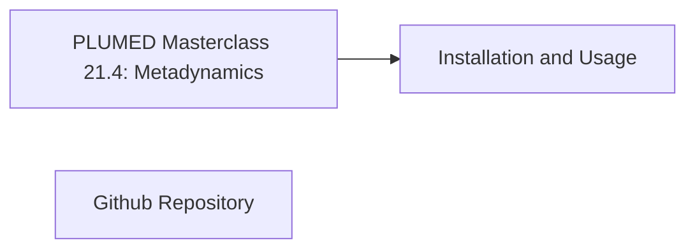

```mermaid
flowchart LR;
    A[PLUMED Masterclass 21.4: Metadynamics]-->B[Installation and Usage];
    C[Github Repository];

    click A "../../../21/004/data/NAVIGATION.html" "You should understand the fundamentals of molecular dynamics simulations and complete this masterclass before moving on"
    click B "INSTRUCTIONS.html" "Instructions for installation, guided questions, and troubleshooting steps for this resource"
    click C "https://github.com/chrispy67/VisMetaDynamics" "Github Repository"
```

<b><a href="https://www.plumed.org/doc-master/user-doc/html/actionlist/?actions=" target="_blank">Click here</a> to open manual pages for actions discussed in this tutorial.</b>

