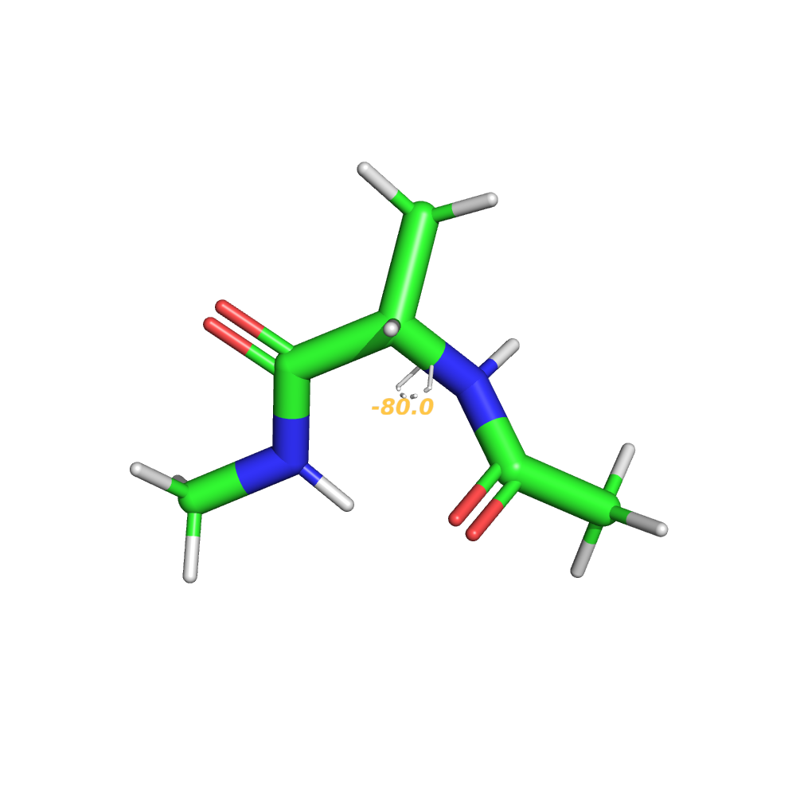
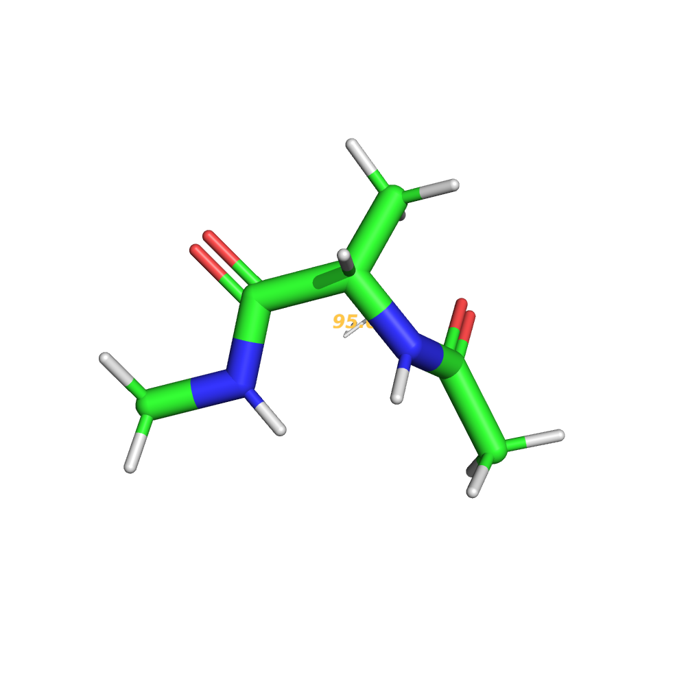
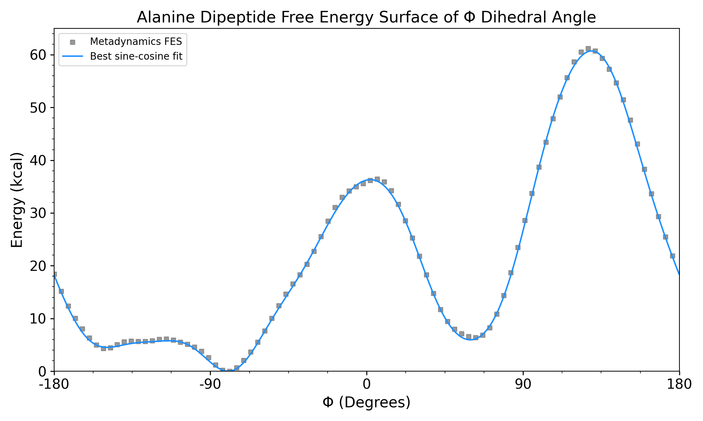

# VisMetaDynamics
An interactive tutorial to metadynamics and enhanced sampling techniques for molecular dynamics simulations.


# Introduction

VisMetaDynamics is a 1-dimensional Langevian integrator using a pre-defined free energy surface. This free energy surface is the result of a short MetaD simulation of alanine dipeptide, similar to this [tutorial](https://www.plumed.org/doc-v2.8/user-doc/html/lugano-3.html) and many others using alanine dipeptide as a toy system. The unmistakable, *a priori* free energy surface consistent with alanine dipeptide's preference towards a *trans* configuration is an instantly recognizable and repeatedly proven result, both computationally and experimentally. 

When I was first learning how to use metadynamics, I struggled to visualize the effects these parameters had on the resulting free energy surface. Besides running several metadynamics simulations with slightly different parameters, there was no intuitive way to understand the effects these hyperparameters had on the reweighted free energy surface. VisMetaDynamics allows you to tune these parameters by hand with many options to visualize and compare simulations in seconds.

Users should try several combinations of parameters and explore the effects these parameters have on end results, simulation performance, and system behavior.


## <b> What/who is this resource for for? </b>
VisMetaDynamics is designed for someone already familiar with MD simulations. This tool is meant to augment [existing tutorials](http://www.plumed-tutorials.org/browse.html) and resources by offering a visual, qualitative understanding of the effect of hyperparameters on the resulting free energy surface and performance. Users are encouraged to play with these sliders and observe changes in simulation performance, accuracy of the free energy surface, and overall simulation behavior as a function of these parameters. 

# Installation
Using this tutorial is as simple as cloning the Github repository, navigating to the repository, and running `python app.py`. This will automatically open up a Flask webpage on your default browser. The Python scripts are run locally and can be computationally intensive depending on the parameters chosen and hardware. The ranges of the values on the sliders are chosen to allow the user to explore many combinations of parameters, but may result in <b>computationally intractable calculations</b>.

A command line interface is also available and simple to use. Each parameter can be addressed the same way, albeit with more freedom to pick extreme parameters that may cause issues with the integrator. The parameters are adjusted with optional command line arguments and unless told otherwise, the same default parameters from the Flask site  will be used.

## CLI example usage
Achieve better sampling with a longer metadynamics simulation and more even sampling:

```
python src/walker.py --steps 100000 --metad --w 1.0 --hfreq 100
```

Or just watch the ball go back and forth with an unbiased simulation:

```
python src/walker.py --steps 10000
```

## Troubleshooting
All of the modules and functions used by `app.py` can be run independently of the Flask application for troubleshooting purposes. If there are issues loading the Flask webpage, try `python walker.py` or `python run_walker.py`. These should display all of the figures visible on the webpage, and `run_walker.py` will print the output that is passed to `app.py` in JSON format. If both of these scripts succeed, there is likely a network or browser issue with `app.py`.

> [!NOTE]
>  This tutorial uses common libraries and has few dependencies, such as Scipy, Numpy, pickle, ffmpeg, and Flask. `environment.yml` is included if needed. 

> [!NOTE]
> If you are having Flask, internet, or browser issues, try to use the command line interface! Directions can be found above. 


> [!CAUTION]
> Maximizing simulation steps and minimizing hill frequency is computationally expensive, explore at your own risk. 
<br>


# About

First described by [Laio and Parrinello][1] in 2002, metadynamics has proven to be useful in applications such as [drug discovery][2], [materials science][3], [ligand bindings][4], and [much more][5]. Since then, numerous versions of metadynamics have been designed to address the shortcomings of classical metadynamics; parallel-bias metadynamics, well-tempered metadynamics, and bias-exchange metadynamics are all flavors of the original 2002 paper. Metadynamics and all related acronyms can be applied easily to modern MD engines via plugins or built-in functions, making this family of enhanced sampling techinques widely accessible. A thorough review of the rigorously correct implementations and limitations for specific use cases of MetaD are beyond the scope of this resource, but users are encouraged to consult [documentation](https://www.plumed.org/) and [practical applications](https://www.plumed-nest.org/) on their own. 


In metadynamics, potential energy is added to a chosen collective variable (CV) periodically in the form of Gaussian kernels, or bias. This bias encourages the system to escape metastable states, allowing the system to  explore otherwise inaccessible conformations in the CV space. With carefully chosen CVs and parameters, rare events can be observed on timescales accessible by modern MD engines and calculate probability distributions of metastable states in the CV space. 

Pictured below are stick representations of *cis* (left) and *trans* (right) configurations of alanine dipeptide. The dihedral angle Φ corresponding to the two metastable states are also defined.

<p float="left">
    
     
</p>


 To ensure adequate sampling and simulation performance, several parameters must be chosen. The equation below shows the added potential as a function of time from classical metadynamics:

$$
V_S(t) = t_0 \sum_{t'=\tau_G} W_0 \exp \left( - \frac{(S_i - S_i(t'))^2}{2\sigma_i^2} \right)
$$

Given appropriate metadynamics parameters and simulation time, enough bias will be added to the system where the biased CV will have enough potential energy to freely diffuse through the CV space. This is a sign that the CV has enough energy to overcome local and global maxima and removing the bias (reweighting) will correspond to the underlying free energy of the CV. This is known colloquially as <b>convergence</b>.  There are several [reweighting techniques](6) that can be used to produce a free energy surface for real simulations, but in this 1-dimensional case the free energy surface can be approximated as:

$$
F_{b}(x, t) = -V(x, t)
$$

<p float="left">
    
</p>

For this tutorial, the CV is periodic and the underlying potential energy is known; in practice, <b>this is rarely true</b>. If the CV space is aperiodic and not known, a system trapped in a broad, deep free energy basin may appear converged. This phenomenon can be visualized in VisMetaDynamics by starting a very short simulation at a local minima. 

In summary, this tutorial aims to give users an opprotunity to develop an intuition for choosing MD simulation and metadynamics parameters. Users are encouraged to explore the extremes of the parameters available and build their own intuition for what these paramters do. In practice, however, metadynamics simulations and their interpretations are far more complex than what is presented here, so go read some papers!

# Contributing 

The underlying potential of the integrator is a sine/cosine fit of a free energy surface produced from a real metadynamics simulation. Details to reproduce the results of this simulation can be found in `MD/`. 

The code used in this tutorial is object-oriented and meant to be modular in case someone wants to explore a new underlying potential or a different flavor of metadynamics. While providing the integrator a new potential to explore is made easy via classes and pickle objects, the metadynamics calculations in `walker.py` and the function applying a periodic boundary condition are more rigid. 

It would be really cool to allow users to explore other flavors of metadynamics or enhanced sampling techniques. Applying the integrator and same model system to [Parallel-bias Metadynamics](https://doi.org/10.1021/acs.jctc.5b00846) or [umbrella sampling](https://doi:10.1016/0021-9991(77)90121-8) on a separate webpage might be done in future releases. 

# References
[Escaping free-energy minima, Laio and Parrinello](https://doi.org/10.1073/pnas.202427399)

[Metadynaimcs for Perspective Drug Desig: Computationally Driven Synthesis of New Protein-Protein Interaction Inhibitors Targeting the EphA2 Receptor](https://pubs.acs.org/doi/10.1021/acs.jmedchem.6b01642)

[Crystal Structrue Transformations in SiO2 from Classical and ab initio Metadynamics](https://doi.org/10.1038/nmat1696)

[Exploring Product Release from yeast Cytosine Deaminase with Metadynamics](https://pubs.acs.org/doi/full/10.1021/acs.jpcb.3c07972)

[Metadynamics: A Method to SImulate Rare Events and Reconstruct the Free Energy in Biophysics, Chemistry, and Material Science](https://doi.org/10.1088/0034-4885/71/12/126601)

[Data Reweighting in Metadynamics Simulations](https://doi.org/10.1021/acs.jctc.9b00867)

[1]: https://doi.org/10.1073/pnas.202427399
[2]: https://pubs.acs.org/doi/10.1021/acs.jmedchem.6b01642
[3]: https://doi.org/10.1038/nmat1696
[4]: https://pubs.acs.org/doi/full/10.1021/acs.jpcb.3c07972
[5]: https://doi.org/10.1088/0034-4885/71/12/126601
[6]: https://doi.org/10.1021/acs.jctc.9b00867


