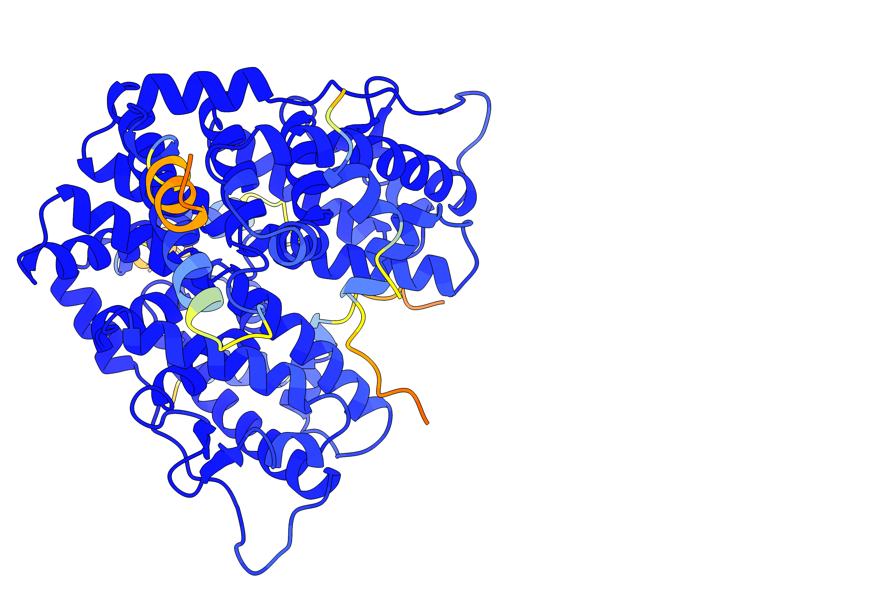

# Structural refinement of protein targets with Bayesian inference for improved druggability

## Aims
The aim of this tutorial is to learn how to use Bayesian inference through PLUMED to refine protein complexes for enhanced virtual screening of small molecules, critical for advancing drug discovery.

## Theoretical background
This tutorial uses the bAIes approach that is founded on the principles of Bayesian inference. It combines the local strucural uncertainties in AlphaFold (AF) predictions with state-of-the-art
molecular mechanics force fields to optimally improve the physico-chemical properties of the system. A more detailed theory is described in the following publication:

[S. Sen, S. E. Hoff, T. Morozova, V. Schnapka, M. Bonomi. Advancing in silico drug design with Bayesian refinement of AlphaFold models.](https://doi.org/10.1101/2025.06.25.661454
)

## Installation
Installation instructions of the software to perform bAIes simulations in this tutorial can be found [here](install.md).

## Resources
To do this tutorial, we provide you with the scripts needed to generate the PLUMED input files, and the protocol to build and refine a protein complex system.

The files needed to complete the tutorial can be found in our github repository. We suggest that you clone this repository to avail the required files all at once at a location where you desire
to do this tutorial. Access the repository [here](https://github.com/COSBlab/bAIes-SM).

## Tutorial
For the purpose of this tutorial, we use the case of a human estrogen receptor (PDB 3ERD).
This system comprises the ligand-binding domain (LBD) of the receptor (herα) in complex with diethylstilbestrol (DES) and a peptide derived from the NR box II region of the coactivator GRIP1,
as well as the crystal structure of the hERα LBD bound to the selective antagonist 4-hydroxytamoxifen (OHT).  
We focus on the DES-LBD-peptide complex.

  
  
  
<em>The entire protein complex and a close-up view of the binding pocket showing the protein molecular bonds, with the native ligand inside it.</em>

The tutorial starts from the protein sequence, and takes you through the AlphaFold structure prediction, followed by Bayesian structural refinement by bAIes.
After this, an optimal model is selected as a refined docking target from an ensemble of bAIes models.  

## Flowchart
The flow chart shown below indicates the order in which you should consult the resources.
You can click on the nodes to access the various resources.
Follow the thick black lines for the best results.
The resources that are connected by dashed lines are supplementary resources that you may find useful during the exercise.  
(The tutorial can be accessed [here](https://github.com/COSBlab/bAIes-SM/tree/main/tutorial).)


<b><a href="https://www.plumed.org/doc-master/user-doc/html/actionlist/?actions=GROUP,BAIES,PRINT,BIASVALUE" target="_blank">Click here</a> to open manual pages for actions discussed in this tutorial.</b>

