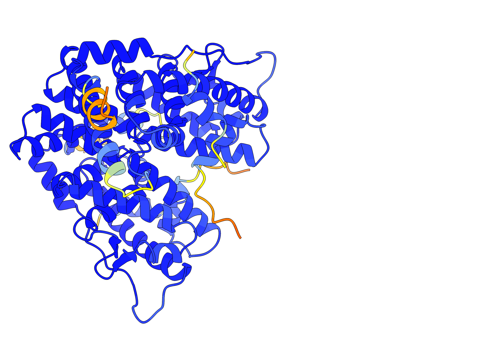
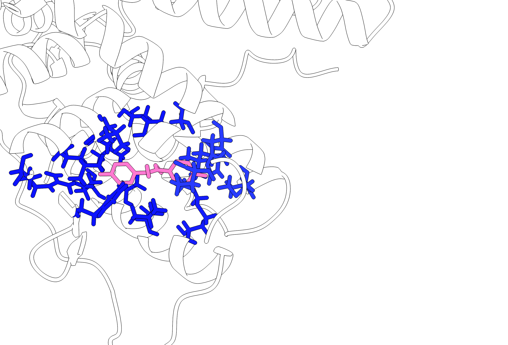

# bAIes-SM Tutorial

In this tutorial, you will learn how to use **bAIes** to refine protein complex structures for improved virtual screening performance.  
**bAIes** is a powerful tool based on Bayesian inference that integrates AlphaFold2 (AF2) local pairwise distance confidence scores with state-of-the-art molecular mechanics force fields.

You will begin by generating an initial protein complex structure and residue-level distance confidence information using AlphaFold2.
Next, we will perform a molecular dynamics (MD) relaxation with Gromacs.
Following this, we will use bAIes to refine the protein models in a Bayesian way, where the MD simulations are guided jointly by MD force fields and the AF-derived local distance confidences.
From the resulting trajectories, one or more refined structures will be selected and used as targets for small molecule (SM) docking.

This workflow is a critical and enabling step in structure-based drug discovery, as it enhances the accuracy and reliability of protein targets for virtual screening, 
ultimately increasing the likelihood of identifying promising therapeutic compounds.

Let's begin! We will use the example of a human estrogen receptor ([PDB 3ERD](https://www.rcsb.org/structure/3ERD)).
This system comprises the ligand-binding domain (LBD) of the receptor (herα) in complex with diethylstilbestrol (DES) and a peptide derived from the NR box II region of the coactivator GRIP1,
as well as the crystal structure of the hERα LBD bound to the selective antagonist 4-hydroxytamoxifen (OHT).  
We focus on the DES-LBD-peptide complex.

<div align="center">
  
  
  <div><em>The entire protein complex and a close-up view of the binding pocket showing the protein molecular bonds, with the native ligand inside it.</em></div>
</div>

## 1 AF
Please go into the relevant directory for this step from the repository root:
```bash
cd tutorials/1-AF
```
As 3ERD is a protein complex, we will use AF multimer for its structure prediction. We will use the standard full MSA, and run it as follows:
```bash
srun alphafold --fasta_paths=tutorials/1-AF/fasta.fasta\
          --max_template_date=2020-05-14 \
          --output_dir=tutorials/1-AF/out \
          --model_preset=multimer \
          --data_dir=${ALPHAFOLD_DATA} \
          --uniref90_database_path=${ALPHAFOLD_DATA}/uniref90/uniref90.fasta \
          --mgnify_database_path=${ALPHAFOLD_DATA}/mgnify/mgy_clusters.fa \
          --template_mmcif_dir=${ALPHAFOLD_DATA}/pdb_mmcif/mmcif_files \
          --obsolete_pdbs_path=${ALPHAFOLD_DATA}/pdb_mmcif/obsolete.dat \
          --bfd_database_path=${ALPHAFOLD_DATA}/bfd/bfd_metaclust_clu_complete_id30_c90_final_seq.sorted_opt \
          --uniref30_database_path=${ALPHAFOLD_DATA_EXT}/Uniref30_2023_02/UniRef30_2023_02 \
          --db_preset=full_dbs \
          --uniprot_database_path=${ALPHAFOLD_DATA}/uniprot/uniprot.fasta \
          --pdb_seqres_database_path=${ALPHAFOLD_DATA}/pdb_seqres/pdb_seqres.txt \
          --use_gpu_relax=true \
          --models_to_relax=best
```

Note the following:  
`ALPHAFOLD_DATA` is the path to the standard AF databases which are searched during the execution, and should be specified if not default.
`ALPHAFOLD_DATA_EXT` is a user-specific location of Uniref30 database that includes data till 30-02-2023, which may have to be downloaded separately to allow the full database `full_dbs` search.  


As this is a time-consuming and expensive process to set up and run, we have already provided you with the relevant results. As you can see, we asked AF to relax only the highest ranked structure.
Among the produced files, our interest lies in that one relaxed structure file  (`relaxed.pdb`) and the metric file (`result.pkl`).
Please note that due to storage space constraints, we have omitted any extra information from `result.pkl` that bAIes will not need in the later steps. We will use the metric file for bAIes in step 3.

## 2 MD relaxation
Please go into the relevant directory for this step from the repository root:
```bash
cd tutorials/2-MD
```

We will now equilibrate the AF predicted structure in water as solvent with vanilla MD using the AMBER forcefield. For this, we will first need to set up the system for MD.
We use GROMACS as the MD software. 
We create the topology of the AF model as:
```bash
gmx_mpi pdb2gmx -f ../1-AF/out/relaxed.pdb -ff amber99sb-ildn -water tip3p -ignh -posrefc 1000 -o temp.gro
```
Note that we use `gmx_mpi` for executing GROMACS because it is the MPI-enabled version, allowing for parallel execution across multiple processors.
We recommend you to use the MPI version to handle these typically large systems which you may have already installed before starting the tutorial.
If not, you can find instructions [here](../install.md).
Note that `temp.gro` may have changed indices of the atoms, but we will take care of this when indexing our files.  
Note that we have included in the topology description a positional restraint on all heavy atoms. We will use this in the steps of relaxing the system.
We place the AF model in a cubic box of suitable dimensions, and solvate the protein with TIP3P water molecules, and add NA+ and CL- and 0.15M concentration ensuring neutrality:
```bash
#box
gmx_mpi editconf -f temp.gro -o temp_box.gro -c -d 1.0 -bt cubic
#solvate
gmx_mpi solvate -cp temp_box.gro -cs spc216.gro -o temp_solv.gro -p topol.top
#ionise
gmx_mpi grompp -f mdps/ions.mdp -c temp_solv.gro -p topol.top -o ions.tpr --maxwarn 1
echo SOL| gmx_mpi genion -s ions.tpr -o solv_ions.gro -p topol.top -pname NA -nname CL -neutral -conc 0.154
#make index file
echo "q"|gmx_mpi make_ndx -f solv_ions.gro -o index.ndx
```

We will now use a steepest-descent algorithm to minimize the energy of this system, followed by relaxation in NVT conditions (T=300K) and then in NPT conditions (P=1 bar, T=300K) for 100ps each.
Note that the equilibration is carried out with positional restraints (we ensured this in the topology creation step) on all heavy atoms of the system (defined as `DPOSRES` in `nvt.mdp` and `npt.mdp`, and described in `topol_Protein_chain_X.itp` (X=A,B,C,D))
```bash
# energy minimisation
gmx_mpi grompp -f mdps/em.mdp -c solv_ions.gro -p topol.top -n index.ndx -o em.tpr
gmx_mpi mdrun -deffnm em -v
# nvt
gmx_mpi grompp -f mdps/nvt.mdp -c em.gro -r em.gro -p topol.top -n index.ndx -o nvt.tpr
gmx_mpi mdrun -nsteps 50000 -deffnm nvt -v
# npt
gmx_mpi grompp -f mdps/npt.mdp -c nvt.gro -r nvt.gro -t nvt.cpt -p topol.top -n index.ndx -o npt.tpr -maxwarn 1
gmx_mpi mdrun -nsteps 50000 -deffnm npt -v
```

## 3.1 bAIes setup
Please go into the relevant directory for this step from the repository root:
```bash
cd tutorials/3-bAIes-setup
```
bAIes uses Bayesian inference to perform MD with the knowledge of AF-predicted local distance confidence. For this, bAIes needs to have a direct on-the-fly communication with
the distance confidence information that is available in `../1-AF/result.pkl`.
AF distograms are distance distributions between every pair of C_β  (C_α for glycine) atoms.

<blockquote>

More about how the distance confidence information is stored:  

`result.pkl` can be read as a Python dictionary. Its entry `distogram` comprises an array (`bin_edges`) specifying the edges of 64 equispaced distance bins (in Angstroms), 
which define the possible pairwise C<sub>β</sub> atom distances of the protein residues (C<sub>α</sub> for Glycine) which range from 0.2 to 2.2 nm.

Corresponding to these bin edges, there is an array (`logits`) specifying the probability (in a raw output form) of observing each such distance. In summary:  

result.pkl: {  
    &nbsp;&nbsp;  'distogram': {  
    &nbsp;&nbsp;&nbsp;&nbsp;    'bin_edges': (64,),  
    &nbsp;&nbsp;&nbsp;&nbsp;    'logits':    (N_residues, N_residues, 64,),      
    &nbsp;&nbsp;}  
}  

</blockquote>
<br>

The communication between bAIes and AF comprises 3 kinds of information:  
i) A list of residue pairs for which bAIes will need the distance confidence information.

<blockquote>

Every C<sub>β</sub>-C<sub>β</sub> atom pair is associated with a distance probability distribution, but not all of them are accounted for by bAIes.
bAIes filters only those pairs which are more likely to have strong interactions, and uses their pairwise distance confidence information from AF to augment the force field in a Bayesian framework.

bAIes selects those residue pairs which:  
a) have the most probable distance (in their distogram) less than a residue pair-specific cut-off, handled by a map from the Baker lab (Methods in article), and,  
b) are separated by at least 3 residues in sequence.

</blockquote>
<br><br>

ii) The most probable distance between the C_β atoms of those residue pairs. 

<blockquote>

The distograms provide a raw distance probabilty as `logits`. We convert them to probability distributions with the `softmax` function.
For each selected residue pair, the most probable distance can now be directly obtained as the distance corresponding to the peak of the probability distribution.

</blockquote>
<br><br>

iii) A measure of confidence in those pairwise distributions.

<blockquote>

The probability distribution of each selected residue pair is fitted with a lognormal curve.
The standard deviation of this fitted curve is then used as a quantitative measure of uncertainty -— a higher standard deviation indicates lower confidence in the predicted distance.

</blockquote>
<br>

Let us back up the provided results:

```bash
cp logn.out bck.logn.out
cp index.ndx bck.index.ndx
```

We will now extract these 3 pieces of information all at once by using the `../../scripts/preprocess.py` script as follows: 

```bash
python3 ../../scripts/preprocess_AFdata.py \
            -pdb ../1-AF/relaxed.pdb \
            -pkl ../1-AF/out/result.pkl \
            -mdpdb mdpdb.pdb \
            -out logn.out \
            -ndxout index.ndx \
            -model lognorm \
            -nmodes 1 \
            -cutoff matrix
```

Note that we need to be careful here about the indexing of the atoms which are altered by GROMACS.
We need the distogram information that was indexed by AF (as in `relaxed.pdb`) to be correctly read by GROMACS.
The mapping is provided to the preprocessing script by a GROMACS format pdb (`mdpdb.pdb`) obtained by:
```bash
echo "System"|gmx_mpi trjconv -f ../2-MD/temp.gro -s ../2-MD/temp.gro  -o ../2-MD/mdpdb.pdb
```


File contents example: 

```txt
#! FIELDS Id atom_i atom_j mu sigma
#! SET model lognormal
1 7 67 -0.320907 0.268035
2 7 86 -0.228300 0.298040
3 24 86 -0.359068 0.174432
4 24 108 -0.067064 0.074948
5 39 108 -0.432000 0.102050
6 50 132 -0.434579 0.090892
7 67 143 -0.412576 0.126715
8 86 165 -0.167598 0.316962
...
```
Column 1: &nbsp;&nbsp; Field identity of selected pairwise residues  
Column 2: &nbsp;&nbsp; Atom i of selected pair ij  
Column 3: &nbsp;&nbsp; Atom j of selected pair ij  
Column 4: &nbsp;&nbsp; Logarithm of mean distance value of fitted lognormal curve  
Column 5: &nbsp;&nbsp; Standard deviation of fitted lognormal curve
<br>

The output of this script (`logn.out` and `index.ndx`) is already provided to you.
The latter file contains redundant information about the selected residues, but in a different format.
It is the unique list of C_β atoms (not atom pairs) belonging to the selected pairwise residues.


## 3.2 bAIes production
Please go into the relevant directory for this step from the repository root:
```bash
cd tutorials/3-bAIes-prod
```

To run bAIes, you will need a PLUMED actions script that specifies how the C_β-C_β distances should be incorporated.
We have provided this to you (`logn_jeff.dat`).
<blockquote>

**File contents**
Example: 

```plumed
# 1:read index file
batoms: GROUP NDX_FILE=3-bAIes-setup/index.ndx NDX_GROUP=batoms

# 2:define action
baies: BAIES ATOMS=batoms DATA_FILE=3-bAIes-setup/logn.out PRIOR=JEFFREYS TEMP=2.478541306

# 3:log
PRINT ARG=baies.ene FILE=COLVAR STRIDE=500

# 4:bias
bbias: BIASVALUE ARG=baies.ene STRIDE=4
```
Line 1: Defines keyword `batoms` by reading the group `batoms` from the index file `index.ndx`  
Line 2: Defines action `baies` to operate on `batoms` using input `logn.out`, and employing the error prior of type `JEFFREYS`  
Line 3: Defines logging information  
Line 4: Applies a biasing potential to the simulation based on the value of `baies.ene` every 4 steps

</blockquote>
<br>

Starting from the MD equilibrated structure, we run bAIes for 5ns as follows:

```bash
gmx_mpi grompp -f ../2-MD/mdps/md_nvt.mdp -c ../2-MD/npt.gro -t ../2-MD/npt.cpt -p ../2-MD/topol.top -o md.tpr
gmx_mpi mdrun -nsteps 5000000 -pin on -ntomp $OMP_NUM_THREADS -plumed logn_jeff.dat --deffnm md
```
Note that to execute the above, you will need the PLUMED-patch of GROMACS to be installed, which you may have already done before starting the tutorial. If not, you can find instructions [here](../install.md).  
Note that you need to set the number of CPU cores to use ($OMP_NUM_THREADS=10, for instance).


## 3.3 Model(s) selection as docking targets
Please go into the relevant directory for this step from the repository root:
```bash
cd tutorials/3-bAIes-select
```

We now have the trajectory generated by bAIes, and it is time to select suitable models from it that will form the docking targets.  
For this, we will cluster the trajectory according to their binding pocket structure as follows:
We define the pocket as the set of heavy protein atoms within 6Å of any heavy atom of the ligand in the X-ray structure.
Then we employed the <em>gromos</em> clustering approach using the RMSD calculated on the C_β pocket atoms as metric. 

We will need a structure file (we use `mdpdb.pdb`) and we will need the pocket selection in the index file.  

```bash
# Make index
echo q|gmx_mpi make_ndx -f ../3-bAIes-setup/mdpdb.pdb -o index.ndx

# Make index group: Pocket
pocket_string="not type H and protein and chainID A and resid 50 53 54 56 57 60 90 91 94 95 97 98 101 111 125 128 131"
python3 ../../scripts/make_ndx.py ../3-bAIes-setup/mdpdb.pdb "${pocket_string}" Pocket --ndx index.ndx

# Make index group: protein
python3  ../../scripts/make_ndx.py ../3-bAIes-setup/mdpdb.pdb "protein" Protein_dock --ndx index.ndx
```

For this example, we choose a cutoff of 0.040 nm to ensure a balance between conformationally distinct and homogeneous model.
Note that a range of cutoffs is usually tested to find the correct balance. In our experience, while very large/small cutoffs can obviously cause problems, the approach is insensitive to differences of around ±0.02 nm.  
To perform the model selection, we cluster the trajectory as follows:

```bash
mkdir clusters
( echo "Pocket"; echo "Protein_dock-H" ) | gmx_mpi cluster -f ../3-bAIes-prod/md.xtc -s ../3-bAIes-setup/mdpdb.pdb -n index.ndx -g clusters/cluster.log \
                -dist clusters/rmsd-dist.xvg -sz "clusters/clust-size.xvg" -cl clusters/clusters.pdb -o clusters/rmsd-clust.xpm \
                -cutoff 0.040 -method gromos -b 0 -e 5000
```

Finally, the different clusters can be split into individual models as:

```bash
bash ../../scripts/split_clusters.sh clusters
```

The bAIes-refined models are now located in the `clusters/frames` subdirectory, ranked according to sampled population.
Typically, the highest rank (`model_1.pdb`) is considered a highly accurate target model against which virtual screening of small molecules can be performed.
In our study (to be published), we have showed that our test cases produce an enrichment, in particular early enrichment, significantly higher than both raw AF models as well as MD-refined models.
