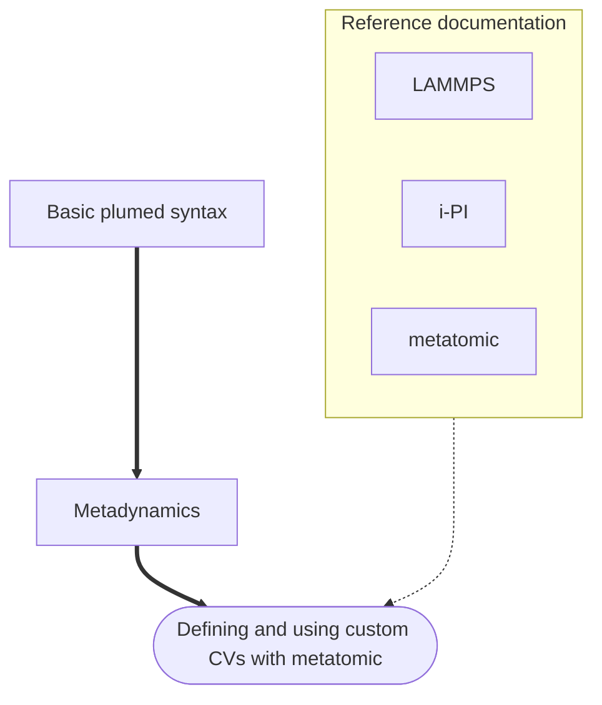

# Defining custom machine learning CV with metatomic

[Metatomic](https://docs.metatensor.org/metatomic/) is a library to use
arbitrary machine learning models together with arbitrary simulation tools.
Here we show how to use the interface between metatomic and plumed to define
fully custom collective variables (CV). These CV can be defined using typical
machine learning tools, but any Python function based on PyTorch will also work,
allowing to define new CV extremely easily.

Through the use of PyTorch, you can focus on defining the CV itself, and
automatically get its gradients. You can also execute the code computing your CV
on GPUs and other accelerators.

Other tools are able to interact with CV defined as metatomic models, most
notably [chemiscope](https://chemiscope.org). You can therefore visualize how
complex CV act on representative structures before even starting a simulation,
and improve the Cv interactively.

## Free-energy surface of LJ38 cluster

The cluster of 38 atoms interacting through a Lennard-Jones potential is an
interesting benchmark system for collective variables, because its global
minimum energy structure is a truncated octahedron with `O_h` symmetry. The
potential energy surface also has a multi-funnel landscape, meaning the system
can easily get trapped in other local minima.

This tutorial contains a hands-on interactive tutorial (that you can also
download and run locally) that defines two different collective variables to
drive metadynamics for this system. The first CV is based on the histogram of
coordination number, and the second one uses a machine learning representation
(the SOAP spherical expansion) as a basis to define Steinhardt oder
parameters-like CVs.



 Click on the labels of the actions for more information on what each action computes 

<pre class="plumedlisting">
<b name="data/NAVIGATION.md_working_1.datsoap" onclick='showPath("data/NAVIGATION.md_working_1.dat","data/NAVIGATION.md_working_1.datsoap","data/NAVIGATION.md_working_1.datsoap","brown")'>soap</b>: METATOMICUse arbitrary machine learning models as collective variables. <a href="https://www.plumed.org/doc-master/user-doc/html/METATOMIC" style="color:green">More details</a><i></i> ...
    MODELpath to the exported metatomic model<i></i>=soap-cv.pt
    EXTENSIONS_DIRECTORYpath to the directory containing TorchScript extensions to load<i></i>=./extensions/
    SPECIES1the indices of atoms in each PLUMED species<i></i>=1-38
    SPECIES_TO_TYPESmapping from PLUMED SPECIES to metatomic's atom types<i></i>=18
...
 The METATOMIC action with label <b>soap</b> calculates the following quantities:<table  align="center" frame="void" width="95%" cellpadding="5%"><tr><td width="5%"><b> Quantity </b>  </td><td><b> Description </b> </td></tr><tr><td width="5%">soap.outputs</td><td>collective variable created by the metatomic model</td></tr><tr><td width="5%">soap.value</td><td>collective variable created by the metatomic model</td></tr></table><b name="data/NAVIGATION.md_working_1.dathistogram" onclick='showPath("data/NAVIGATION.md_working_1.dat","data/NAVIGATION.md_working_1.dathistogram","data/NAVIGATION.md_working_1.dathistogram","brown")'>histogram</b>: METATOMICUse arbitrary machine learning models as collective variables. <a href="https://www.plumed.org/doc-master/user-doc/html/METATOMIC" style="color:green">More details</a><i></i> ...
    MODELpath to the exported metatomic model<i></i>=histo-cv.pt

    SPECIES1the indices of atoms in each PLUMED species<i></i>=1-38
    SPECIES_TO_TYPESmapping from PLUMED SPECIES to metatomic's atom types<i></i>=18
...
 The METATOMIC action with label <b>histogram</b> calculates the following quantities:<table  align="center" frame="void" width="95%" cellpadding="5%"><tr><td width="5%"><b> Quantity </b>  </td><td><b> Description </b> </td></tr><tr><td width="5%">histogram.outputs</td><td>collective variable created by the metatomic model</td></tr><tr><td width="5%">histogram.value</td><td>collective variable created by the metatomic model</td></tr></table><b name="data/NAVIGATION.md_working_1.datcv1" onclick='showPath("data/NAVIGATION.md_working_1.dat","data/NAVIGATION.md_working_1.datcv1","data/NAVIGATION.md_working_1.datcv1","brown")'>cv1</b>: SELECT_COMPONENTSCreate a new value to hold a subset of the components that are in a vector or matrix <a href="https://www.plumed.org/doc-master/user-doc/html/SELECT_COMPONENTS" style="color:green">More details</a><i></i> ARGthe value from which we are selecting components<i></i>=<b name="data/NAVIGATION.md_working_1.dathistogram">histogram</b> COMPONENTSthe components in the input value that you woul like to build a new vector from<i></i>=1
The SELECT_COMPONENTS action with label <b>cv1</b> calculates the following quantities:<table  align="center" frame="void" width="95%" cellpadding="5%"><tr><td width="5%"><b> Quantity </b>  </td><td><b> Description </b> </td></tr><tr><td width="5%">cv1.value</td><td>a vector containing the selected components</td></tr></table><b name="data/NAVIGATION.md_working_1.datcv2" onclick='showPath("data/NAVIGATION.md_working_1.dat","data/NAVIGATION.md_working_1.datcv2","data/NAVIGATION.md_working_1.datcv2","brown")'>cv2</b>: SELECT_COMPONENTSCreate a new value to hold a subset of the components that are in a vector or matrix <a href="https://www.plumed.org/doc-master/user-doc/html/SELECT_COMPONENTS" style="color:green">More details</a><i></i> ARGthe value from which we are selecting components<i></i>=<b name="data/NAVIGATION.md_working_1.dathistogram">histogram</b> COMPONENTSthe components in the input value that you woul like to build a new vector from<i></i>=2

The SELECT_COMPONENTS action with label <b>cv2</b> calculates the following quantities:<table  align="center" frame="void" width="95%" cellpadding="5%"><tr><td width="5%"><b> Quantity </b>  </td><td><b> Description </b> </td></tr><tr><td width="5%">cv2.value</td><td>a vector containing the selected components</td></tr></table><b name="data/NAVIGATION.md_working_1.datmtd" onclick='showPath("data/NAVIGATION.md_working_1.dat","data/NAVIGATION.md_working_1.datmtd","data/NAVIGATION.md_working_1.datmtd","brown")'>mtd</b>: METADUsed to performed metadynamics on one or more collective variables. <a href="https://www.plumed.org/doc-master/user-doc/html/METAD" style="color:green">More details</a><i></i> ...
    ARGthe labels of the scalars on which the bias will act<i></i>=<b name="data/NAVIGATION.md_working_1.datcv1">cv1</b>,<b name="data/NAVIGATION.md_working_1.datcv2">cv2</b>
    HEIGHTthe heights of the Gaussian hills<i></i>=0.04
    PACEthe frequency for hill addition<i></i>=30
    SIGMAthe widths of the Gaussian hills<i></i>=1.0,0.5
    GRID_MINthe lower bounds for the grid<i></i>=0,0
    GRID_MAXthe upper bounds for the grid<i></i>=30,20
    GRID_BINthe number of bins for the grid<i></i>=300,200
    BIASFACTORuse well tempered metadynamics and use this bias factor<i></i>=40
    FILE a file in which the list of added hills is stored<i></i>=HILLS
    TEMPthe system temperature - this is only needed if you are doing well-tempered metadynamics<i></i>=19.3
...
The METAD action with label <b>mtd</b> calculates the following quantities:<table  align="center" frame="void" width="95%" cellpadding="5%"><tr><td width="5%"><b> Quantity </b>  </td><td><b> Description </b> </td></tr><tr><td width="5%">mtd.bias</td><td>the instantaneous value of the bias potential</td></tr></table></pre>
  

Depending on your previous experience, you may want to follow the lessons on
metadynamics first.


<b><a href="https://www.plumed.org/doc-master/user-doc/html/actionlist/?actions=METATOMIC,METAD,SELECT_COMPONENTS" target="_blank">Click here</a> to open manual pages for actions discussed in this tutorial.</b>

